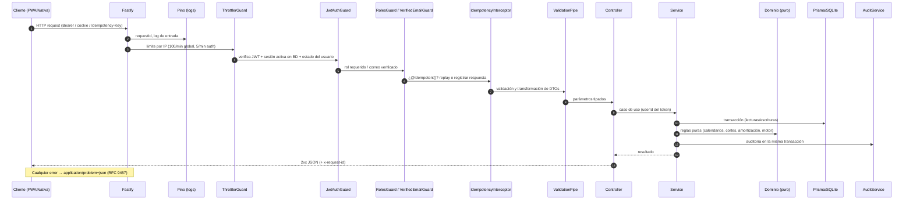
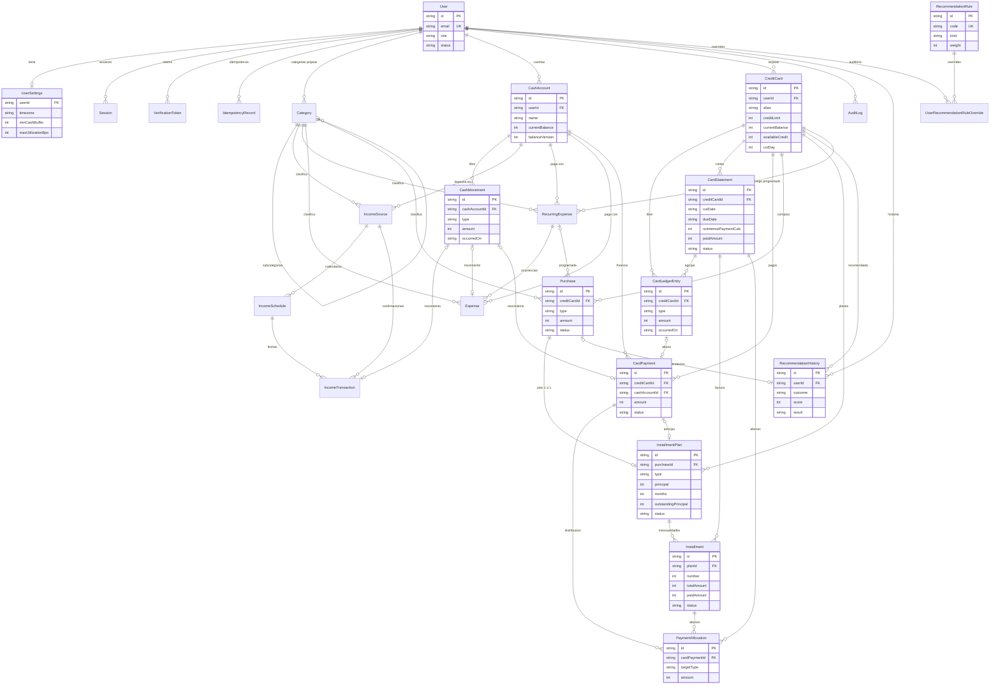
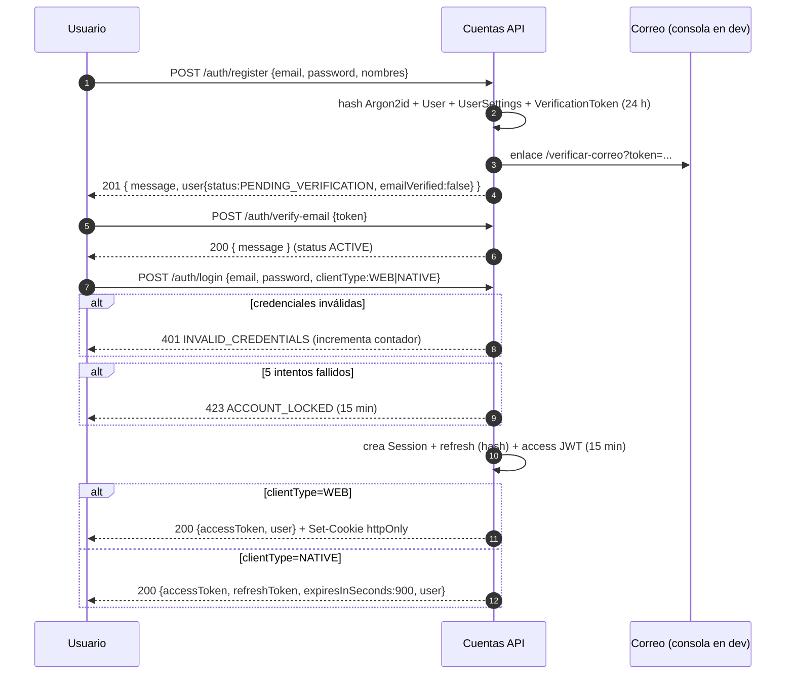
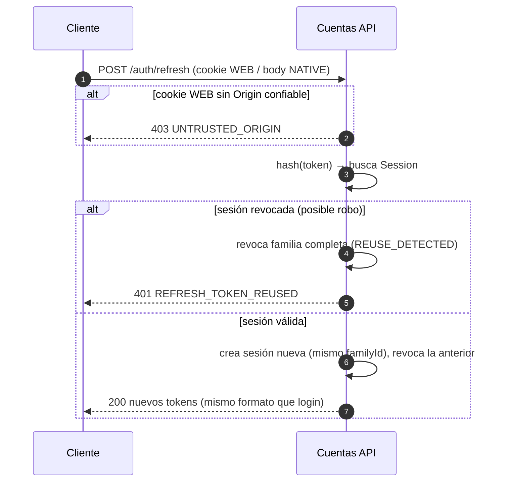
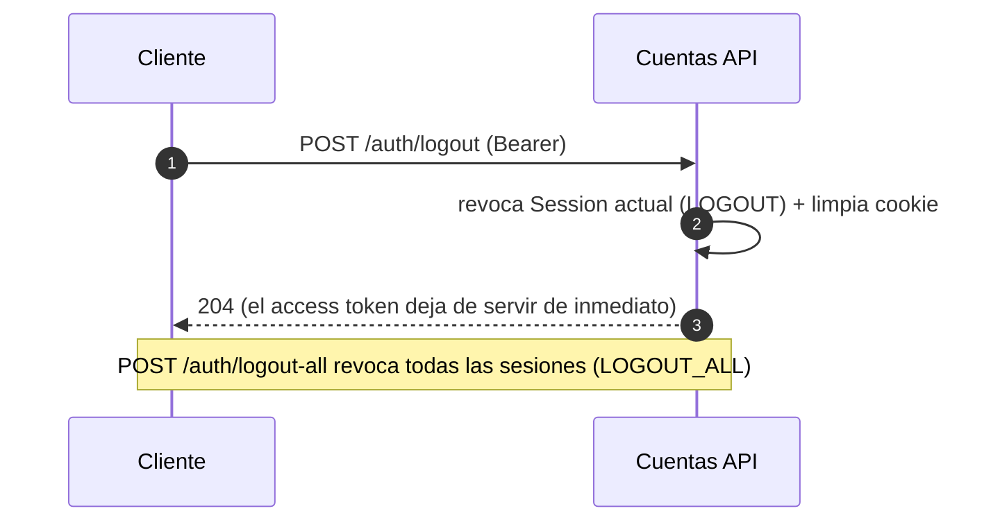
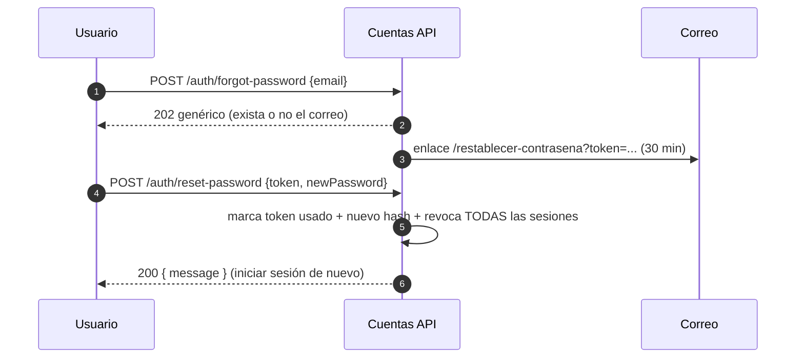
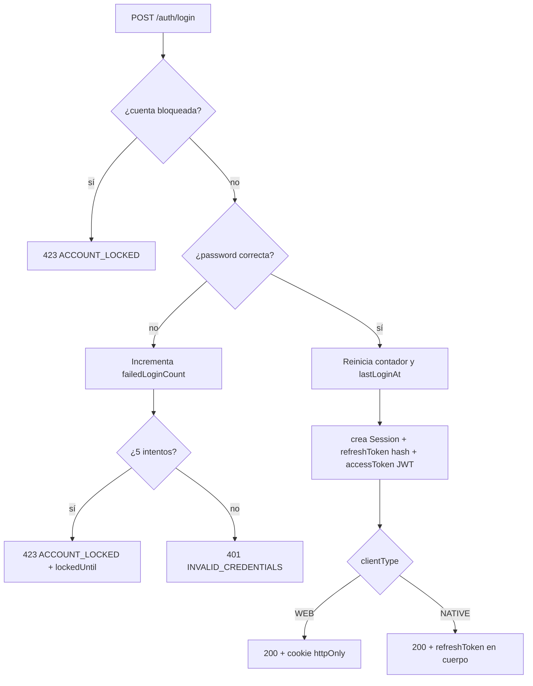
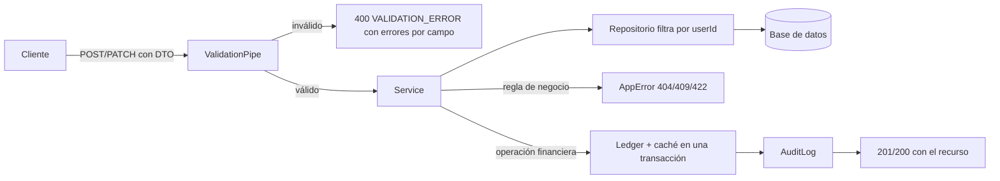
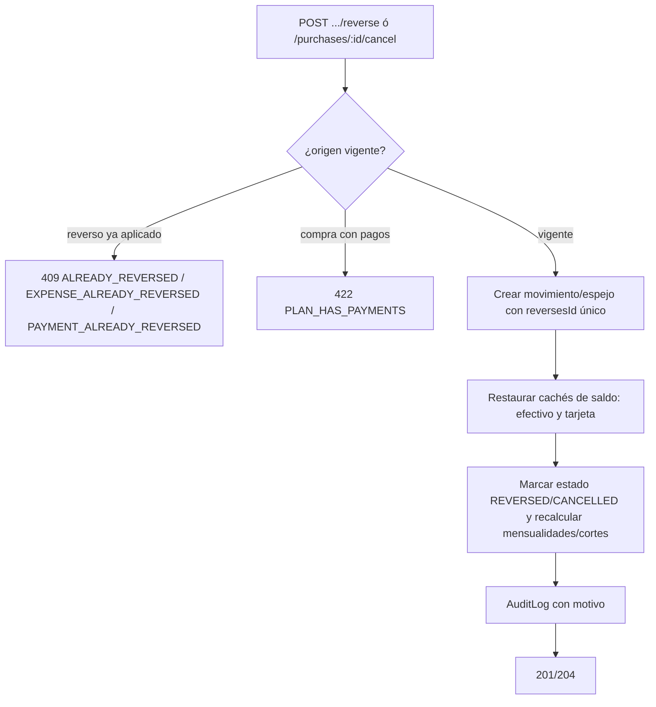
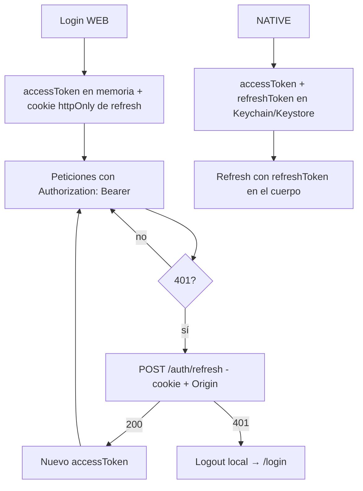

# Documentación Técnica — Cuentas API (Backend)

> **Versión del documento:** 1.0 · **Fecha:** 2 de octubre de 2026
> **Base analizada:** código implementado en `C:\Users\Hector.Espinoza\OneDrive - ECI\Devs\Cuentas\cuentas-api`
> **Alcance:** Fases 0 a 8 completadas · 26 tablas · 69 rutas · 92 endpoints · 38 suites / 172 pruebas
>
> Documento autocontenido: permite construir el frontend (PWA o app nativa) **sin leer el código fuente**.

---

# 1. Resumen General

## 1.1 Objetivo de la aplicación

**Cuentas** es un asistente financiero personal que ayuda a decidir **qué tarjeta de crédito conviene usar para una compra**, considerando la situación financiera real del usuario (saldo disponible, ingresos próximos, gastos recurrentes, pagos de tarjetas, mensualidades) y las características de cada tarjeta (fecha de corte, fecha límite de pago, crédito disponible, tasas, MSI).

Además del motor de recomendaciones, la aplicación funciona como un sistema completo de control financiero personal:

- Libro de efectivo con saldo calculado.
- Ingresos fijos y variables con calendarios de pago y reglas de días inhábiles.
- Gastos y gastos recurrentes.
- Tarjetas de crédito con cortes, estados de cuenta, conciliación y pagos.
- Compras regulares, meses sin intereses (MSI) y diferidas con intereses.
- Historial reproducible de recomendaciones.

> ⚠️ **Aviso obligatorio:** toda recomendación es una estimación basada en la información registrada por el usuario y **no constituye asesoría financiera profesional**. Toda respuesta del motor incluye el campo `disclaimer`.

## 1.2 Funcionalidades principales

| Módulo | Funcionalidades |
|---|---|
| **Autenticación** | Registro, verificación de correo, login (web con cookie httpOnly / nativo con refresh en cuerpo), refresh con rotación y detección de robo, logout y logout-all, sesiones activas, recuperación de contraseña, bloqueo por intentos fallidos |
| **Usuarios** | Perfil, configuración financiera (colchón, utilización máxima, factor de ingresos variables, zona horaria, calendario de festivos), exportación JSON, eliminación con 30 días de gracia y cancelación |
| **Efectivo** | Cuentas (efectivo/débito/ahorro), saldo inicial, movimientos, ajustes con motivo, transferencias, reversos, recálculo de saldo desde el libro |
| **Ingresos** | Fuentes de ingreso (fijas/variables), calendarios (semanal, quincenal, mensual, personalizado, único), próximos pagos con reglas de días inhábiles, confirmación de ingreso real, omisión de fechas |
| **Gastos** | Registro de gastos con categoría, reversos, gastos recurrentes con próximas ocurrencias y confirmación |
| **Tarjetas** | CRUD, corte y fecha límite configurables, estados de cuenta calculados, conciliación con el banco, libro de la tarjeta, pagos con aplicación a cortes y saldo revolvente |
| **Compras** | Regulares, MSI, diferidas con amortización francesa + IVA, calendario de mensualidades, anticipos, liquidación, cancelaciones |
| **Recomendaciones** | Motor de reglas eliminatorias y de puntaje, explicaciones, advertencias, alternativas ordenadas, caso "ninguna opción", historial con snapshots, reglas configurables por admin y por usuario |
| **Administración** | Reglas globales de recomendación, mantenimiento (purga y limpieza) |
| **Operación** | Health checks, logs JSON con requestId, errores RFC 9457, idempotencia, auditoría |

## 1.3 Casos de uso

1. **Registrar una compra con tarjeta**: el usuario pide una recomendación → el sistema simula todas las tarjetas y el efectivo → devuelve la mejor opción con motivos → el usuario registra la compra (puede ligarla a la recomendación).
2. **Elegir entre MSI y pago de contado**: el motor compara interés, días de financiamiento y efecto en el flujo de efectivo.
3. **Anticipar pagos de una compra a meses**: pagar mensualidades futuras o liquidar el plan.
4. **Controlar el flujo de efectivo**: registrar ingresos confirmados, gastos y ver el saldo actual y proyectado.
5. **Manejar múltiples ingresos** (sueldo quincenal, freelance variable, renta) con fechas ajustadas a días hábiles.
6. **Pagar tarjetas**: aplicar pagos al corte vigente con distribución automática a mensualidades, cargos y saldo revolvente.
7. **Conciliar** el saldo del banco con el registrado.
8. **Consultar por qué se recomendó** algo meses después: el historial guarda snapshots exactos.

## 1.4 Tipos de usuarios

| Rol | Descripción | Permisos |
|---|---|---|
| `USER` | Usuario final | Acceso completo **a sus propios datos**; recomendar; configurar sus reglas de recomendación (override) |
| `ADMIN` | Administrador de la plataforma | Todo lo anterior + ajustar reglas globales (`PATCH /admin/recommendation-rules/:code`) + ejecutar mantenimiento (`POST /admin/maintenance/run`). **No puede ver datos financieros de otros usuarios** |

Estados del usuario (`User.status`): `PENDING_VERIFICATION` → `ACTIVE` → (`PENDING_DELETION` → `DELETED`/purga).

---

# 2. Arquitectura de la Solución

## 2.1 Arquitectura utilizada

Arquitectura **en capas con dominio puro** (estilo hexagonal pragmático) sobre NestJS:

```
┌─────────────────────────────────────────────────────────────────┐
│ HTTP (Fastify)                                                   │
│  Controllers · DTOs (class-validator) · Guards · Interceptors    │
├─────────────────────────────────────────────────────────────────┤
│ Aplicación                                                       │
│  Services · Repositories (Prisma) · AuditService · Transacciones │
├─────────────────────────────────────────────────────────────────┤
│ Dominio (TypeScript puro, sin NestJS ni Prisma)                  │
│  local-date · business-calendar · schedule-generator             │
│  card-cycle · amortization · recommendation/engine               │
├─────────────────────────────────────────────────────────────────┤
│ Infraestructura                                                  │
│  PrismaService (SQLite) · ClockService · MailService · Pino      │
└─────────────────────────────────────────────────────────────────┘
```

## 2.2 Capas del proyecto

| Capa | Ubicación | Responsabilidad |
|---|---|---|
| **HTTP** | `src/modules/*/*.controller.ts`, `src/common/*` | Rutas, validación de entrada, serialización, códigos HTTP, guards |
| **Aplicación** | `src/modules/*/*.service.ts`, `*repository.ts` | Casos de uso, orquestación, transacciones, auditoría, ensamblado de contexto |
| **Dominio** | `src/domain/*` | Reglas financieras puras y testeables: fechas, calendarios, cortes, amortización, motor de recomendaciones |
| **Infraestructura** | `src/infrastructure/*` | Prisma/SQLite, reloj inyectable, correo (adaptador), logger pino |
| **Transversal** | `src/common/*`, `src/config/*` | Errores RFC 9457, validación, cookies, idempotencia, autenticación (decoradores), configuración |

## 2.3 Responsabilidades por capa

- **Controllers**: reciben y validan; **nunca** contienen reglas de negocio; obtienen `userId` del token con `@CurrentUser()`.
- **Services**: aplican reglas de negocio, abren transacciones, escriben auditoría, lanzan errores tipados (`AppError`).
- **Repositories**: encapsulan Prisma; **siempre** filtran por `userId` (no existe un método para leer por `id` ajeno).
- **Dominio**: funciones puras sin dependencias externas, cubiertas por pruebas unitarias con fechas fijas.
- **Libros (ledgers)**: `CashMovement` y `CardLedgerEntry` son la **fuente de verdad**; los saldos (`currentBalance`, `availableCredit`) son **caché** con `balanceVersion`, actualizada en la misma transacción.
- **Auditoría**: `AuditService.record()` dentro de la misma transacción de las operaciones sensibles.

## 2.4 Patrones de diseño implementados

| Patrón | Implementación |
|---|---|
| Modular (feature modules) | Un módulo NestJS por dominio (`auth`, `cards`, `purchases`, …) |
| Repository | `UsersRepository`, `CardsRepository`, `IncomeRepository`, … filtran por usuario |
| Service layer / caso de uso | `CardsService`, `StatementsService`, `RecommendationsService`, … |
| Estrategia | Reglas del motor de recomendación evaluadas por `code` (`switch` extensible) |
| Ledger + caché de saldo | Libros solo-inserción + saldo cacheado con control de versión |
| Reverso (compensación) | Los errores no se editan: se crea un movimiento inverso con `reverses*Id` único |
| Snapshot | `RecommendationHistory` guarda solicitud, contexto, reglas y resultado |
| Idempotencia | Interceptor + tabla `IdempotencyRecord` (cabecera opcional `Idempotency-Key`) |
| Circuito de formato de error | Filtro global → RFC 9457 (`application/problem+json`) |
| Inyección de dependencias | NestJS DI en todo el proyecto |
| Reloj inyectable | `ClockService` (zonas horarias) para pruebas deterministas |
| Política de fechas | `FinancialDatePolicy`: sin fechas futuras, límite de días hacia atrás |

## 2.5 Flujo completo de una petición



## 2.6 Convenciones transversales

| Tema | Regla |
|---|---|
| Dinero | Enteros en **centavos** (`Int`, máx. $21,474,836.47) |
| Tasas | **Puntos base** (3699 = 36.99%) |
| Fechas de calendario | `YYYY-MM-DD` (String) |
| Fechas/hora | ISO-8601 UTC |
| Errores | `application/problem+json` con `type,title,status,detail,instance,code,timestamp,requestId` |
| Éxito | Recurso directo; colecciones `{ data, meta: { limit, nextCursor, hasMore } }` |
| Paginación | Por cursor (id del último elemento) |
| IDs | UUID v4 |
| Idioma | Códigos de error y campos en inglés; mensajes en español |
| Zona horaria | `UserSettings.timezone` (default `America/Mexico_City`) |
| Request ID | Todas las respuestas incluyen `x-request-id` (se respeta el entrante) |

---

# 3. Stack Tecnológico

## 3.1 Resumen

| Componente | Tecnología | Versión instalada |
|---|---|---|
| Lenguaje | TypeScript (modo estricto) | 5.9.3 |
| Runtime | Node.js | 24 (LTS) |
| Framework HTTP | NestJS sobre Fastify | Nest 11.2.7 / Fastify 5.12.5 (override) |
| ORM | Prisma Client | 6.19.3 |
| Base de datos | SQLite (WAL, busy_timeout) → MySQL en el futuro | SQLite 3 (embebida) |
| Validación de entorno | Zod | 4.6.5 |
| Validación de DTOs | class-validator + class-transformer | 0.15.1 / 0.5.1 |
| Autenticación | @nestjs/jwt (JWT HS256) | 11.0.2 |
| Hash de contraseñas | @node-rs/argon2 (Argon2id) | 2.2.1 |
| Logging | nestjs-pino + pino + pino-http | 5.3.0 / 10.3.1 / 11.0.0 |
| Documentación | @nestjs/swagger (OpenAPI) | 11.4.7 |
| Seguridad HTTP | @fastify/helmet, @nestjs/throttler | 13.1.1 / 6.7.1 |
| Tareas programadas | @nestjs/schedule | 6.1.3 |
| Archivos estáticos (Swagger UI) | @fastify/static | 10.1.5 |
| Pruebas | Jest + Supertest + ts-jest | 29.7.0 / 7.3.1 / 29.4.14 |
| Utilidades | rxjs, reflect-metadata, tsx | 7.8.2 / 0.2.2 / 4.23.15 |
| Lint/Formato | ESLint (flat) + Prettier | 10.11.0 / 3.9.9 |

## 3.2 Base de datos

- **Desarrollo:** SQLite fuera de OneDrive (`%LOCALAPPDATA%\Cuentas\data\cuentas.db`) con `journal_mode=WAL` y `busy_timeout=5000`.
- **Pruebas:** una base por worker de Jest (`cuentas.test.N.db` en SQLite; `cuentas_test_N` en MySQL).
- **Portabilidad MySQL:** tipos tolerantes (String para enums/fechas/JSON, Int de 32 bits), sin SQL nativo; script `npm run mysql:schema`.

## 3.3 Variables de entorno

| Variable | Default | Descripción |
|---|---|---|
| `NODE_ENV` | `development` | `development \| test \| production` |
| `HOST` / `PORT` | `0.0.0.0` / `3000` | Servidor |
| `APP_VERSION` | `0.1.0` | Se reporta en `/health` y OpenAPI |
| `DATABASE_URL` | — | `file:...` o `mysql://...` |
| `CORS_ORIGINS` | `http://localhost:5173` | Lista separada por comas |
| `LOG_LEVEL` | `info` | `trace…fatal \| silent` |
| `DOCS_ENABLED` | `true` | Swagger en `/api/docs` |
| `THROTTLE_TTL_MS` / `THROTTLE_LIMIT` | `60000` / `100` | Límite global por IP |
| `JWT_SECRET` | — (obligatorio, ≥32 chars) | Firma de access tokens |
| `JWT_ACCESS_TTL_MINUTES` | `15` | Vigencia del access token |
| `JWT_REFRESH_TTL_DAYS` | `30` | Vigencia del refresh token |
| `AUTH_MAX_FAILED_ATTEMPTS` / `AUTH_LOCK_MINUTES` | `5` / `15` | Bloqueo por intentos |
| `EMAIL_VERIFICATION_TTL_HOURS` | `24` | Tokens de verificación |
| `PASSWORD_RESET_TTL_MINUTES` | `30` | Tokens de reset |
| `AUTH_THROTTLE_TTL_MS` / `AUTH_THROTTLE_LIMIT` | `60000` / `5` | Límite en `/auth/*` |
| `WEB_APP_URL` | `http://localhost:5173` | Enlaces de correo |
| `TEST_MYSQL_URL` | — | Solo pruebas: corre la suite contra MySQL |
| `BACKUP_DIR` / `BACKUP_RETENTION` | carpeta de la BD / 14 | Respaldo SQLite |

---

# 4. Estructura del Proyecto

## 4.1 Árbol de carpetas

```
cuentas-api/
├─ prisma/
│  ├─ schema.prisma                 Modelo de datos (26 tablas)
│  ├─ migrations/                   7 migraciones aplicadas
│  └─ seed/
│     ├─ index.ts                   Seed idempotente
│     └─ data/                      categories.ts · holidays.ts · recommendation-rules.ts
├─ scripts/
│  ├─ backup.mjs                    Respaldo SQLite (VACUUM INTO + rotación)
│  ├─ mysql-schema.mjs              Genera prisma/schema.mysql.prisma
│  ├─ openapi-3.1.mjs               Convierte la spec servida a OpenAPI 3.1
│  └─ test-mysql.mjs                Corre la suite contra MySQL
├─ src/
│  ├─ main.ts                       Bootstrap (Fastify + pino)
│  ├─ app.module.ts                 Módulos, guards globales e interceptor
│  ├─ app.setup.ts                  Helmet, CORS, prefijo, validación, Swagger
│  ├─ fastify-adapter.factory.ts    genReqId / trustProxy
│  ├─ config/                       env.schema.ts (Zod), AppConfigService/Module
│  ├─ common/
│  │  ├─ auth/                      @Public, @Roles, @CurrentUser, @RequireVerifiedEmail,
│  │  │                             @AllowPendingDeletion, AuthenticatedUser
│  │  ├─ errors/                    AppError, errores HTTP, factory RFC 9457, filtro
│  │  ├─ http/                      cookies.ts, request-meta.ts
│  │  ├─ idempotency/               @Idempotent + interceptor
│  │  └─ validation/                pipe global, transforms, @IsLocalDate, flatten
│  ├─ domain/                       LÓGICA PURA (sin Nest/Prisma)
│  │  ├─ shared/local-date.ts       Fechas YYYY-MM-DD, sumas, zonas horarias
│  │  ├─ calendar/business-calendar.ts  Días hábiles y ajustes
│  │  ├─ schedules/                 Config Zod + generador de ocurrencias
│  │  ├─ cards/card-cycle.ts        RN-12/13/14, fechas de corte/pago, estados
│  │  ├─ installments/amortization.ts   MSI y amortización francesa exacta
│  │  └─ recommendation/            types.ts + engine.ts (motor)
│  ├─ infrastructure/
│  │  ├─ prisma/                    PrismaService (WAL) + módulo global
│  │  ├─ clock/                     ClockService (hoy por zona horaria)
│  │  └─ mail/                      MailService abstracto + adaptador consola
│  └─ modules/                      Un módulo por dominio
│     ├─ auth/ health/ users/ categories/ holidays/ audit/ ledger/
│     ├─ cash-accounts/ cash-movements/ income/ expenses/
│     ├─ card-ledger/ cards/ card-payments/ installments/ purchases/
│     ├─ recommendations/ maintenance/
├─ test/
│  ├─ e2e/full-flow.spec.ts         Ciclo completo end-to-end
│  ├─ integration/                  18 suites de integración
│  ├─ unit/                         11 suites unitarias (dominio, auth, config)
│  └─ helpers/                      api.ts, test-app.ts, test-db.ts, global-setup.ts,
│                                   setup-env.ts, test-mail.service.ts
├─ docs/                            Documentación por fase + OpenAPI
├─ Dockerfile · docker-compose.yml · ecosystem.config.js
├─ .env · .env.example · .env.production.example
├─ jest.config.js · eslint.config.mjs · .prettierrc · tsconfig*.json · nest-cli.json
└─ package.json
```

## 4.2 Descripción de carpetas

| Carpeta | Contenido y responsabilidad |
|---|---|
| `prisma/` | Esquema, migraciones y seed idempotente (categorías, festivos MX, 8 reglas de recomendación) |
| `src/config/` | Validación Zod del entorno; acceso tipado (`AppConfigService`) |
| `src/common/` | Transversal: errores RFC 9457, validación, cookies, idempotencia, decoradores de auth |
| `src/domain/` | Reglas financieras puras y deterministas (fechas, calendario, cortes, amortización, motor) |
| `src/infrastructure/` | Adaptadores externos: Prisma, reloj, correo |
| `src/modules/` | Módulos HTTP + aplicación por dominio |
| `test/` | Unitarias del dominio/guards, integración con app real, E2E, helpers |
| `scripts/` | Operación: respaldo, esquema MySQL, OpenAPI 3.1, suite MySQL |
| `docs/` | Documentación por fase y especificaciones OpenAPI |

## 4.3 Archivos principales

| Archivo | Descripción |
|---|---|
| `src/main.ts` | Arranque: NestFactory + Fastify, logger pino, shutdown hooks |
| `src/app.module.ts` | Ensambla módulos; registra `ThrottlerGuard`, `JwtAuthGuard`, `RolesGuard`, `VerifiedEmailGuard` (en ese orden) y `IdempotencyInterceptor` |
| `src/app.setup.ts` | Helmet, CORS por lista blanca, prefijo `api/v1` (health excluido), pipe de validación, filtro de errores, Swagger |
| `src/fastify-adapter.factory.ts` | `genReqId` (respeta `x-request-id`), `trustProxy` |
| `src/modules/ledger/ledger.service.ts` | Único punto que crea `CashMovement` y actualiza el saldo de efectivo |
| `src/modules/card-ledger/card-ledger.service.ts` | Único punto que crea `CardLedgerEntry` y actualiza saldo/crédito de tarjeta |
| `src/modules/cards/statements.service.ts` | Materializa cortes, calcula pago para no generar intereses, aplica pagos (RN-23) y estima intereses (RN-22) |
| `src/modules/recommendations/recommendations.service.ts` | Ensambla el contexto real y llama al motor; guarda historial |
| `src/domain/recommendation/engine.ts` | Motor puro: elimina, puntúa y explica |
| `src/modules/maintenance/maintenance.service.ts` | Purga de cuentas (30 días) y limpieza de sesiones/tokens/idempotencia |
| `prisma/seed/index.ts` | Seed idempotente ejecutable con `npm run db:seed` |

---

# 5. Base de Datos

**Convenciones globales**

- Llaves primarias `String` (UUID v4) en todas las tablas.
- Dinero: `Int` en centavos. Tasas: `Int` en puntos base.
- Fechas de calendario: `String(10)` `YYYY-MM-DD`. Marcas de tiempo: `DateTime` UTC.
- "Enums": `String` validado por la aplicación (facilita migrar de SQLite a MySQL).
- JSON: `String` serializado (configuraciones, snapshots, respuestas de idempotencia).
- `createdAt` en todas las tablas; `updatedAt` en las mutables; `deletedAt` en maestras (borrado lógico).
- Libros (`CashMovement`, `CardLedgerEntry`) y auditoría: solo inserción.

## 5.1 User

Usuarios de la aplicación. Dueño de todos los registros financieros.

| Campo | Tipo | Restricciones / Notas |
|---|---|---|
| id | String | **PK**, UUID |
| email | String | **UNIQUE**; minúsculas |
| passwordHash | String | Argon2id |
| firstName / lastName | String | 1–80 caracteres |
| role | String | `USER` \| `ADMIN` (default `USER`) |
| status | String | `PENDING_VERIFICATION` \| `ACTIVE` \| `PENDING_DELETION` \| `DELETED` (default `PENDING_VERIFICATION`) |
| emailVerifiedAt | DateTime? | Fecha de verificación |
| failedLoginCount | Int | default 0 |
| lockedUntil | DateTime? | Bloqueo temporal |
| lastLoginAt | DateTime? | Último acceso |
| deletionRequestedAt | DateTime? | Inicio de gracia de 30 días |
| createdAt / updatedAt | DateTime | Auditoría |
| deletedAt | DateTime? | Borrado lógico |

- **Índices:** `(status)`, `(deletedAt)`.
- **Relaciones:** 1:1 `UserSettings`; 1:N con Categories, Sessions, VerificationTokens, CashAccounts, CashMovements, IncomeSources/Schedules/Transactions, RecurringExpenses, Expenses, CreditCards, CardLedgerEntries, CardStatements, CardPayments, PaymentAllocations, Purchases, InstallmentPlans, Installments, RecommendationHistory, RuleOverrides, IdempotencyRecords; AuditLogs (como sujeto y como actor).

## 5.2 UserSettings

Preferencias financieras y regionales (1:1 con User).

| Campo | Tipo | Default | Notas |
|---|---|---|---|
| userId | String | — | **PK**, FK → User (Cascade) |
| timezone | String | America/Mexico_City | Zona horaria del usuario |
| locale | String | es-MX | |
| holidayCalendarCode | String | MX_BANKING | `MX_BANKING` \| `MX_LABOR` |
| minCashBuffer | Int | 0 | Colchón mínimo (centavos) |
| maxUtilizationBps | Int | 3000 | 30% de utilización máxima |
| variableIncomeFactorBps | Int | 9000 | 90% para ingresos variables |
| pendingIncomeGraceDays | Int | 3 | Gracia de ingresos (RN-11) |
| backdateLimitDays | Int | 60 | Límite hacia atrás (RN-06) |
| projectionMinDays | Int | 60 | Horizonte mínimo de proyección |
| createdAt / updatedAt | DateTime | | |

## 5.3 Session

Sesiones activas; el refresh token se guarda **solo como hash** SHA-256.

| Campo | Tipo | Notas |
|---|---|---|
| id | String | **PK** |
| userId | String | FK → User (Cascade) |
| familyId | String | Familia de rotación |
| tokenHash | String | **UNIQUE** |
| clientType | String | `WEB` \| `NATIVE` (default WEB) |
| deviceName / ip / userAgent | String? | Contexto |
| expiresAt | DateTime | Vigencia |
| lastUsedAt | DateTime | default now |
| revokedAt | DateTime? | |
| revokedReason | String? | `ROTATED` \| `LOGOUT` \| `LOGOUT_ALL` \| `PASSWORD_CHANGED` \| `PASSWORD_RESET` \| `REUSE_DETECTED` \| `DELETION_REQUESTED` |
| replacedBySessionId | String? | Rotación |
| createdAt / updatedAt | DateTime | |

- **Índices:** `(userId, revokedAt)`, `(familyId)`, `(expiresAt)`.

## 5.4 VerificationToken

Tokens de un solo uso (solo hash).

| Campo | Tipo | Notas |
|---|---|---|
| id | String | **PK** |
| userId | String | FK → User (Cascade) |
| type | String | `EMAIL_VERIFY` \| `PASSWORD_RESET` |
| tokenHash | String | **UNIQUE** |
| expiresAt | DateTime | 24 h / 30 min según tipo |
| usedAt | DateTime? | Un solo uso |
| createdAt / updatedAt | DateTime | |

- **Índices:** `(userId, type)`, `(expiresAt)`.

## 5.5 IdempotencyRecord

Repetición segura de POST financieros.

| Campo | Tipo | Notas |
|---|---|---|
| id | String | **PK** |
| userId | String | FK → User (Cascade) |
| key | String | Cabecera `Idempotency-Key` |
| method / path | String | Petición original |
| requestHash | String | SHA-256 de método+URL+cuerpo |
| responseStatus | Int | |
| responseBody | String | JSON de la respuesta original |
| createdAt / expiresAt | DateTime | Retención 24 h |

- **Restricción única:** `(userId, key)`; **índice** `(expiresAt)`.

## 5.6 AuditLog

Bitácora de operaciones importantes (solo inserción).

| Campo | Tipo | Notas |
|---|---|---|
| id | String | **PK** |
| userId | String? | Sujeto (FK → User, `SetNull`) |
| actorUserId | String? | Actor (FK → User, `SetNull`) |
| action | String | p. ej. `auth.login.success`, `cash_account.created` |
| entityType / entityId | String / String? | Recurso afectado |
| changes | String? | JSON antes/después |
| ip / userAgent / requestId | String? | Contexto HTTP |
| createdAt | DateTime | |

- **Índices:** `(userId, createdAt)`, `(entityType, entityId)`, `(createdAt)`.

## 5.7 Category

Categorías globales (`userId` nulo, `isSystem=true`) y propias.

| Campo | Tipo | Notas |
|---|---|---|
| id | String | **PK** |
| userId | String? | FK → User (Cascade) |
| parentId | String? | FK → Category (Cascade, un nivel) |
| name | String | |
| kind | String | `EXPENSE` \| `INCOME` \| `BOTH` |
| icon | String? | Nombre de ícono |
| isSystem | Boolean | default false |
| createdAt / updatedAt / deletedAt | DateTime | |

- **Índices:** `(userId, parentId, name)`, `(kind)`.
- **Relaciones:** 1:N IncomeSources, RecurringExpenses, Expenses, Purchases.

## 5.8 Holiday

Festivos por calendario.

| Campo | Tipo | Notas |
|---|---|---|
| id | String | **PK** |
| calendarCode | String | `MX_LABOR` \| `MX_BANKING` |
| date | String | `YYYY-MM-DD` |
| name | String | |
| createdAt / updatedAt | DateTime | |

- **Único:** `(calendarCode, date)`; **índice** `(calendarCode)`.
- Seed: 14 festivos MX_LABOR y 22 MX_BANKING (2026–2027).

## 5.9 CashAccount

Cuentas de efectivo. El saldo es caché del libro.

| Campo | Tipo | Notas |
|---|---|---|
| id | String | **PK** |
| userId | String | FK → User (Cascade) |
| name | String | Único por usuario |
| type | String | `CASH` \| `DEBIT` \| `SAVINGS` \| `OTHER` |
| isSpendable | Boolean | default true (RN-04) |
| isDefault | Boolean | default false (una por usuario) |
| currency | String | `MXN` |
| currentBalance | Int | **Caché** del libro (centavos) |
| balanceVersion | Int | Control de versión |
| status | String | `ACTIVE` \| `INACTIVE` |
| lastReconciledAt | DateTime? | Último recálculo |
| createdAt / updatedAt / deletedAt | DateTime | |

- **Único:** `(userId, name)`; **índice** `(userId, deletedAt)`.

## 5.10 CashMovement

Libro de efectivo (solo inserción). **Fuente de verdad del saldo.**

| Campo | Tipo | Notas |
|---|---|---|
| id | String | **PK** |
| userId | String | FK → User |
| cashAccountId | String | FK → CashAccount (Restrict) |
| reversesMovementId | String? | **UNIQUE**; revierte a otro movimiento |
| type | String | `OPENING_BALANCE` \| `INCOME` \| `EXPENSE` \| `CARD_PAYMENT` \| `ADJUSTMENT` \| `TRANSFER_IN` \| `TRANSFER_OUT` \| `REVERSAL` |
| amount | Int | Con signo (+ entra), ≠ 0 |
| occurredOn | String | `YYYY-MM-DD` (≤ hoy, dentro del límite) |
| description | String | |
| reason | String? | Obligatorio en ajustes |
| sourceType / sourceId | String? | `Expense` \| `IncomeTransaction` \| `Transfer` \| `CardPayment` \| `Adjustment` \| `Reversal` |
| createdById | String | Usuario que lo creó |
| createdAt | DateTime | |

- **Índices:** `(userId, cashAccountId, occurredOn)`, `(userId, createdAt)`, `(sourceType, sourceId)`.

## 5.11 IncomeSource

Fuente de ingreso.

| Campo | Tipo | Notas |
|---|---|---|
| id / userId / cashAccountId | String | PK / FK User / FK CashAccount (Restrict) |
| categoryId | String? | FK → Category (SetNull) |
| name / payer | String / String? | |
| amountType | String | `FIXED` \| `VARIABLE` |
| estimatedAmount | Int | Centavos > 0 |
| isActive | Boolean | default true |
| createdAt / updatedAt / deletedAt | DateTime | |

- **Índice:** `(userId, isActive)`.

## 5.12 IncomeSchedule

Calendario de pagos de una fuente.

| Campo | Tipo | Notas |
|---|---|---|
| id / userId / incomeSourceId | String | PK / FK User / FK IncomeSource (Cascade) |
| frequency | String | `WEEKLY` \| `BIWEEKLY` \| `MONTHLY` \| `CUSTOM` \| `ONE_TIME` |
| config | String | JSON validado con Zod (ver §6) |
| nonBusinessDayRule | String | `PREVIOUS` (default) \| `NEXT` \| `NONE` (RN-09) |
| useHolidays | Boolean | default true |
| amountOverride | Int? | |
| startDate / endDate | String / String? | `YYYY-MM-DD` |
| isActive | Boolean | default true |
| createdAt / updatedAt | DateTime | |

- **Índice:** `(userId, isActive)`.

## 5.13 IncomeTransaction

Confirmación u omisión de una fecha estimada.

| Campo | Tipo | Notas |
|---|---|---|
| id / userId / incomeSourceId | String | PK / FK User / FK IncomeSource (Cascade) |
| incomeScheduleId | String? | FK → IncomeSchedule (SetNull) |
| cashMovementId | String? | **UNIQUE**; FK → CashMovement (SetNull) |
| expectedDate | String? | `YYYY-MM-DD` |
| expectedAmount | Int? | Estimado (sin factor) |
| actualDate | String? | Fecha real del depósito |
| actualAmount | Int? | Monto real |
| status | String | `CONFIRMED` \| `SKIPPED` \| `RESCHEDULED` |
| notes | String? | |
| createdAt / updatedAt | DateTime | |

- **Único:** `(incomeScheduleId, expectedDate)`; **índices** `(userId, status)`, `(userId, actualDate)`.

## 5.14 RecurringExpense

Gasto recurrente programado. Se paga desde una cuenta de efectivo o con una tarjeta de crédito.

| Campo | Tipo | Notas |
|---|---|---|
| id / userId | String | PK / FK User |
| cashAccountId | String? | FK → CashAccount (Restrict); obligatorio si `paymentMethod = CASH_ACCOUNT` |
| creditCardId | String? | FK → CreditCard (Restrict); obligatorio si `paymentMethod = CREDIT_CARD` |
| categoryId | String? | FK → Category (SetNull) |
| name | String | |
| amount | Int | > 0 |
| amountType | String | `FIXED` \| `VARIABLE` |
| paymentMethod | String | `CASH_ACCOUNT` \| `CREDIT_CARD`; define si confirmar crea un gasto o una compra |
| frequency / config | String / String | Igual que IncomeSchedule |
| nonBusinessDayRule | String | default `NONE` |
| useHolidays | Boolean | default true |
| startDate / endDate | String / String? | |
| isActive | Boolean | default true |
| createdAt / updatedAt / deletedAt | DateTime | |

- **Índice:** `(userId, isActive)`. El listado/detalle incluye `category {id,name}`, `cashAccount {id,name}` y `creditCard {id,alias,last4}`.

## 5.15 Expense

Gasto pagado con efectivo (siempre ligado a un movimiento).

| Campo | Tipo | Notas |
|---|---|---|
| id / userId / cashAccountId | String | PK / FK User / FK CashAccount (Restrict) |
| categoryId / recurringExpenseId | String? | FKs (SetNull) |
| cashMovementId | String | **UNIQUE**; FK → CashMovement (Restrict) |
| description | String | |
| amount | Int | > 0 |
| expenseDate | String | `YYYY-MM-DD` |
| occurrenceDate | String? | Fecha programada si viene de recurrente |
| status | String | `PAID` \| `REVERSED` |
| notes | String? | |
| createdAt / updatedAt | DateTime | |

- **Único:** `(recurringExpenseId, occurrenceDate)`; **índice** `(userId, expenseDate)`.

## 5.16 CreditCard

Tarjeta de crédito. Saldo y crédito disponible son caché del libro.

| Campo | Tipo | Notas |
|---|---|---|
| id / userId | String | PK / FK User (Cascade) |
| alias / institution | String | Alias único por usuario |
| last4 | String | 4 dígitos (nunca el número completo) |
| currency | String | `MXN` |
| status | String | `ACTIVE` \| `INACTIVE` |
| creditLimit | Int | > 0 |
| currentBalance | Int | **Caché** (+ = deuda) |
| availableCredit | Int | **Caché** = límite − saldo |
| balanceVersion | Int | |
| annualRateBps | Int | default 0 |
| annualFee / annualFeeMonth | Int? / Int? | Anualidad y mes (1–12) |
| cutDay | Int | 1–31 (RN-12) |
| dueDateMode | String | `FIXED_DAY` \| `DAYS_AFTER_CUT` |
| dueDay / dueDaysAfterCut | Int? / Int? | Config de fecha límite |
| dueNonBusinessDayRule | String | `PREVIOUS` (default) \| `NEXT` \| `NONE` |
| sameDayCutIncluded | Boolean | default true (RN-14) |
| createdAt / updatedAt / deletedAt | DateTime | |

- **Único:** `(userId, alias)`; **índice** `(userId, status)`.

## 5.17 CardLedgerEntry

Libro de la tarjeta (solo inserción). Positivo aumenta la deuda.

| Campo | Tipo | Notas |
|---|---|---|
| id / userId / creditCardId | String | PK / FK User / FK CreditCard (Restrict) |
| statementId | String? | FK → CardStatement (SetNull) |
| reversesEntryId | String? | **UNIQUE** |
| type | String | `OPENING_BALANCE` \| `PURCHASE` \| `INSTALLMENT_PRINCIPAL` \| `INTEREST` \| `FEE` \| `ANNUAL_FEE` \| `PAYMENT` \| `REFUND` \| `ADJUSTMENT` \| `REVERSAL` |
| amount | Int | Con signo, ≠ 0 |
| occurredOn | String | `YYYY-MM-DD` |
| description | String | |
| sourceType / sourceId | String? | `Purchase` \| `InstallmentPlan` \| `CardPayment` \| `InstallmentPrepayment` \| `Reconciliation` \| `PurchaseCancellation` \| `Reversal` |
| createdById | String | |
| createdAt | DateTime | |

- **Índices:** `(userId, creditCardId, occurredOn)`, `(sourceType, sourceId)`.

## 5.18 CardStatement

Estado de cuenta (corte) materializado desde el libro.

| Campo | Tipo | Notas |
|---|---|---|
| id / userId / creditCardId | String | PK / FK User / FK CreditCard (Restrict) |
| periodStart / cutDate / dueDate | String | `YYYY-MM-DD` |
| statementBalance | Int | Deuda total al corte |
| cycleCharges | Int | Cargos regulares del periodo (excluye compras a meses) |
| noInterestPaymentCalc | Int | RN-17: cargos regulares + mensualidades exigibles + saldo anterior no cubierto |
| noInterestPaymentReported | Int? | Dato del banco (sobrescribe) |
| minimumPaymentReported / minimumPaymentEstimated | Int? / Int | RN-16 |
| paidAmount | Int | Suma de asignaciones vigentes |
| status | String | `OPEN` \| `CLOSED` \| `PAID` \| `PARTIALLY_PAID` \| `OVERDUE` |
| createdAt / updatedAt | DateTime | |

- **Único:** `(creditCardId, cutDate)`; **índices** `(userId, dueDate)`, `(userId, status)`.

## 5.19 CardPayment

Pago de tarjeta financiado con una cuenta de efectivo.

| Campo | Tipo | Notas |
|---|---|---|
| id / userId / creditCardId / cashAccountId | String | PK y FKs (Restrict) |
| statementId | String? | FK → CardStatement (SetNull) |
| installmentPlanId | String? | FK → InstallmentPlan (SetNull) |
| cashMovementId | String | **UNIQUE**; FK → CashMovement |
| cardLedgerEntryId | String | **UNIQUE**; FK → CardLedgerEntry |
| amount | Int | > 0 |
| paymentDate | String | `YYYY-MM-DD` |
| type | String | `STATEMENT` \| `PARTIAL` \| `INSTALLMENT_PREPAYMENT` \| `PLAN_PAYOFF` |
| status | String | `APPLIED` \| `REVERSED` |
| notes | String? | |
| createdAt / updatedAt | DateTime | |

- **Índice:** `(userId, paymentDate)`.

## 5.20 PaymentAllocation

Distribución de un pago (RN-23).

| Campo | Tipo | Notas |
|---|---|---|
| id / userId / cardPaymentId | String | PK / FK User / FK CardPayment (Cascade) |
| statementId | String? | FK → CardStatement (SetNull) |
| targetType | String | `STATEMENT` \| `INSTALLMENT` \| `REVOLVING` |
| installmentId | String? | FK → Installment (SetNull) |
| amount | Int | |
| createdAt | DateTime | |

- **Índices:** `(cardPaymentId)`, `(statementId)`, `(installmentId)`.

## 5.21 Purchase

Compra con tarjeta.

| Campo | Tipo | Notas |
|---|---|---|
| id / userId / creditCardId | String | PK y FKs (Restrict) |
| categoryId / recurringExpenseId | String? | FKs (SetNull) |
| recommendationId | String? | FK → RecommendationHistory (SetNull) |
| description | String | |
| amount | Int | > 0 |
| purchaseDate | String | `YYYY-MM-DD` |
| occurrenceDate | String? | |
| type | String | `REGULAR` \| `MSI` \| `DEFERRED_INTEREST` |
| status | String | `ACTIVE` \| `PAID` \| `CANCELLED` \| `REFUNDED` |
| notes | String? | |
| createdAt / updatedAt | DateTime | |

- **Único:** `(recurringExpenseId, occurrenceDate)` (evita confirmar dos veces la misma ocurrencia de un recurrente con tarjeta); **índices:** `(userId, creditCardId, purchaseDate)`, `(userId, status)`.

## 5.22 InstallmentPlan

Plan de mensualidades (1:1 con la compra).

| Campo | Tipo | Notas |
|---|---|---|
| id / userId / creditCardId | String | PK y FKs (Restrict) |
| purchaseId | String | **UNIQUE**; FK → Purchase (Cascade) |
| type | String | `MSI` \| `DEFERRED_INTEREST` |
| principal | Int | |
| months | Int | 2–48 |
| annualRateBps | Int | 0 en MSI |
| ivaRateBps | Int | default 1600 (16%) |
| commissionAmount / commissionMode | Int / String | `NONE` \| `UPFRONT` \| `PRORATED` |
| amortizationMethod | String | `FRENCH` (default) \| `EQUAL` |
| firstStatementDate | String | Corte de la primera mensualidad (RN-19) |
| estimatedMonthlyPayment | Int | Pago mensual estimado (promedio en diferidas) |
| totalInterest / totalIva | Int | Totales exactos |
| outstandingPrincipal | Int | **Caché** de principal pendiente |
| prepaymentMode | String | `REDUCE_TERM` (default) \| `REDUCE_PAYMENT` (no disponible) |
| status | String | `ACTIVE` \| `PAID_OFF` \| `CANCELLED` |
| version | Int | |
| createdAt / updatedAt | DateTime | |

- **Índice:** `(userId, status)`.

## 5.23 Installment

Mensualidad del plan.

| Campo | Tipo | Notas |
|---|---|---|
| id / userId / planId | String | PK / FK User / FK InstallmentPlan (Cascade) |
| statementId | String? | FK → CardStatement (SetNull) |
| number | Int | 1..months |
| statementCutDate | String | Corte que la factura |
| dueDate | String | Fecha límite |
| principal / interest / iva / fee | Int | Desglose |
| totalAmount | Int | Suma exacta |
| paidAmount | Int | default 0 |
| status | String | `SCHEDULED` \| `BILLED` \| `PARTIALLY_PAID` \| `PAID` \| `CANCELLED` |
| paidAt | DateTime? | |
| createdAt / updatedAt | DateTime | |

- **Único:** `(planId, number)`; **índices** `(userId, dueDate)`, `(userId, status)`.

## 5.24 RecommendationRule

Reglas configurables del motor (globales).

| Campo | Tipo | Notas |
|---|---|---|
| id | String | **PK** |
| code | String | **UNIQUE** (p. ej. `NO_INTEREST`) |
| name / description | String | |
| kind | String | `ELIMINATORY` \| `SCORING` |
| weight | Int | 0 en eliminatorias |
| params | String? | JSON |
| isEnabled | Boolean | default true |
| version | Int | default 1 |
| createdAt / updatedAt | DateTime | |

- Seed (8 reglas): eliminatorias `CARD_ACTIVE`, `CREDIT_AVAILABLE`, `MSI_ELIGIBLE`, `CASHFLOW_NON_NEGATIVE`; de puntaje `NO_INTEREST` 35, `CASH_BUFFER` 25, `FINANCING_DAYS` 25 (`targetDays: 45`), `UTILIZATION` 15.

## 5.25 UserRecommendationRuleOverride

Ajustes por usuario sobre las reglas globales.

| Campo | Tipo | Notas |
|---|---|---|
| id / userId / ruleId | String | PK / FKs (Cascade) |
| isEnabled / weight / params | Boolean? / Int? / String? | Nulos = usar el global |
| createdAt / updatedAt | DateTime | |

- **Único:** `(userId, ruleId)`.

## 5.26 RecommendationHistory

Historial reproducible con snapshots.

| Campo | Tipo | Notas |
|---|---|---|
| id / userId | String | PK / FK User (Cascade) |
| recommendedCardId | String? | FK → CreditCard (SetNull) |
| purchaseId | String? | Reservado (la liga vive en Purchase) |
| engineVersion | String | `1.0.0` |
| requestInput / contextSnapshot / rulesSnapshot / result | String | JSON |
| outcome | String | `CARD` \| `CASH` \| `NONE` |
| score | Int? | Puntaje de la opción recomendada |
| createdAt | DateTime | |

- **Índice:** `(userId, createdAt)`.

## 5.27 Diagrama entidad-relación (Mermaid)



## 5.28 Resumen de índices y restricciones únicas

| Tabla | Únicos | Índices adicionales |
|---|---|---|
| User | email | status, deletedAt |
| CashAccount | (userId, name) | (userId, deletedAt) |
| CreditCard | (userId, alias) | (userId, status) |
| Category | — (unicidad en aplicación) | (userId, parentId, name), kind |
| Holiday | (calendarCode, date) | calendarCode |
| CashMovement | reversesMovementId | (userId, cashAccountId, occurredOn), (userId, createdAt), (sourceType, sourceId) |
| CardLedgerEntry | reversesEntryId | (userId, creditCardId, occurredOn), (sourceType, sourceId) |
| CardStatement | (creditCardId, cutDate) | (userId, dueDate), (userId, status) |
| CardPayment | cashMovementId, cardLedgerEntryId | (userId, paymentDate) |
| Purchase | — | (userId, creditCardId, purchaseDate), (userId, status) |
| InstallmentPlan | purchaseId | (userId, status) |
| Installment | (planId, number) | (userId, dueDate), (userId, status) |
| IncomeTransaction | (incomeScheduleId, expectedDate), cashMovementId | (userId, status), (userId, actualDate) |
| Expense | (recurringExpenseId, occurrenceDate), cashMovementId | (userId, expenseDate) |
| RecommendationRule | code | — |
| UserRecommendationRuleOverride | (userId, ruleId) | — |
| IdempotencyRecord | (userId, key) | expiresAt |
| Session | tokenHash | (userId, revokedAt), familyId, expiresAt |
| VerificationToken | tokenHash | (userId, type), expiresAt |

---

# 6. Entidades y Modelos (capa API)

> Los **modelos de base de datos** están en §5. Esta sección documenta los **DTOs** (contratos de la API) con sus validaciones. Mensajes de error en español; la validación es estricta (`whitelist` + `forbidNonWhitelisted`: cualquier campo no declarado produce 400).

## 6.1 Tipos primitivos

| Tipo | Formato | Reglas |
|---|---|---|
| `Money` | Entero (centavos) | `@IsInt`, `@Min`/`@Max` según campo; máximo 2147483647 |
| `LocalDate` | String `YYYY-MM-DD` | `@IsLocalDate` (valida día real del mes) |
| `RateBps` | Entero | 0–10000 (0%–100%) |
| `Uuid` | String | `@IsUUID('4')` |
| `PersentajeBps` | Entero | 0–10000 (utilización, factor) |

## 6.2 Auth

| DTO | Campo | Tipo | Validación |
|---|---|---|---|
| **RegisterDto** | email | string | `@IsEmail`, máx 254, transforma a minúsculas/trim |
| | password | string | 10–128 caracteres |
| | firstName / lastName | string | no vacíos, máx 80, trim |
| **LoginDto** | email | string | `@IsEmail`, máx 254 |
| | password | string | no vacío, máx 128 |
| | clientType | enum? | `WEB` \| `NATIVE` (default `WEB`) |
| **RefreshDto** | refreshToken | string? | máx 512 (solo app nativa; PWA usa cookie) |
| **ForgotPasswordDto** | email | string | `@IsEmail`, máx 254 |
| **ResetPasswordDto** | token | string | no vacío, máx 512 |
| | newPassword | string | 10–128 |
| **VerifyEmailDto** | token | string | no vacío, máx 512 |
| **ResendVerificationDto** | email | string | `@IsEmail`, máx 254 |

**Respuestas:** `AuthResponseDto { accessToken, tokenType:'Bearer', expiresInSeconds, refreshToken?, user }`, `RegisterResponseDto { message, user }`, `MessageResponseDto { message }`, `SessionResponseDto { id, clientType, deviceName?, ip?, userAgent?, createdAt, lastUsedAt, current }`.

## 6.3 Users

| DTO | Campo | Tipo | Validación |
|---|---|---|---|
| **UpdateProfileDto** | firstName? / lastName? | string | no vacío, máx 80, trim |
| **ChangePasswordDto** | currentPassword | string | no vacío, máx 128 |
| | newPassword | string | 10–128 (no puede ser igual a la actual) |
| **UpdateSettingsDto** | timezone? | string | máx 64 |
| | locale? | string | máx 10 |
| | holidayCalendarCode? | enum | `MX_LABOR` \| `MX_BANKING` |
| | minCashBuffer? | Money | ≥ 0 |
| | maxUtilizationBps? | bps | 0–10000 |
| | variableIncomeFactorBps? | bps | 0–10000 |
| | pendingIncomeGraceDays? | int | 0–30 |
| | backdateLimitDays? | int | 0–365 |
| | projectionMinDays? | int | 1–365 |
| **DeleteAccountDto** | password | string | no vacío, máx 128 |
| **ResetDataDto** | password | string | no vacío, máx 128 |
| | scope? | enum | `ALL` (default, todo) \| `CARDS` (solo tarjetas) |

**Respuestas:** `UserResponseDto { id, email, firstName, lastName, role, status, emailVerified, createdAt, updatedAt }`; `UserSettingsResponseDto { timezone, locale, holidayCalendarCode, minCashBuffer, maxUtilizationBps, variableIncomeFactorBps, pendingIncomeGraceDays, backdateLimitDays, projectionMinDays, updatedAt }`.

## 6.4 Cash Accounts / Movements

| DTO | Campo | Tipo | Validación |
|---|---|---|---|
| **CreateCashAccountDto** | name | string | no vacío, máx 80, trim |
| | type? | enum | `CASH` \| `DEBIT` \| `SAVINGS` \| `OTHER` |
| | isSpendable? / isDefault? | boolean | |
| | openingBalance? | Money | ≥ 1 |
| | openingDate? | LocalDate | |
| **UpdateCashAccountDto** | name? / isSpendable? / isDefault? | | |
| | status? | enum | `ACTIVE` \| `INACTIVE` |
| **OpeningBalanceDto** | amount | Money | ≥ 1 |
| | occurredOn? | LocalDate | |
| **TransferDto** | fromAccountId / toAccountId | uuid | distintos |
| | amount | Money | ≥ 1 |
| | occurredOn | LocalDate | |
| | description? | string | máx 200 |
| **AdjustmentDto** | cashAccountId | uuid | |
| | amount | Money | ≠ 0 (con signo) |
| | occurredOn | LocalDate | |
| | description | string | no vacío, máx 200 |
| | reason | string | **obligatorio**, máx 300 |
| **ReverseMovementDto** | reason | string | no vacío, máx 300 |
| **ListMovementsQueryDto** | cashAccountId? / type? / from? / to? / limit? / cursor? | | type ∈ 8 tipos; limit 1–100; cursor uuid |

## 6.5 Income (ingresos)

| DTO | Campo | Tipo | Validación |
|---|---|---|---|
| **IncomeScheduleInputDto** | frequency | enum | `WEEKLY` \| `BIWEEKLY` \| `MONTHLY` \| `CUSTOM` \| `ONE_TIME` |
| | config? | objeto | validado con Zod por frecuencia (ver 6.9) |
| | nonBusinessDayRule? | enum | `PREVIOUS` \| `NEXT` \| `NONE` |
| | useHolidays? | boolean | |
| | amountOverride? | Money | ≥ 1 |
| | startDate / endDate? | LocalDate / LocalDate? | endDate ≥ startDate |
| **CreateIncomeSourceDto** | name | string | no vacío, máx 120 |
| | cashAccountId / categoryId? | uuid | |
| | payer? | string | máx 120 |
| | amountType? | enum | `FIXED` \| `VARIABLE` |
| | estimatedAmount | Money | ≥ 1 |
| | schedules | array | **mínimo 1**, anidados |
| **UpdateIncomeSourceDto** | name? / payer? / amountType? / estimatedAmount? / cashAccountId? / categoryId? / isActive? | | |
| **UpdateIncomeScheduleDto** | config? / nonBusinessDayRule? / useHolidays? / amountOverride? / startDate? / endDate? / isActive? | | |
| **ConfirmIncomeDto** | incomeSourceId, incomeScheduleId | uuid | |
| | expectedDate | LocalDate | |
| | actualAmount? | Money | ≥ 1 |
| | actualDate? | LocalDate | |
| | notes? | string | máx 300 |
| **SkipIncomeDto** | incomeSourceId, incomeScheduleId, expectedDate, notes? | | |
| **UpcomingIncomeQueryDto** | incomeSourceId?, days (1–365), limit (1–100) | | |
| **ListIncomeTransactionsQueryDto** | incomeSourceId?, status? (`CONFIRMED\|SKIPPED\|RESCHEDULED`), limit?, cursor? | | |

## 6.6 Expenses (gastos y recurrentes)

| DTO | Campo | Tipo | Validación |
|---|---|---|---|
| **CreateExpenseDto** | cashAccountId / categoryId? | uuid | |
| | description | string | no vacío, máx 200 |
| | amount | Money | ≥ 1 |
| | expenseDate | LocalDate | |
| | notes? | string | máx 300 |
| **ReverseExpenseDto** | reason | string | no vacío, máx 300 |
| **ListExpensesQueryDto** | cashAccountId?, categoryId?, from?, to?, limit?, cursor? | | |
| **RecurringScheduleDto** | frequency, config?, nonBusinessDayRule?, useHolidays?, startDate, endDate? | | igual que IncomeScheduleInputDto |
| **CreateRecurringExpenseDto** | name (≤120), amount (≥1), amountType?, categoryId?, paymentMethod?, cashAccountId?, creditCardId?, schedule | | schedule anidado obligatorio; `paymentMethod ∈ CASH_ACCOUNT \| CREDIT_CARD` y exige la cuenta o la tarjeta correspondiente |
| **UpdateRecurringExpenseDto** | name?, amount?, amountType?, categoryId?, paymentMethod?, cashAccountId?, creditCardId?, config?, nonBusinessDayRule?, useHolidays?, startDate?, endDate?, isActive? | | cambiar de método exige el id destino |
| **ConfirmRecurringExpenseDto** | occurrenceDate | LocalDate | |
| | actualAmount? | Money | ≥ 1 |
| | actualDate? | LocalDate | |
| | notes? | string | máx 300 |

## 6.7 Cards

| DTO | Campo | Tipo | Validación |
|---|---|---|---|
| **CreateCardDto** | alias (≤60), institution (≤80) | string | no vacíos |
| | last4 | string | exactamente 4 dígitos |
| | creditLimit | Money | ≥ 1 |
| | annualRateBps? | bps | 0–10000 |
| | annualFee? | Money | ≥ 0 |
| | annualFeeMonth? | int | 1–12 |
| | cutDay | int | 1–31 |
| | dueDateMode? | enum | `FIXED_DAY` \| `DAYS_AFTER_CUT` (default) |
| | dueDay? / dueDaysAfterCut? | int | dueDay 1–31; días 1–60 (default 20) |
| | dueNonBusinessDayRule? | enum | `PREVIOUS` \| `NEXT` \| `NONE` |
| | sameDayCutIncluded? | boolean | default true |
| | openingBalance? / openingDate? | Money/LocalDate | ≥ 1 |
| **UpdateCardDto** | alias?, institution?, creditLimit?, annualRateBps?, annualFee?, annualFeeMonth?, cutDay?, dueDateMode?, dueDay?, dueDaysAfterCut?, dueNonBusinessDayRule?, sameDayCutIncluded?, status? | | `FIXED_DAY` exige `dueDay`; límite ≥ saldo actual |
| **ReconcileCardDto** | reportedBalance | Money | ≥ 0 |
| | asOfDate | LocalDate | |
| | reason | string | no vacío, máx 300 |
| **UpdateStatementDto** | noInterestPaymentReported? / minimumPaymentReported? | Money | ≥ 0 |
| **ListCardLedgerQueryDto** | type?, from?, to?, limit? (1–100), cursor? | | type ∈ 10 tipos |

## 6.8 Card Payments / Purchases / Recommendations

| DTO | Campo | Tipo | Validación |
|---|---|---|---|
| **CreateCardPaymentDto** | creditCardId, cashAccountId | uuid | |
| | amount | Money | ≥ 1 (≤ saldo actual) |
| | paymentDate | LocalDate | |
| | notes? | string | máx 300 |
| **ReverseCardPaymentDto** | reason | string | no vacío, máx 300 |
| **ListCardPaymentsQueryDto** | creditCardId?, limit?, cursor? | | |
| **CreatePurchaseDto** | creditCardId, categoryId? | uuid | |
| | description (≤200), amount (≥1), purchaseDate | | |
| | type | enum | `REGULAR` \| `MSI` \| `DEFERRED_INTEREST` |
| | months? | int | 2–48 (obligatorio en MSI/diferida) |
| | annualRateBps? | bps | 0–10000 (obligatorio en diferida; prohibido >0 en MSI) |
| | commissionAmount? / commissionMode? | Money/enum | `NONE` \| `UPFRONT` \| `PRORATED` |
| | firstStatementMonth? | mes | `YYYY-MM`; solo MSI/diferida ya iniciada: las mensualidades ya vencidas quedan pagadas y la tarjeta suma solo el principal pendiente |
| | notes?, recommendationId? | | recommendationId debe existir y ser del usuario |
| **ListPurchasesQueryDto** | creditCardId?, type?, status?, from?, to?, limit?, cursor? | | |
| **CancelPurchaseDto** | reason | string | no vacío, máx 300 |
| **PrepayPlanDto** | cashAccountId, amount (≥1), paymentDate | | |
| | mode? | enum | `REDUCE_TERM` (default); `REDUCE_PAYMENT` responde 422 |
| **CreateRecommendationDto** | amount | Money | ≥ 1 |
| | purchaseDate | LocalDate | |
| | type | enum | `REGULAR` \| `MSI` \| `DEFERRED_INTEREST` |
| | months? (2–48), annualRateBps? (0–10000) | | |
| | eligibleCardIds? | uuid[] | máx 20 |
| **UpdateRuleOverrideDto** | isEnabled?, weight? (0–100), params? | | |
| **AdminUpdateRuleDto** | isEnabled?, weight?, params? | | reglas eliminatorias sin peso |

## 6.9 Configuración JSON de calendarios (validada con Zod)

| Frecuencia | Config | Ejemplo |
|---|---|---|
| `WEEKLY` | `{ dayOfWeek: 0..6 }` (0=domingo). Si se omite, usa el día de `startDate` | `{ "dayOfWeek": 1 }` |
| `BIWEEKLY` | `{ days: [1..31 \| "LAST", ...] }` (1–4). Default `[15,"LAST"]` (RN-08) | `{ "days": [15, "LAST"] }` |
| `MONTHLY` | `{ day: 1..31 \| "LAST" }`. Default: día de `startDate` | `{ "day": 30 }` |
| `CUSTOM` | Exactamente una modalidad: `{ everyNDays: 1..365, anchor? }`, `{ daysOfMonth: [1..31] }` o `{ specificDates: ["YYYY-MM-DD"] }` | `{ "everyNDays": 14, "anchor": "2026-01-05" }` |
| `ONE_TIME` | `{ date: "YYYY-MM-DD" }`. Default: `startDate` | `{ "date": "2026-12-20" }` |

Los días que no existen en un mes se ajustan al último día. Las fechas se ajustan por la regla de día inhábil (`PREVIOUS`/`NEXT`/`NONE`).

## 6.10 Categorías propias

| DTO | Campo | Tipo | Validación |
|---|---|---|---|
| **CreateCategoryDto** | name | string | no vacío, máx 60, único por usuario (sin distinguir mayúsculas) |
| | kind | enum | `EXPENSE` \| `INCOME` \| `BOTH` |
| | parentId? | uuid | categoría visible, un solo nivel de anidación, tipo compatible |
| | icon? | string | máx 40 |
| **UpdateCategoryDto** | name?, kind?, parentId? (`null` desliga del padre), icon? | | mismas reglas |

---

# 7. Reglas de Negocio

## 7.1 Reglas formales RN-01 a RN-29 (todas implementadas)

| ID | Regla | Dónde vive |
|---|---|---|
| RN-01 | Moneda única MXN | `currency` en CashAccount/CreditCard (=`MXN`); sin conversiones |
| RN-02 | Zona horaria por usuario; "hoy" se calcula en ella | `ClockService.today(timezone)`, `UserSettings.timezone` |
| RN-03 | Dinero en centavos; tasas en puntos base | Validación de DTOs y esquema |
| RN-04 | Varias cuentas de efectivo; solo `isSpendable` cuentan para el motor | `CashAccounts`, `RecommendationsService` |
| RN-05 | Ningún saldo se modifica sin movimiento; ajustes con motivo | `LedgerService`/`CardLedgerService` únicos escritores; `AdjustmentDto.reason` obligatorio |
| RN-06 | Movimientos con fecha pasada hasta `backdateLimitDays` (60) | `FinancialDatePolicy.assertAllowed` |
| RN-07 | Sin fechas futuras en movimientos; lo futuro son programaciones | `FinancialDatePolicy` (error `FUTURE_DATE_NOT_ALLOWED`) |
| RN-08 | Quincena default días 15 y último del mes | `parseScheduleConfig('BIWEEKLY')` |
| RN-09 | Día inhábil → día hábil anterior (configurable) | `business-calendar.ts` + `nonBusinessDayRule` |
| RN-10 | Ingresos variables se proyectan al 90% (configurable) | `IncomeService.projectedAmount` con `variableIncomeFactorBps` |
| RN-11 | Ingreso vencido sin confirmar deja de proyectarse tras N días | `IncomeService.upcoming` (`pendingIncomeGraceDays`) |
| RN-12 | Corte = día fijo; si no existe, último del mes; nunca se ajusta | `card-cycle.cutDateForMonth` |
| RN-13 | Fecha límite fija o N días después del corte; se mueve al hábil anterior | `card-cycle.dueDateFor` |
| RN-14 | Compra el día del corte entra en ese corte (configurable) | `sameDayCutIncluded`, `cutDateForPurchase` |
| RN-15 | Saldo de tarjeta híbrido + conciliación auditada | `CardsService.reconcile` (entrada `ADJUSTMENT`) |
| RN-16 | Pago mínimo reportado o estimado (1.25% del saldo al corte) | `CardStatement.minimumPayment*` |
| RN-17 | Pago para no generar intereses calculado y sobrescribible | `StatementsService.sync` (`noInterestPaymentCalc`) |
| RN-18 | MSI/diferidas ocupan el monto completo del crédito y lo liberan al pagar | Entrada `PURCHASE` por el total; pagos reducen el saldo |
| RN-19 | Primera mensualidad en el corte de la compra; residuo en la última | `cutDateForPurchase` + `buildMsiSchedule`/`buildFrenchSchedule` |
| RN-20 | Diferidas: cuota fija capital+interés (francesa) e IVA 16% sobre el interés sumado al pago; comisión configurable | `amortization.ts` |
| RN-21 | Anticipos reducen plazo por defecto | `prepay` (`REDUCE_TERM`); `REDUCE_PAYMENT` responde 422 |
| RN-22 | Interés estimado = saldo × tasa/360 × días × 1.16 en cortes vencidos | `StatementsService.withEstimatedInterest` (`estimatedInterest`) |
| RN-23 | Pagos: primero mensualidades exigibles, luego cargos del corte, luego revolvente | `applyPaymentAllocations` |
| RN-24 | Anualidad como cargo/obligación futura | Obligación `Anualidad {alias}` en recomendaciones |
| RN-25 | Gasto = efectivo/débito; compra = tarjeta | `Expenses` vs `Purchases` |
| RN-26 | Errores/cancelaciones se corrigen con reverso | `reverse` en movimientos/gastos/pagos; cancelación de compra con `REFUND` |
| RN-27 | Eliminar una compra (regular, MSI o diferida) revierte en la tarjeta el cargo vivo —con plan: cargo original − pagos aplicados; regular: hasta la deuda actual— fechado en el periodo original para que los cortes ya cerrados se recalculen, y borra el registro; lo ya pagado no se toca | `PurchasesService.remove` (entrada `REFUND` con `allowBackdated`, auditoría `purchase.deleted`); en regulares resta de los cargos del periodo (`statements.service`) |
| RN-28 | Reiniciar una tarjeta borra su dominio completo y la deja con saldo 0 y crédito completo; eliminarla borra además la tarjeta y los recurrentes ligados a ella. Los movimientos de efectivo de pagos no se tocan | `CardsService.reset` / `CardsService.remove` (`purgeDomain`, auditorías `credit_card.reset` / `credit_card.deleted`) |
| RN-29 | Sin `days`, la proyección de flujo cubre hasta la última obligación programada (mensualidades pendientes o próxima anualidad) y genera ingresos/gastos hasta ahí; mínimo `projectionMinDays`, tope 5 años | `CashflowContextService.horizonDaysFor` + `CashflowService.projection` |

| Recurrente con tarjeta se confirma como compra | `paymentMethod = CREDIT_CARD` crea `Purchase` REGULAR + entrada `PURCHASE`; efectivo crea `Expense` + movimiento | `PAYMENT_METHOD_REQUIRED`, `CREDIT_CARD_REQUIRED`, `CARD_NOT_FOUND`, `CARD_INACTIVE` |
| Una ocurrencia se confirma una sola vez | Único `(recurringExpenseId, occurrenceDate)` en Expense y Purchase | `OCCURRENCE_ALREADY_CONFIRMED` |
| Compra a meses ya iniciada al corriente | `firstStatementMonth` fija el primer corte; las mensualidades vencidas quedan `PAID` y la tarjeta solo suma el principal pendiente | `START_MONTH_REQUIRES_PLAN`, `PLAN_ALREADY_PAID_OFF` |

## 7.2 Reglas adicionales implementadas

| Regla | Comportamiento | Código de error |
|---|---|---|
| Una cuenta predeterminada por usuario | Al marcar `isDefault` se desmarca la anterior; la primera cuenta nace default | — |
| Cuenta con saldo no se elimina | `currentBalance !== 0` → 422 | `ACCOUNT_WITH_BALANCE` |
| Cuenta inactiva no opera | Movimientos/pagos bloqueados | `ACCOUNT_INACTIVE` |
| Saldo inicial único por cuenta | Segundo intento → 409 | `OPENING_BALANCE_EXISTS` |
| Transferencias a la misma cuenta | Bloqueado | `SAME_ACCOUNT` |
| Un movimiento solo se revierte una vez | Índice único en `reverses*Id` | `ALREADY_REVERSED` |
| Un reverso no se revierte | Validación explícita | `CANNOT_REVERSE_REVERSAL` |
| Reenviar verificación invalida el token anterior | `invalidatePending` | — |
| Tokens de un solo uso | `usedAt` | `INVALID_VERIFICATION_TOKEN` / `INVALID_RESET_TOKEN` |
| Correos no registrados no se revelan | 202 genérico en forgot/resend | — |
| Bloqueo tras 5 intentos fallidos (15 min) | `failedLoginCount` + `lockedUntil` | `ACCOUNT_LOCKED` (423) |
| Cambiar contraseña cierra las demás sesiones | `revokeAllForUser(except current)` | — |
| Reset de contraseña cierra todas las sesiones | `PASSWORD_RESET` | — |
| Reutilizar refresh revoca toda la familia | `REUSE_DETECTED` | `REFRESH_TOKEN_REUSED` |
| Cuenta en eliminación solo puede cancelar/exportar/logout | `PendingDeletionGuard` lógico | `PENDING_DELETION` (403) |
| Purga definitiva a los 30 días | Cron diario 03:00 + endpoint admin | — |
| Mensualidad duplicada | Único `(planId, number)` / `(recurringExpenseId, occurrenceDate)` | `OCCURRENCE_ALREADY_*` |
| Compra cancelable solo sin pagos | 422 si hay mensualidades con pago | `PLAN_HAS_PAYMENTS` |
| Pago no puede exceder saldo | 422 | `PAYMENT_EXCEEDS_BALANCE`, `CARD_WITHOUT_BALANCE` |
| Anticipo no puede exceder el plan | 422 | `PREPAYMENT_EXCEEDS_PLAN`, `PLAN_PAID_OFF` |
| Reglas eliminatorias sin peso (admin) | 400 | `ELIMINATORY_RULE_WITH_WEIGHT` |
| Idempotencia opcional | Replay o 409 si cambia el cuerpo | `IDEMPOTENCY_KEY_INVALID`, `IDEMPOTENCY_KEY_CONFLICT` |
| Aislamiento por usuario | Recursos ajenos → 404 (nunca 403) | `NOT_FOUND` |
| Mutaciones financieras exigen correo verificado | Guard global | `EMAIL_NOT_VERIFIED` (403) |

## 7.3 Permisos por rol

| Operación | Público | USER | ADMIN |
|---|---|---|---|
| Registro/login/refresh/verificación/reset | ✅ | ✅ | ✅ |
| Resto de endpoints `/api/v1/*` | ❌ | ✅ (solo sus datos) | ✅ (solo sus datos) |
| `GET/PUT/DELETE /recommendation-rules*` (overrides propios) | ❌ | ✅ | ✅ |
| `PATCH /admin/recommendation-rules/:code` | ❌ | ❌ 403 | ✅ |
| `POST /admin/maintenance/run` | ❌ | ❌ 403 | ✅ |
| `/health`, `/api/docs*` | ✅ | ✅ | ✅ |

## 7.4 Procesos automáticos

| Proceso | Disparador | Descripción |
|---|---|---|
| Materialización de estados de cuenta | Primera lectura (`GET statements` / recomendar / pagar) | Crea/actualiza los cortes ocurridos desde el primer movimiento; recalcula montos desde el libro |
| Facturación de mensualidades | Sync de cortes | `SCHEDULED → BILLED` + `statementId` |
| Cálculo de pago para no generar intereses | Sync | Cargos regulares + mensualidades exigibles pendientes + saldo anterior no cubierto |
| Intereses estimados | Lectura de cortes vencidos | `estimatedInterest` (RN-22) |
| Anualidad | Contexto de recomendación | Obligación futura en el 1º del mes configurado |
| Bloqueo de cuenta | 5º intento fallido | `lockedUntil = now + 15 min`, contador reiniciado |
| Expiración/rotación de sesiones | Refresh/logout | Familias revocadas ante reuso |
| Mantenimiento | Cron 03:00 / endpoint admin | Purga usuarios 30 días, limpia sesiones/tokens (>30 días) e idempotencia vencida |

## 7.5 Cálculos financieros

| Cálculo | Fórmula implementada |
|---|---|
| Saldo de cuenta | Suma de `CashMovement.amount` (caché `currentBalance` con `balanceVersion`) |
| Crédito disponible | `creditLimit − currentBalance` (caché `availableCredit`) |
| Saldo al corte | Suma de todas las entradas del libro con `occurredOn ≤ cutDate` |
| Pago para no generar intereses | Cargos regulares del periodo + mensualidades exigibles pendientes del corte + saldo anterior no cubierto |
| Pago mínimo estimado | `max(round(saldo al corte × 1.25%), 0)` |
| Interés estimado (RN-22) | `round(saldoInsoluto × tasaAnual / 360 × díasVencidos × 1.16)` |
| MSI | Cuota base = `floor(principal/meses)`; residuo en la **última**; suma exacta = principal |
| Diferida (francesa) | Cuota = `P·i / (1 − (1+i)^−n)`, `i = tasaAnual/12`; interés = saldo insoluto × i; IVA = interés × 16%; última cuota cierra el saldo; invariante `Σcuotas = principal + intereses + IVA (+ comisión)` |
| Utilización resultante | `round((saldoActual + monto) / límite × 10000)` bps |
| Flujo proyectado | Saldo gastable + ingresos esperados − gastos recurrentes − obligaciones de tarjeta − plan de la compra simulada; se reporta el mínimo y su fecha |
| Puntaje | `Σ(peso × score) / Σpesos × 100`; niveles: ≥80 Excelente, 60–79 Buena, 40–59 Aceptable, <40 No recomendable |

---

# 8. Autenticación y Autorización

## 8.1 Método de autenticación

- **JWT con firma HS256** (`@nestjs/jwt`). Payload: `{ sub: userId, sid: sessionId, role }`.
- **Access token:** vigencia 15 minutos (`JWT_ACCESS_TTL_MINUTES`). Se envía como `Authorization: Bearer <token>`.
- **Refresh token:** 256 bits aleatorios (`base64url`), **solo se guarda el hash SHA-256** en `Session.tokenHash`. Vigencia 30 días (`JWT_REFRESH_TTL_DAYS`).
- **Doble modo de cliente:**
  - `WEB` (PWA): refresh en cookie `cuentas_refresh` `httpOnly; SameSite=Strict; Path=/api/v1/auth; Secure` en producción. En cada refresh se valida `Origin` contra `CORS_ORIGINS`.
  - `NATIVE`: refresh en el cuerpo de la respuesta; se recomienda Keychain/Keystore.
- **Validación por petición:** `JwtAuthGuard` verifica la firma **y** que la sesión siga activa en la base (`revokedAt = null`, no expirada) y que el usuario no esté `DELETED`. Esto permite revocación inmediata (logout invalida el access token al instante).

## 8.2 Refresh tokens y rotación

1. Cada login/registro de sesión crea una `Session` con `familyId` nuevo.
2. Cada refresh **rota**: crea sesión nueva (mismo `familyId`) y revoca la anterior (`revokedReason=ROTATED`, `replacedBySessionId`).
3. Si se presenta un token de una sesión ya revocada → **se revoca toda la familia** (`REUSE_DETECTED`) y responde 401 `REFRESH_TOKEN_REUSED`.
4. El access token anterior deja de servir tras la rotación (su sesión ya no está activa).

## 8.3 Roles y permisos

| Rol | Acceso |
|---|---|
| `USER` | Todos los endpoints autenticados, **solo a datos propios** (filtro por `userId` del token) |
| `ADMIN` | Lo anterior + `/admin/recommendation-rules` + `/admin/maintenance` |

- `RolesGuard` protege rutas con `@Roles('ADMIN')` → 403 `INSUFFICIENT_ROLE`.
- Recursos ajenos → **404** (no 403) para no revelar existencia.
- `VerifiedEmailGuard` (`@RequireVerifiedEmail()`): todas las **mutaciones financieras** exigen correo verificado → 403 `EMAIL_NOT_VERIFIED`.
- `@AllowPendingDeletion()`: en estado `PENDING_DELETION` solo funcionan `logout`, `logout-all`, `cancel-deletion` y `export`; el resto → 403 `PENDING_DELETION`.

## 8.4 Contraseñas y tokens de un solo uso

- **Argon2id** con parámetros OWASP (19 MiB, 2 iteraciones, 1 hilo). Mínimo 10 caracteres.
- Verificación de correo: token de un solo uso, 24 h, guardado como hash. Reenviar invalida el anterior.
- Reset de contraseña: token de un solo uso, 30 min. Al usarlo se revocan **todas** las sesiones.
- Respuestas 202 genéricas para `forgot-password` y `resend-verification` (no revelan si el correo existe).

## 8.5 Flujo de registro y login



## 8.6 Flujo de refresh (rotación)



## 8.7 Flujo de logout



## 8.8 Flujo de recuperación de contraseña



## 8.9 Protección contra abuso

| Protección | Valor |
|---|---|
| Límite global por IP | 100 req/min (`THROTTLE_LIMIT`) |
| Límite en `/auth/*` | 5 req/min (`AUTH_THROTTLE_LIMIT`) |
| Bloqueo por intentos | 5 fallidos → 423 con minutos restantes |
| Mensajes de error | No revelan si un correo existe |
| Redacción en logs | `authorization`, `cookie`, `password`, `refreshToken` → `[REDACTED]` |

---

# 9. API Completa

**URL base:** `/api/v1` · **Salud:** `/health` · **Docs:** `/api/docs` y `/api/docs-json`

## 9.0 Convenciones comunes

- **Headers:** `Authorization: Bearer <accessToken>` (rutas autenticadas); `Idempotency-Key: <uuid>` **opcional** en POST financieros; `Content-Type: application/json`; todas las respuestas incluyen `x-request-id`.
- **Errores comunes** (formato `application/problem+json`): `400 VALIDATION_ERROR` (`errors: [{field, errors[]}]`), `401 UNAUTHORIZED`/`INVALID_ACCESS_TOKEN`/`SESSION_REVOKED`, `403` específico, `404 NOT_FOUND` (también para recursos ajenos), `409 CONFLICT`, `422` regla de negocio, `423 ACCOUNT_LOCKED`, `429 TOO_MANY_REQUESTS`, `500 INTERNAL_ERROR`, `503 SERVICE_UNAVAILABLE`.
- **Colecciones:** `{ "data": [...], "meta": { "limit": 20, "nextCursor": "uuid|null", "hasMore": true } }`.
- Las mutaciones financieras requieren correo verificado (se omite repetirlo en cada endpoint).

## 9.1 Health

| Método | Ruta | Auth | Descripción |
|---|---|---|---|
| GET | `/health` | Pública | Estado del servicio + base de datos |
| GET | `/health/live` | Pública | Liveness |

**GET /health → 200**
```json
{
  "status": "ok", "version": "0.1.0", "environment": "development",
  "uptimeSeconds": 12, "timestamp": "2026-10-02T15:30:12.009Z",
  "checks": { "database": { "status": "up", "latencyMs": 2 } }
}
```
Errores: `503 SERVICE_UNAVAILABLE` con `checks.database.status = "down"`.

## 9.2 Auth

| Método | Ruta | Auth | Throttle |
|---|---|---|---|
| POST | `/auth/register` | Pública | 5/min |
| POST | `/auth/login` | Pública | 5/min |
| POST | `/auth/refresh` | Pública | 5/min |
| POST | `/auth/logout` | Bearer | — |
| POST | `/auth/logout-all` | Bearer | — |
| GET | `/auth/sessions` | Bearer | — |
| DELETE | `/auth/sessions/:id` | Bearer | — |
| POST | `/auth/verify-email` | Pública | 5/min |
| POST | `/auth/resend-verification` | Pública | 5/min |
| POST | `/auth/forgot-password` | Pública | 5/min |
| POST | `/auth/reset-password` | Pública | 5/min |

**POST /auth/register → 201**
```json
// Request
{ "email": "ana@ejemplo.com", "password": "Password1234", "firstName": "Ana", "lastName": "López" }
// Response
{ "message": "Cuenta creada. Revisa tu correo para verificarla.",
  "user": { "id": "uuid", "email": "ana@ejemplo.com", "firstName": "Ana", "lastName": "López",
            "role": "USER", "status": "PENDING_VERIFICATION", "emailVerified": false,
            "createdAt": "2026-10-02T...", "updatedAt": "2026-10-02T..." } }
```
Errores: `409 CONFLICT EMAIL_ALREADY_REGISTERED`, `400 VALIDATION_ERROR`.

**POST /auth/login → 200**
```json
// Request (WEB)
{ "email": "ana@ejemplo.com", "password": "Password1234", "clientType": "WEB" }
// Response WEB (además Set-Cookie: cuentas_refresh=...; HttpOnly; SameSite=Strict; Path=/api/v1/auth)
{ "accessToken": "eyJ...", "tokenType": "Bearer", "expiresInSeconds": 900,
  "user": { "id": "uuid", "email": "ana@ejemplo.com", "emailVerified": true, "status": "ACTIVE", "...": "..." } }
// Response NATIVE (incluye además)
{ "refreshToken": "v1_9Kd...", "extras": "mismo resto de campos" }
```
Errores: `401 INVALID_CREDENTIALS`, `423 ACCOUNT_LOCKED` (`detail` con minutos restantes).

**POST /auth/refresh → 200** · Request WEB: sin cuerpo (cookie). Request NATIVE: `{ "refreshToken": "..." }`.
Respuesta igual a login (WEB rota la cookie; NATIVE devuelve `refreshToken`).
Errores: `401 INVALID_REFRESH_TOKEN`, `401 REFRESH_TOKEN_REUSED` (familia revocada), `401 REFRESH_TOKEN_EXPIRED`, `403 UNTRUSTED_ORIGIN` (cookie sin `Origin` permitido), `401 MISSING_REFRESH_TOKEN`.

**POST /auth/logout → 204** · Sin cuerpo. Revoca la sesión actual y limpia la cookie.
**POST /auth/logout-all → 204** · Revoca todas las sesiones (`{ "revokedSessions": 2 }` internamente auditado).

**GET /auth/sessions → 200**
```json
[ { "id": "uuid-sesion", "clientType": "NATIVE", "deviceName": null, "ip": "127.0.0.1",
    "userAgent": "supertest", "createdAt": "...", "lastUsedAt": "...", "current": true } ]
```
**DELETE /auth/sessions/:id → 204** · Errores: `404 SESSION_NOT_FOUND` (también si es de otro usuario).

**POST /auth/verify-email → 200** · `{ "token": "..." }` → `{ "message": "Correo verificado correctamente." }` · Errores: `400 INVALID_VERIFICATION_TOKEN`.

**POST /auth/resend-verification → 202** · `{ "email": "..." }` → `{ "message": "Si el correo esta registrado y sin verificar, enviaremos un nuevo enlace." }`

**POST /auth/forgot-password → 202** · Igual mensaje genérico.
**POST /auth/reset-password → 200** · `{ "token": "...", "newPassword": "..." }` → `{ "message": "Contrasena restablecida. Inicia sesion con tu nueva contrasena." }` · Errores: `400 INVALID_RESET_TOKEN`.

## 9.3 Usuarios

| Método | Ruta | Descripción |
|---|---|---|
| GET | `/users/me` | Perfil |
| PATCH | `/users/me` | Actualiza nombres |
| POST | `/users/me/change-password` | Cambia contraseña (cierra otras sesiones) |
| GET | `/users/me/settings` | Configuración financiera |
| PATCH | `/users/me/settings` | Actualiza configuración |
| POST | `/users/me/delete` | Solicita eliminación (30 días) |
| POST | `/users/me/cancel-deletion` | Cancela eliminación (permitido en `PENDING_DELETION`) |
| POST | `/users/me/reset` | Restablece los datos: `scope: ALL` (default) o `CARDS` (conserva cuenta, sesión y preferencias) |
| GET | `/users/me/export` | Exporta JSON completo (permitido en `PENDING_DELETION`) |

**GET /users/me → 200**
```json
{ "id": "uuid", "email": "ana@ejemplo.com", "firstName": "Ana", "lastName": "López",
  "role": "USER", "status": "ACTIVE", "emailVerified": true,
  "createdAt": "...", "updatedAt": "..." }
```

**PATCH /users/me → 200** · `{ "firstName": "Ana María" }` (ambos campos opcionales; respuesta = usuario).
**POST /users/me/change-password → 200** · `{ "currentPassword": "Password1234", "newPassword": "NuevaPassword123" }` → `{ "message": "Contrasena actualizada. Se cerraron las demas sesiones." }` · Errores: `400 INVALID_CURRENT_PASSWORD`, `400 PASSWORD_UNCHANGED`.

**GET /users/me/settings → 200**
```json
{ "timezone": "America/Mexico_City", "locale": "es-MX", "holidayCalendarCode": "MX_BANKING",
  "minCashBuffer": 150000, "maxUtilizationBps": 3000, "variableIncomeFactorBps": 9000,
  "pendingIncomeGraceDays": 3, "backdateLimitDays": 60, "projectionMinDays": 60, "updatedAt": "..." }
```
**PATCH /users/me/settings → 200** · Cualquier subconjunto de campos de §6.3.

**POST /users/me/delete → 200** · `{ "password": "Password1234" }` → `{ "message": "La cuenta se eliminara definitivamente en 30 dias..." }` · Errores: `400 INVALID_PASSWORD`. Revoca todas las sesiones.
**POST /users/me/cancel-deletion → 200** · `{ "message": "La eliminacion fue cancelada..." }`
**POST /users/me/reset → 200** · `{ "password": "Password1234", "scope": "ALL" }` → borra cuentas, movimientos, ingresos, gastos, recurrentes, tarjetas, estados de cuenta, pagos, compras, mensualidades, recomendaciones, overrides, categorías propias, idempotencia y auditoría; conserva la cuenta, la sesión y las preferencias. Con `"scope": "CARDS"` borra solo el dominio de tarjetas (tarjetas, libro, cortes, pagos, asignaciones, compras, planes y mensualidades) y **conserva** efectivo, ingresos, gastos, recurrentes, auditoría y los movimientos de efectivo de los pagos. Errores: `400 INVALID_PASSWORD`, validación de `scope`.
```json
{ "message": "Tarjetas restablecidas. Tu efectivo, ingresos, gastos y preferencias siguen intactos.",
  "scope": "CARDS",
  "deleted": { "paymentAllocations": 1, "installments": 3, "cardPayments": 1,
               "installmentPlans": 1, "purchases": 1, "cardLedgerEntries": 2,
               "cardStatements": 0, "creditCards": 1 } }
```
Con `scope: ALL` (default) la respuesta incluye además las tablas de efectivo, ingresos, categorías, idempotencia y auditoría, y el mensaje es `"Datos restablecidos..."`. Deja un registro `user.data.reset` en la auditoría con el alcance y los conteos.
**GET /users/me/export → 200** · `Content-Disposition: attachment; filename="cuentas-export-YYYY-MM-DD.json"`
```json
{ "exportedAt": "...", "schemaVersion": 2,
  "user": { "...": "..." }, "settings": { "...": "..." }, "sessions": [ "..." ],
  "financial": { "cashAccounts": [], "cashMovements": [], "categories": [], "incomeSources": [],
                 "incomeSchedules": [], "incomeTransactions": [], "recurringExpenses": [],
                 "expenses": [], "creditCards": [], "cardLedgerEntries": [], "cardStatements": [],
                 "cardPayments": [], "paymentAllocations": [], "purchases": [],
                 "installmentPlans": [], "installments": [], "recommendationHistory": [],
                 "ruleOverrides": [] } }
```

## 9.4 Categorías

| Método | Ruta | Descripción |
|---|---|---|
| GET | `/categories?kind=EXPENSE\|INCOME` | Globales (`isSystem`) + propias |
| POST | `/categories` | Crea categoría propia |
| PATCH | `/categories/:id` | Edita nombre, tipo, padre o ícono |
| DELETE | `/categories/:id` | Borrado lógico (bloquea con hijos activos) |

**GET /categories?kind=EXPENSE|INCOME → 200**
```json
[ { "id": "uuid", "userId": null, "parentId": null, "name": "Alimentos", "kind": "EXPENSE",
    "icon": "restaurant", "isSystem": true } ]
```
Devuelve globales (`isSystem`) + propias, ordenadas por sistema y nombre. `kind` filtra incluyendo `BOTH`.

**POST /categories → 201**
```json
// Request
{ "name": "Mascotas", "kind": "EXPENSE", "parentId": null, "icon": "paw" }
// Response
{ "id": "uuid", "userId": "uuid", "parentId": null, "name": "Mascotas",
  "kind": "EXPENSE", "icon": "paw", "isSystem": false }
```
Errores: `409 CATEGORY_NAME_TAKEN`, `400 PARENT_CATEGORY_NOT_FOUND`, `400 CATEGORY_NESTING_LIMIT`, `400 CATEGORY_KIND_MISMATCH`, `400 SELF_PARENT`.
**PATCH /categories/:id → 200** · Acepta `name`, `kind`, `parentId` (`null` desliga del padre) e `icon`.
**DELETE /categories/:id → 204** · Errores: `422 SYSTEM_CATEGORY_READ_ONLY` (categorías del sistema), `422 CATEGORY_HAS_CHILDREN`, `404` para categorías ajenas. Las mutaciones exigen correo verificado.

## 9.5 Cuentas de efectivo

| Método | Ruta | Descripción |
|---|---|---|
| GET | `/cash-accounts` | Lista cuentas activas (default primero) |
| POST | `/cash-accounts` | Crea cuenta (saldo inicial opcional) |
| POST | `/cash-accounts/transfer` | Transferencia entre cuentas |
| GET | `/cash-accounts/:id` | Detalle |
| PATCH | `/cash-accounts/:id` | Edita nombre/tipo/estado/default |
| DELETE | `/cash-accounts/:id` | Borrado lógico (solo con saldo 0) |
| POST | `/cash-accounts/:id/opening-balance` | Registra saldo inicial (una vez) |
| POST | `/cash-accounts/:id/recalculate` | Recalcula el saldo desde el libro |

**POST /cash-accounts → 201**
```json
// Request
{ "name": "Débito BBVA", "type": "DEBIT", "isSpendable": true, "openingBalance": 500000, "openingDate": "2026-10-01" }
// Response
{ "id": "uuid", "userId": "uuid", "name": "Débito BBVA", "type": "DEBIT", "isSpendable": true,
  "isDefault": true, "currency": "MXN", "currentBalance": 500000, "balanceVersion": 1,
  "status": "ACTIVE", "lastReconciledAt": null, "createdAt": "...", "updatedAt": "...", "deletedAt": null }
```
Errores: `409` nombre duplicado, `422 FUTURE_DATE_NOT_ALLOWED`, `422 BACKDATE_LIMIT_EXCEEDED`.

**GET /cash-accounts → 200** · Arreglo de cuentas (misma forma).
**PATCH /cash-accounts/:id → 200** · `{ "isDefault": true }` (desmarca la anterior), `{ "status": "INACTIVE" }`, etc.
**DELETE /cash-accounts/:id → 204** · Errores: `422 ACCOUNT_WITH_BALANCE`.
**POST /cash-accounts/:id/opening-balance → 201**
```json
// Request
{ "amount": 250000, "occurredOn": "2026-10-01" }
// Response
{ "account": { "id": "uuid", "currentBalance": 250000, "balanceVersion": 1, "...": "..." },
  "movementId": "uuid-movimiento" }
```
Errores: `409 OPENING_BALANCE_EXISTS`.
**POST /cash-accounts/transfer → 201**
```json
// Request
{ "fromAccountId": "uuid-a", "toAccountId": "uuid-b", "amount": 30000,
  "occurredOn": "2026-10-02", "description": "Traspaso" }
// Response
{ "transferId": "uuid", "outMovementId": "uuid", "inMovementId": "uuid" }
```
Errores: `422 SAME_ACCOUNT`, `404 ACCOUNT_NOT_FOUND`, `422 ACCOUNT_INACTIVE`.
**POST /cash-accounts/:id/recalculate → 201**
```json
{ "accountId": "uuid", "storedBalance": 12345, "calculatedBalance": 50000,
  "matches": false, "corrected": true, "movementCount": 7 }
```

## 9.6 Movimientos de efectivo

| Método | Ruta | Descripción |
|---|---|---|
| GET | `/cash-movements` | Listado con filtros y cursor |
| POST | `/cash-movements/adjustments` | Ajuste manual (motivo obligatorio) — **@Idempotent** |
| GET | `/cash-movements/:id` | Detalle |
| POST | `/cash-movements/:id/reverse` | Reverso (una sola vez) |

**GET /cash-movements?cashAccountId=&type=&from=&to=&limit=&cursor= → 200**
```json
{ "data": [
    { "id": "uuid", "userId": "uuid", "cashAccountId": "uuid", "reversesMovementId": null,
      "type": "OPENING_BALANCE", "amount": 500000, "occurredOn": "2026-10-01",
      "description": "Saldo inicial", "reason": null, "sourceType": null, "sourceId": null,
      "createdById": "uuid", "createdAt": "..." } ],
  "meta": { "limit": 20, "nextCursor": "uuid|null", "hasMore": false } }
```
**POST /cash-movements/adjustments → 201**
```json
// Request (headers: Idempotency-Key: 7f4c... opcional)
{ "cashAccountId": "uuid", "amount": -15000, "occurredOn": "2026-10-02",
  "description": "Corrección de conteo", "reason": "Diferencia contra el estado de cuenta" }
// Response
{ "id": "uuid", "type": "ADJUSTMENT", "amount": -15000, "occurredOn": "2026-10-02",
  "description": "Corrección de conteo", "reason": "Diferencia contra el estado de cuenta", "...": "..." }
```
Errores: `422 FUTURE_DATE_NOT_ALLOWED`, `422 BACKDATE_LIMIT_EXCEEDED`, `422 INVALID_MOVEMENT_AMOUNT`, `400 IDEMPOTENCY_KEY_INVALID`, `409 IDEMPOTENCY_KEY_CONFLICT`.
**POST /cash-movements/:id/reverse → 201**
```json
// Request: { "reason": "Se registró por error" }
// Response: movimiento REVERSAL con amount = -amount original, reversesMovementId = :id
```
Errores: `409 ALREADY_REVERSED`, `422 CANNOT_REVERSE_REVERSAL`, `404 MOVEMENT_NOT_FOUND`.

## 9.7 Ingresos

| Método | Ruta | Descripción |
|---|---|---|
| GET | `/income/sources` | Fuentes (con calendarios) |
| POST | `/income/sources` | Crea fuente con ≥1 calendario |
| GET | `/income/sources/:id` | Detalle |
| PATCH | `/income/sources/:id` | Edita fuente |
| DELETE | `/income/sources/:id` | Borrado lógico |
| POST | `/income/sources/:id/schedules` | Agrega calendario |
| PATCH | `/income/sources/:id/schedules/:scheduleId` | Edita calendario |
| DELETE | `/income/sources/:id/schedules/:scheduleId` | Desactiva calendario |
| GET | `/income/upcoming` | Próximos ingresos estimados (RN-08..RN-11) |
| GET | `/income/transactions` | Historial de confirmaciones/omisiones |
| POST | `/income/transactions/confirm` | Confirma ingreso real — **@Idempotent** |
| POST | `/income/transactions/skip` | Omite una fecha |

**POST /income/sources → 201**
```json
// Request
{ "name": "Sueldo", "cashAccountId": "uuid", "categoryId": "uuid-salario",
  "payer": "Empresa SA", "amountType": "FIXED", "estimatedAmount": 1500000,
  "schedules": [ { "frequency": "BIWEEKLY", "startDate": "2026-10-01" } ] }
// Response (fragmento)
{ "id": "uuid", "name": "Sueldo", "amountType": "FIXED", "estimatedAmount": 1500000,
  "isActive": true, "cashAccount": { "...": "..." }, "category": { "id": "uuid", "name": "Salario" },
  "schedules": [ { "id": "uuid", "frequency": "BIWEEKLY", "config": { "days": [15, "LAST"] },
                   "nonBusinessDayRule": "PREVIOUS", "useHolidays": true, "amountOverride": null,
                   "startDate": "2026-10-01", "endDate": null, "isActive": true } ] }
```
Errores: `400 INVALID_SCHEDULE_CONFIG`, `400 INVALID_DATE_RANGE`, `400 MONTHS_REQUIRED` (compras), `404 ACCOUNT_NOT_FOUND`, `400 CATEGORY_KIND_MISMATCH`.

**GET /income/upcoming?days=60&limit=50&incomeSourceId= → 200**
```json
{ "today": "2026-10-02", "timezone": "America/Mexico_City", "graceDays": 3, "horizonDays": 60,
  "occurrences": [ { "incomeSourceId": "uuid", "incomeSourceName": "Sueldo",
                     "incomeScheduleId": "uuid", "expectedDate": "2026-10-15",
                     "expectedAmount": 1500000, "amountType": "FIXED",
                     "overdue": false, "daysUntil": 13 } ] }
```
**POST /income/transactions/confirm → 201**
```json
// Request
{ "incomeSourceId": "uuid", "incomeScheduleId": "uuid", "expectedDate": "2026-10-15",
  "actualAmount": 1550000, "actualDate": "2026-10-15", "notes": "Incluyó bono" }
// Response
{ "id": "uuid", "status": "CONFIRMED", "expectedDate": "2026-10-15", "expectedAmount": 1500000,
  "actualDate": "2026-10-15", "actualAmount": 1550000, "cashMovementId": "uuid", "...": "..." }
```
Errores: `409 OCCURRENCE_ALREADY_REGISTERED`, `404 INCOME_SOURCE_NOT_FOUND`, `400 SCHEDULE_MISMATCH`, `422 FUTURE_DATE_NOT_ALLOWED`.
**POST /income/transactions/skip → 201** · Igual sin montos reales; `status: "SKIPPED"`.
**GET /income/transactions?status=CONFIRMED&incomeSourceId=&limit=&cursor= → 200** · Colección paginada con `incomeSource.name`.
**PATCH /income/sources/:id → 200** · `{ "estimatedAmount": 1600000, "isActive": true, ... }`
**POST /income/sources/:id/schedules → 201** · Cuerpo = `IncomeScheduleInputDto`; responde el calendario con `config` parseado.

## 9.8 Gastos

| Método | Ruta | Descripción |
|---|---|---|
| GET | `/expenses` | Listado con filtros |
| POST | `/expenses` | Registra gasto (genera movimiento) |
| GET | `/expenses/:id` | Detalle con categoría |
| POST | `/expenses/:id/reverse` | Reverso |

**POST /expenses → 201**
```json
// Request
{ "cashAccountId": "uuid", "categoryId": "uuid-supermercado", "description": "Supermercado",
  "amount": 45000, "expenseDate": "2026-10-02", "notes": null }
// Response
{ "id": "uuid", "description": "Supermercado", "amount": 45000, "expenseDate": "2026-10-02",
  "occurrenceDate": null, "status": "PAID", "cashMovementId": "uuid", "...": "..." }
```
**GET /expenses?from=&to=&categoryId=&cashAccountId=&limit=&cursor= → 200** · `data[]` incluye `category {id,name}`.
**POST /expenses/:id/reverse → 201** · `{ "reason": "Compra duplicada" }` → `{ "expenseId": "uuid", "reversalMovementId": "uuid" }` · Errores: `409 EXPENSE_ALREADY_REVERSED`.

## 9.9 Gastos recurrentes

| Método | Ruta | Descripción |
|---|---|---|
| GET | `/recurring-expenses?includeInactive=true` | Listado (activos por defecto) |
| POST | `/recurring-expenses` | Crea recurrente |
| GET | `/recurring-expenses/upcoming` | Ocurrencias por confirmar (vencidas recientes + próximas) |
| GET | `/recurring-expenses/:id` | Detalle |
| PATCH | `/recurring-expenses/:id` | Edita (incluye `isActive`) |
| DELETE | `/recurring-expenses/:id` | Borrado lógico |
| GET | `/recurring-expenses/:id/upcoming` | Próximas de uno |
| POST | `/recurring-expenses/:id/confirm` | Confirma ocurrencia → gasto + movimiento (efectivo) o compra + cargo (tarjeta) |

**POST /recurring-expenses → 201**
```json
// Request (efectivo)
{ "name": "Renta", "amount": 1200000, "amountType": "FIXED", "categoryId": "uuid-vivienda",
  "paymentMethod": "CASH_ACCOUNT", "cashAccountId": "uuid",
  "schedule": { "frequency": "MONTHLY", "config": { "day": 1 }, "nonBusinessDayRule": "NONE",
                "useHolidays": true, "startDate": "2026-01-01" } }
// Request (tarjeta)
{ "name": "Streaming", "amount": 30000, "paymentMethod": "CREDIT_CARD", "creditCardId": "uuid-tarjeta",
  "schedule": { "frequency": "MONTHLY", "config": { "day": 15 }, "startDate": "2026-01-01" } }
// Response
{ "id": "uuid", "name": "Renta", "amount": 1200000, "paymentMethod": "CASH_ACCOUNT",
  "cashAccountId": "uuid", "creditCardId": null,
  "frequency": "MONTHLY", "config": "{\"day\":1}", "startDate": "2026-01-01",
  "isActive": true, "...": "..." }
```
**GET /recurring-expenses?includeInactive=true → 200** · cada elemento incluye `category {id,name}`, `cashAccount {id,name}` y `creditCard {id,alias,last4}`.
**GET /recurring-expenses/upcoming?days=60&limit=50 → 200** · Lista las ocurrencias **vencidas recientes** (hasta `backdateLimitDays` hacia atrás, con `daysUntil < 0`) y las próximas dentro del horizonte; excluye las ya confirmadas. Confirmar una vencida la registra con su fecha original, así que cae en el corte que le corresponde.
```json
{ "today": "2026-10-02", "timezone": "America/Mexico_City", "horizonDays": 60,
  "occurrences": [ { "recurringExpenseId": "uuid", "name": "Renta", "expectedDate": "2026-10-01",
                     "amount": 1200000, "categoryId": "uuid", "daysUntil": -1 },
                   { "recurringExpenseId": "uuid", "name": "Renta", "expectedDate": "2026-11-01",
                     "amount": 1200000, "categoryId": "uuid", "daysUntil": 30 } ] }
```
**POST /recurring-expenses/:id/confirm → 201** · `actualDate` es opcional: sin él, una ocurrencia vencida se registra en su fecha (`occurrenceDate`) y una futura confirmada antes de tiempo, en hoy.
```json
// Request: { "occurrenceDate": "2026-10-01", "actualAmount": 1200000, "actualDate": "2026-10-01" }
// Response efectivo: { "expenseId": "uuid", "movementId": "uuid" }
// Response tarjeta:  { "purchaseId": "uuid" }
```
Errores: `409 OCCURRENCE_ALREADY_CONFIRMED`, `400 PAYMENT_METHOD_REQUIRED`, `400 CREDIT_CARD_REQUIRED`, `404 CARD_NOT_FOUND`, `422 CARD_INACTIVE`.

## 9.10 Tarjetas de crédito

| Método | Ruta | Descripción |
|---|---|---|
| GET | `/cards` | Lista tarjetas |
| POST | `/cards` | Crea tarjeta (saldo inicial opcional) |
| GET | `/cards/:id` | Detalle |
| PATCH | `/cards/:id` | Edita tarjeta |
| DELETE | `/cards/:id` | Elimina la tarjeta y todo su historial (RN-28) |
| POST | `/cards/:id/reset` | Reinicia la tarjeta: borra su historial y la deja como nueva (RN-28) |
| POST | `/cards/:id/reconcile` | Conciliación con el banco |
| GET | `/cards/:id/ledger` | Libro de la tarjeta |
| GET | `/cards/:id/statements` | Estados de cuenta (materializa cortes) |
| GET | `/cards/:id/statements/current` | Ciclo abierto |
| GET | `/cards/:id/statements/:statementId` | Detalle del corte con asignaciones |
| PATCH | `/cards/:id/statements/:statementId` | Montos reportados (RN-16/17) |

**POST /cards → 201**
```json
// Request
{ "alias": "Oro", "institution": "Banco A", "last4": "4321", "creditLimit": 3000000,
  "annualRateBps": 3600, "annualFee": 150000, "annualFeeMonth": 3, "cutDay": 15,
  "dueDateMode": "DAYS_AFTER_CUT", "dueDaysAfterCut": 20, "dueNonBusinessDayRule": "PREVIOUS",
  "sameDayCutIncluded": true, "openingBalance": 500000, "openingDate": "2026-09-22" }
// Response
{ "id": "uuid", "alias": "Oro", "institution": "Banco A", "last4": "4321", "currency": "MXN",
  "status": "ACTIVE", "creditLimit": 3000000, "currentBalance": 500000, "availableCredit": 2500000,
  "balanceVersion": 1, "annualRateBps": 3600, "annualFee": 150000, "annualFeeMonth": 3,
  "cutDay": 15, "dueDateMode": "DAYS_AFTER_CUT", "dueDay": null, "dueDaysAfterCut": 20,
  "dueNonBusinessDayRule": "PREVIOUS", "sameDayCutIncluded": true, "...": "..." }
```
Errores: `400 DUE_DAY_REQUIRED`, `409` alias duplicado, `422` fecha inválida.
**PATCH /cards/:id → 200** · `{ "creditLimit": 4000000 }` · Errores: `422 LIMIT_BELOW_BALANCE`, `400 DUE_DAY_REQUIRED`.
**POST /cards/:id/reset → 201** · `{ "reason": "Tarjeta de pruebas" }` → borra el dominio de la tarjeta (libro, cortes, pagos, asignaciones, compras, planes y mensualidades) y la deja con `currentBalance = 0` y `availableCredit = creditLimit`. La tarjeta, los recurrentes y los movimientos de efectivo de los pagos siguen intactos. Errores: `404 CARD_NOT_FOUND`.
**DELETE /cards/:id → 200** · `{ "reason": "Ya no la uso" }` → igual que el reinicio y además borra la tarjeta (borrado real: el alias queda libre) y los recurrentes configurados con ella. Los movimientos de efectivo de los pagos no se tocan.
```json
// Response (ambos)
{ "message": "...", "deleted": { "purchases": 1, "installmentPlans": 1, "installments": 3,
  "cardPayments": 1, "paymentAllocations": 1, "cardLedgerEntries": 2, "cardStatements": 1,
  "recurringExpenses": 0 } }
```
**POST /cards/:id/reconcile → 201**
```json
// Request: { "reportedBalance": 520000, "asOfDate": "2026-10-02", "reason": "Estado de cuenta del banco" }
// Response: { "card": { "currentBalance": 520000, "...": "..." }, "difference": 20000, "adjusted": true, "entryId": "uuid" }
```
**GET /cards/:id/ledger?type=&from=&to=&limit=&cursor= → 200** · `data[]` = `CardLedgerEntry` (type, amount con signo, occurredOn, description, sourceType...).

**GET /cards/:id/statements → 200**
```json
[ { "id": "uuid", "periodStart": "2026-09-23", "cutDate": "2026-09-22", "dueDate": "2026-10-12",
    "statementBalance": 500000, "cycleCharges": 500000, "noInterestPaymentCalc": 500000,
    "noInterestPaymentReported": null, "minimumPaymentReported": null, "minimumPaymentEstimated": 6250,
    "paidAmount": 0, "status": "CLOSED", "estimatedInterest": 0, "estimatedInterestDays": 0, "...": "..." } ]
```
Con corte vencido sin pagar: `status: "OVERDUE"`, `estimatedInterest > 0` (RN-22).
**GET /cards/:id/statements/current → 200**
```json
{ "cardId": "uuid", "today": "2026-10-02", "lastCutDate": "2026-09-22", "nextCutDate": "2026-10-22",
  "currentPeriodStart": "2026-09-23", "cycleChargesToDate": 0, "currentBalance": 500000,
  "availableCredit": 2500000, "projectedDueDate": "2026-11-11" }
```
**GET /cards/:id/statements/:statementId → 200** · Corte + `allocations[]` con `{targetType, amount, installmentId, cardPayment:{id, paymentDate, amount}}`.
**PATCH /cards/:id/statements/:statementId → 200** · `{ "noInterestPaymentReported": 480000, "minimumPaymentReported": 45000 }`

## 9.11 Pagos de tarjeta

| Método | Ruta | Descripción |
|---|---|---|
| GET | `/card-payments` | Listado (filtro por tarjeta) |
| POST | `/card-payments` | Registra pago — **@Idempotent** |
| GET | `/card-payments/:id` | Detalle con asignaciones |
| POST | `/card-payments/:id/reverse` | Reverso del pago (una vez) |

**POST /card-payments → 201**
```json
// Request
{ "creditCardId": "uuid", "cashAccountId": "uuid", "amount": 500000,
  "paymentDate": "2026-10-02", "notes": null }
// Response
{ "payment": { "id": "uuid", "amount": 500000, "paymentDate": "2026-10-02",
               "type": "STATEMENT", "status": "APPLIED", "statementId": "uuid", "...": "..." },
  "allocations": [ { "targetType": "STATEMENT", "amount": 500000 } ] }
```
Con MSI del corte: primero `targetType: "INSTALLMENT"` (con `installmentId`), luego `STATEMENT`; sobrante → `REVOLVING`.
Errores: `422 PAYMENT_EXCEEDS_BALANCE`, `422 CARD_WITHOUT_BALANCE`, `422 CARD_INACTIVE`, `422 FUTURE_DATE_NOT_ALLOWED`, `404 CARD_NOT_FOUND/ACCOUNT_NOT_FOUND`.

**POST /card-payments/:id/reverse → 201** · `{ "reason": "Pago duplicado" }` → devuelve el pago con `status: "REVERSED"`; restaura efectivo, saldo de tarjeta, mensualidades y montos del corte. Errores: `409 PAYMENT_ALREADY_REVERSED`.

## 9.12 Compras y mensualidades

| Método | Ruta | Descripción |
|---|---|---|
| GET | `/purchases` | Listado con plan y mensualidades |
| POST | `/purchases` | Registra compra (regular/MSI/diferida) — **@Idempotent** |
| GET | `/purchases/:id` | Detalle |
| POST | `/purchases/:id/cancel` | Cancelación/devolución (solo sin pagos) |
| DELETE | `/purchases/:id` | Eliminar compra (regular, MSI o diferida), con pagos incluidos (RN-27) |
| GET | `/installment-plans/:id` | Plan + mensualidades |
| POST | `/installment-plans/:id/prepay` | Anticipo/liquidación — **@Idempotent** |

**POST /purchases (REGULAR) → 201**
```json
// Request
{ "creditCardId": "uuid", "categoryId": "uuid", "description": "Supermercado",
  "amount": 100000, "purchaseDate": "2026-10-02", "type": "REGULAR",
  "recommendationId": "uuid-opcional" }
// Response
{ "id": "uuid", "description": "Supermercado", "amount": 100000, "purchaseDate": "2026-10-02",
  "type": "REGULAR", "status": "ACTIVE", "installmentPlan": null, "category": { "id": "uuid", "name": "..." } }
```

**POST /purchases (MSI) → 201**
```json
// Request
{ "creditCardId": "uuid", "description": "Teléfono", "amount": 100000, "purchaseDate": "2026-08-23",
  "type": "MSI", "months": 3 }
// Response (fragmento del plan)
{ "id": "uuid", "type": "MSI", "status": "ACTIVE",
  "installmentPlan": {
    "id": "uuid-plan", "type": "MSI", "principal": 100000, "months": 3, "annualRateBps": 0,
    "ivaRateBps": 1600, "estimatedMonthlyPayment": 33333, "totalInterest": 0, "totalIva": 0,
    "outstandingPrincipal": 100000, "firstStatementDate": "2026-08-23", "status": "ACTIVE",
    "installments": [
      { "number": 1, "statementCutDate": "2026-08-23", "dueDate": "2026-09-12",
        "principal": 33333, "interest": 0, "iva": 0, "fee": 0, "totalAmount": 33333,
        "paidAmount": 0, "status": "SCHEDULED" },
      { "number": 2, "...": "..." }, { "number": 3, "...": "33334, residuo al final" } ] } }
```

**POST /purchases (DEFERRED_INTEREST) → 201** · Igual con `annualRateBps` obligatorio, `totalInterest > 0`, `totalIva = round(interés×16%)` y `commissionMode` opcional. La cuota fija cubre **capital + interés** (tasa anual/12 sobre saldo insoluto) y el **IVA se suma encima**, así que el pago baja mes a mes; `estimatedMonthlyPayment` es el pago promedio.

**POST /purchases (MSI ya iniciada) → 201** · `"firstStatementMonth": "2026-05"` fija el primer corte en ese mes: las mensualidades ya vencidas se crean `PAID` (sin estado de cuenta) y la tarjeta solo carga el principal pendiente; `estimatedMonthlyPayment` pasa a ser el promedio de las vigentes y la proyección únicamente cuenta las pendientes. El `amount` sigue siendo el monto original y `purchase.amount` no cambia.
Errores: `400 MONTHS_REQUIRED`, `400 MSI_WITH_RATE`, `400 RATE_REQUIRED`, `400 START_MONTH_REQUIRES_PLAN`, `422 PLAN_ALREADY_PAID_OFF`, `400 RECOMMENDATION_NOT_FOUND`, `422 CARD_INACTIVE`, `400 CATEGORY_KIND_MISMATCH`.

**POST /purchases/:id/cancel → 201** · `{ "reason": "Devolución completa" }` → compra `CANCELLED`, plan `CANCELLED`, mensualidades `CANCELLED`, entrada `REFUND` que restaura el crédito. Errores: `409 PURCHASE_NOT_ACTIVE`, `422 PLAN_HAS_PAYMENTS`.

**DELETE /purchases/:id → 200** · `{ "reason": "Registrada por error" }` → elimina la compra aunque tenga mensualidades pagadas o sea regular. Revierte en el libro de la tarjeta el cargo vivo **fechado en el periodo original del cargo** (compensación interna `allowBackdated`, no depende del límite de días hacia atrás) y borra la compra (con su plan y mensualidades en cascada si los tiene), registrando `purchase.deleted` en auditoría. Al recalcularse, los cortes ya cerrados que incluían la compra dejan de exigir su pago:

- **Con plan (MSI/diferida):** `refundedPrincipal = cargo original − pagos/anticipos aplicados`. Si el plan ya estaba cancelado, no hay doble reverso.
- **Regular:** los pagos se aplican a cortes completos, no a cada compra; se revierte `min(monto, deuda viva de la tarjeta)`, así que una compra ya pagada no genera saldo a favor.

Los pagos y movimientos de efectivo ya hechos no se modifican; los estados de cuenta se recalculan del libro al consultarse.
```json
// Response
{ "deleted": true, "refundedPrincipal": 60000, "paidAmount": 30000 }
```
Errores: `404 PURCHASE_NOT_FOUND` (también si es de otro usuario).

**GET /installment-plans/:id → 200**
```json
{ "id": "uuid-plan", "type": "MSI", "principal": 100000, "months": 3, "outstandingPrincipal": 60000,
  "estimatedMonthlyPayment": 33333, "totalInterest": 0, "totalIva": 0, "status": "ACTIVE",
  "purchase": { "id": "uuid", "description": "Teléfono", "...": "..." },
  "creditCard": { "id": "uuid", "alias": "Oro" },
  "installments": [ { "number": 1, "status": "PAID", "paidAmount": 33333, "...": "..." } ] }
```
**POST /installment-plans/:id/prepay → 201**
```json
// Request: { "cashAccountId": "uuid", "amount": 33333, "paymentDate": "2026-10-02" }
// Response
{ "plan": { "id": "uuid-plan", "outstandingPrincipal": 66667, "status": "ACTIVE",
            "installments": [ { "number": 1, "status": "PAID" }, { "...": "..." } ] },
  "paymentId": "uuid", "allocations": [ { "installmentId": "uuid", "amount": 33333 } ], "settled": false }
```
Al liquidar todo: `settled: true`, plan `PAID_OFF`, compra `PAID`, pago tipo `PLAN_PAYOFF`.
Errores: `422 PREPAYMENT_EXCEEDS_PLAN`, `422 PAYMENT_EXCEEDS_BALANCE`, `422 PLAN_PAID_OFF`, `422 PLAN_CANCELLED`, `422 REDUCE_PAYMENT_NOT_AVAILABLE`.

## 9.13 Recomendaciones

| Método | Ruta | Descripción |
|---|---|---|
| POST | `/recommendations` | Genera recomendación + historial |
| GET | `/recommendations` | Historial paginado |
| GET | `/recommendations/:id` | Detalle con snapshots |

**POST /recommendations → 201**
```json
// Request
{ "amount": 250000, "purchaseDate": "2026-10-02", "type": "REGULAR" }
// (MSI) { "amount": 300000, "purchaseDate": "2026-10-02", "type": "MSI", "months": 6,
//         "eligibleCardIds": ["uuid-tarjeta"] }
// (Diferida) { "...", "type": "DEFERRED_INTEREST", "months": 6, "annualRateBps": 4800 }

// Response (fragmento)
{
  "historyId": "uuid",
  "outcome": "CARD",                        // CARD | CASH | NONE
  "recommended": {
    "kind": "CARD", "cardId": "uuid", "cardAlias": "Oro", "eligible": true, "eliminatedBy": [],
    "score": 89, "level": "EXCELLENT",      // EXCELLENT | GOOD | FAIR | NOT_RECOMMENDED
    "reasons": [ { "code": "NO_INTEREST", "message": "Sin intereses: pagarias el total sin costo adicional." },
                 { "code": "CASH_BUFFER", "message": "Flujo minimo proyectado: $17500.00 el 2026-11-04." },
                 { "code": "FINANCING_DAYS", "message": "33 dias de financiamiento hasta el pago." },
                 { "code": "UTILIZATION", "message": "Utilizacion de credito: 8.3%." } ],
    "warnings": [],
    "cutDate": "2026-10-15", "dueDate": "2026-11-04", "financingDays": 33,
    "interestCost": 0, "minimumProjectedBalance": 1750000, "minimumProjectedDate": "2026-11-04",
    "utilizationBpsAfter": 833, "paymentPlan": [ { "date": "2026-11-04", "amount": 250000 } ] },
  "alternatives": [ { "kind": "CASH", "score": 75, "level": "GOOD", "financingDays": 0, "...": "..." },
                    { "kind": "CARD", "cardAlias": "Basica", "eligible": false, "score": 0,
                      "eliminatedBy": [ { "code": "CREDIT_AVAILABLE",
                        "message": "Basica no tiene credito suficiente (disponible $1000.00).",
                        "params": { "availableCredit": 100000, "amount": 500000 } } ] } ],
  "suggestions": [],                        // solo si outcome = NONE
  "comparison": { "financingDays": 33, "interestCost": 0, "utilizationBpsAfter": 833 },
  "disclaimer": "Esta recomendacion es una estimacion basada en la informacion que registraste y no constituye asesoria financiera profesional.",
  "engineVersion": "1.0.0", "evaluatedAt": "2026-10-02T..."
}
```
Si `outcome: "NONE"`: `recommended` ausente y `suggestions` con `{ code: "RETRY_AFTER_DATE" | "FREE_CREDIT" | "MSI_NOT_ELIGIBLE" | "NO_OPTION", message, params? }`.

**GET /recommendations?limit=&cursor= → 200**
```json
{ "data": [ { "id": "uuid", "outcome": "CARD", "score": 89, "engineVersion": "1.0.0",
              "recommendedCard": { "id": "uuid", "alias": "Oro", "last4": "4321" },
              "requestInput": { "amount": 250000, "...": "..." }, "createdAt": "..." } ],
  "meta": { "limit": 20, "nextCursor": null, "hasMore": false } }
```
**GET /recommendations/:id → 200** · Igual + `contextSnapshot`, `rulesSnapshot` y `result` completos.

## 9.14 Reglas de recomendación

| Método | Ruta | Descripción |
|---|---|---|
| GET | `/recommendation-rules` | Reglas resueltas para el usuario |
| PUT | `/recommendation-rules/:code/override` | Sobrescribe peso/parámetros/estado |
| DELETE | `/recommendation-rules/:code/override` | Restablece la regla global |
| PATCH | `/admin/recommendation-rules/:code` | Ajuste global (solo ADMIN) |

**GET /recommendation-rules → 200**
```json
[ { "code": "CASHFLOW_NON_NEGATIVE", "kind": "ELIMINATORY", "name": "Flujo de efectivo no negativo",
    "description": "La proyeccion de flujo de efectivo nunca debe quedar por debajo de cero.",
    "isEnabled": true, "weight": 0, "params": {}, "isOverridden": false },
  { "code": "NO_INTEREST", "kind": "SCORING", "weight": 35, "params": {}, "...": "..." } ]
```
**PUT /recommendation-rules/:code/override → 200** · `{ "isEnabled": false }`, `{ "weight": 40 }`, `{ "params": { "targetDays": 60 } }` → devuelve el listado actualizado. Errores: `404 RULE_NOT_FOUND`.
**DELETE .../override → 204**
**PATCH /admin/recommendation-rules/:code → 200** · Errores: `403 INSUFFICIENT_ROLE`, `400 ELIMINATORY_RULE_WITH_WEIGHT`.

## 9.15 Administración / mantenimiento

**POST /admin/maintenance/run → 200** · Body `{}` (solo ADMIN)
```json
{ "ranAt": "2026-10-02T21:00:00.000Z", "sessionsDeleted": 3, "tokensDeleted": 1,
  "idempotencyDeleted": 0, "usersPurged": 0 }
```

## 9.16 Flujo de efectivo y dashboard

**GET /cashflow/projection?days=60 → 200**
```json
{ "today": "2026-10-05", "timezone": "America/Mexico_City", "horizonDays": 60,
  "startingBalance": 500000, "minCashBuffer": 0,
  "points": [
    { "date": "2026-10-06", "inflows": 0, "outflows": 700000, "balance": -200000,
      "events": [ { "type": "RECURRING_EXPENSE", "description": "Renta", "amount": -700000,
                    "recurringExpenseId": "uuid" } ] },
    { "date": "2026-10-08", "inflows": 100000, "outflows": 0, "balance": -100000,
      "events": [ { "type": "INCOME", "description": "Bono", "amount": 100000,
                    "incomeSourceId": "uuid", "incomeScheduleId": "uuid" } ] } ],
  "minimum": { "date": "2026-10-06", "balance": -200000 },
  "finalBalance": -100000, "belowBuffer": true }
```
Tipos de evento: `INCOME`, `RECURRING_EXPENSE`, `CARD_STATEMENT`, `INSTALLMENT`, `ANNUAL_FEE` (montos con signo; positivo suma al efectivo). `days` 1–365 **opcional**: si se omite, el horizonte cubre hasta la última obligación programada (mensualidades pendientes o próxima anualidad, tope 5 años) con mínimo `projectionMinDays`; los ingresos y gastos programados se generan hasta ahí (RN-29). Usa el mismo contexto que el motor de recomendaciones (RN-09/10/11, cortes, mensualidades y anualidades).

**GET /dashboard/summary?month=YYYY-MM → 200**
```json
{ "today": "2026-10-05", "timezone": "America/Mexico_City", "month": "2026-10",
  "cash": { "spendableBalance": 975000, "totalBalance": 975000, "accountCount": 1 },
  "cards": { "totalDebt": 200000, "totalAvailableCredit": 800000,
    "items": [ { "id": "uuid", "alias": "Oro", "last4": "4321", "creditLimit": 1000000,
                 "currentBalance": 200000, "availableCredit": 800000, "utilizationBps": 2000,
                 "nextCutDate": "2026-10-05", "nextDueDate": "2026-10-26", "pendingPayment": 200000 } ] },
  "upcomingIncome": { "horizonDays": 30, "total": 100000,
    "items": [ { "incomeSourceId": "uuid", "incomeScheduleId": "uuid", "name": "Bono",
                 "date": "2026-10-10", "amount": 100000, "overdue": false } ] },
  "upcomingPayments": { "horizonDays": 30, "total": 200000,
    "items": [ { "type": "CARD_STATEMENT", "description": "Pago Oro (corte 2026-10-05)",
                 "date": "2026-10-26", "amount": 200000, "cardAlias": "Oro" } ] },
  "expenses": { "month": "2026-10", "spent": 25000, "previousMonth": "2026-09", "previousSpent": 0,
    "topCategories": [ { "categoryId": "uuid", "name": "Supermercado", "amount": 25000 } ] },
  "lastRecommendation": { "id": "uuid", "outcome": "CARD", "score": 89, "cardAlias": "Oro",
                          "last4": "4321", "createdAt": "..." } }
```
`month` es opcional (default: mes actual del usuario). Errores: `400` si no tiene formato `YYYY-MM`; `401` sin token.

---

# 10. OpenAPI / Swagger

## 10.1 Archivos generados

| Archivo | Versión | Descripción |
|---|---|---|
| `docs/openapi.json` | OpenAPI 3.0.0 | Especificación tal como la sirve la aplicación (`GET /api/docs-json`) |
| `docs/openapi-3.1.json` | **OpenAPI 3.1.0** | Conversión oficial del proyecto (`npm run openapi:3.1`): proveedor 3.1, `nullable` → tipos unión con `null`, sin palabras incompatibles |

**Estadísticas:** 69 rutas · 92 operaciones · 48 esquemas · 48 KB.

**Importación directa:**
- **Swagger UI:** <https://editor.swagger.io> → *File → Import file* → seleccionar `docs/openapi-3.1.json`.
- **Swagger UI local:** ya servido en `/api/docs` (y `/api/docs-json`).
- **Postman/Insomnia:** *Import → File* → `docs/openapi-3.1.json`.

**Seguridad declarada:** `bearerAuth` (HTTP Bearer JWT) registrada como `access-token` en el Swagger UI de la app (`persistAuthorization: true`).

## 10.2 Especificación OpenAPI 3.1 completa

> El bloque siguiente es el contenido íntegro de `docs/openapi-3.1.json`, listo para copiarse a un archivo `.json` e importarse en Swagger UI.

```json
{
  "openapi": "3.1.0",
  "paths": {
    "/api/v1/auth/register": {
      "post": {
        "operationId": "AuthController_register",
        "parameters": [],
        "requestBody": {
          "required": true,
          "content": {
            "application/json": {
              "schema": {
                "$ref": "#/components/schemas/RegisterDto"
              }
            }
          }
        },
        "responses": {
          "201": {
            "description": "",
            "content": {
              "application/json": {
                "schema": {
                  "$ref": "#/components/schemas/RegisterResponseDto"
                }
              }
            }
          }
        },
        "tags": [
          "auth"
        ]
      }
    },
    "/api/v1/auth/login": {
      "post": {
        "operationId": "AuthController_login",
        "parameters": [],
        "requestBody": {
          "required": true,
          "content": {
            "application/json": {
              "schema": {
                "$ref": "#/components/schemas/LoginDto"
              }
            }
          }
        },
        "responses": {
          "200": {
            "description": "",
            "content": {
              "application/json": {
                "schema": {
                  "$ref": "#/components/schemas/AuthResponseDto"
                }
              }
            }
          }
        },
        "tags": [
          "auth"
        ]
      }
    },
    "/api/v1/auth/refresh": {
      "post": {
        "operationId": "AuthController_refresh",
        "parameters": [],
        "requestBody": {
          "required": true,
          "content": {
            "application/json": {
              "schema": {
                "$ref": "#/components/schemas/RefreshDto"
              }
            }
          }
        },
        "responses": {
          "200": {
            "description": "",
            "content": {
              "application/json": {
                "schema": {
                  "$ref": "#/components/schemas/AuthResponseDto"
                }
              }
            }
          }
        },
        "tags": [
          "auth"
        ]
      }
    },
    "/api/v1/auth/logout": {
      "post": {
        "operationId": "AuthController_logout",
        "parameters": [],
        "responses": {
          "204": {
            "description": ""
          }
        },
        "tags": [
          "auth"
        ]
      }
    },
    "/api/v1/auth/logout-all": {
      "post": {
        "operationId": "AuthController_logoutAll",
        "parameters": [],
        "responses": {
          "204": {
            "description": ""
          }
        },
        "tags": [
          "auth"
        ]
      }
    },
    "/api/v1/auth/sessions": {
      "get": {
        "operationId": "AuthController_listSessions",
        "parameters": [],
        "responses": {
          "200": {
            "description": "",
            "content": {
              "application/json": {
                "schema": {
                  "type": "array",
                  "items": {
                    "$ref": "#/components/schemas/SessionResponseDto"
                  }
                }
              }
            }
          }
        },
        "security": [
          {
            "access-token": []
          }
        ],
        "tags": [
          "auth"
        ]
      }
    },
    "/api/v1/auth/sessions/{id}": {
      "delete": {
        "operationId": "AuthController_revokeSession",
        "parameters": [
          {
            "name": "id",
            "required": true,
            "in": "path",
            "schema": {
              "type": "string"
            }
          }
        ],
        "responses": {
          "204": {
            "description": ""
          }
        },
        "security": [
          {
            "access-token": []
          }
        ],
        "tags": [
          "auth"
        ]
      }
    },
    "/api/v1/auth/verify-email": {
      "post": {
        "operationId": "AuthController_verifyEmail",
        "parameters": [],
        "requestBody": {
          "required": true,
          "content": {
            "application/json": {
              "schema": {
                "$ref": "#/components/schemas/VerifyEmailDto"
              }
            }
          }
        },
        "responses": {
          "200": {
            "description": "",
            "content": {
              "application/json": {
                "schema": {
                  "type": "object"
                }
              }
            }
          }
        },
        "tags": [
          "auth"
        ]
      }
    },
    "/api/v1/auth/resend-verification": {
      "post": {
        "operationId": "AuthController_resendVerification",
        "parameters": [],
        "requestBody": {
          "required": true,
          "content": {
            "application/json": {
              "schema": {
                "$ref": "#/components/schemas/ResendVerificationDto"
              }
            }
          }
        },
        "responses": {
          "202": {
            "description": "",
            "content": {
              "application/json": {
                "schema": {
                  "type": "object"
                }
              }
            }
          }
        },
        "tags": [
          "auth"
        ]
      }
    },
    "/api/v1/auth/forgot-password": {
      "post": {
        "operationId": "AuthController_forgotPassword",
        "parameters": [],
        "requestBody": {
          "required": true,
          "content": {
            "application/json": {
              "schema": {
                "$ref": "#/components/schemas/ForgotPasswordDto"
              }
            }
          }
        },
        "responses": {
          "202": {
            "description": "",
            "content": {
              "application/json": {
                "schema": {
                  "type": "object"
                }
              }
            }
          }
        },
        "tags": [
          "auth"
        ]
      }
    },
    "/api/v1/auth/reset-password": {
      "post": {
        "operationId": "AuthController_resetPassword",
        "parameters": [],
        "requestBody": {
          "required": true,
          "content": {
            "application/json": {
              "schema": {
                "$ref": "#/components/schemas/ResetPasswordDto"
              }
            }
          }
        },
        "responses": {
          "200": {
            "description": "",
            "content": {
              "application/json": {
                "schema": {
                  "type": "object"
                }
              }
            }
          }
        },
        "tags": [
          "auth"
        ]
      }
    },
    "/api/v1/users/me": {
      "get": {
        "operationId": "UsersController_getMe",
        "parameters": [],
        "responses": {
          "200": {
            "description": "",
            "content": {
              "application/json": {
                "schema": {
                  "$ref": "#/components/schemas/UserResponseDto"
                }
              }
            }
          }
        },
        "security": [
          {
            "access-token": []
          }
        ],
        "tags": [
          "users"
        ]
      },
      "patch": {
        "operationId": "UsersController_updateProfile",
        "parameters": [],
        "requestBody": {
          "required": true,
          "content": {
            "application/json": {
              "schema": {
                "$ref": "#/components/schemas/UpdateProfileDto"
              }
            }
          }
        },
        "responses": {
          "200": {
            "description": "",
            "content": {
              "application/json": {
                "schema": {
                  "$ref": "#/components/schemas/UserResponseDto"
                }
              }
            }
          }
        },
        "security": [
          {
            "access-token": []
          }
        ],
        "tags": [
          "users"
        ]
      }
    },
    "/api/v1/users/me/change-password": {
      "post": {
        "operationId": "UsersController_changePassword",
        "parameters": [],
        "requestBody": {
          "required": true,
          "content": {
            "application/json": {
              "schema": {
                "$ref": "#/components/schemas/ChangePasswordDto"
              }
            }
          }
        },
        "responses": {
          "200": {
            "description": "",
            "content": {
              "application/json": {
                "schema": {
                  "type": "object"
                }
              }
            }
          }
        },
        "security": [
          {
            "access-token": []
          }
        ],
        "tags": [
          "users"
        ]
      }
    },
    "/api/v1/users/me/settings": {
      "get": {
        "operationId": "UsersController_getSettings",
        "parameters": [],
        "responses": {
          "200": {
            "description": "",
            "content": {
              "application/json": {
                "schema": {
                  "$ref": "#/components/schemas/UserSettingsResponseDto"
                }
              }
            }
          }
        },
        "security": [
          {
            "access-token": []
          }
        ],
        "tags": [
          "users"
        ]
      },
      "patch": {
        "operationId": "UsersController_updateSettings",
        "parameters": [],
        "requestBody": {
          "required": true,
          "content": {
            "application/json": {
              "schema": {
                "$ref": "#/components/schemas/UpdateSettingsDto"
              }
            }
          }
        },
        "responses": {
          "200": {
            "description": "",
            "content": {
              "application/json": {
                "schema": {
                  "$ref": "#/components/schemas/UserSettingsResponseDto"
                }
              }
            }
          }
        },
        "security": [
          {
            "access-token": []
          }
        ],
        "tags": [
          "users"
        ]
      }
    },
    "/api/v1/users/me/delete": {
      "post": {
        "operationId": "UsersController_requestDeletion",
        "parameters": [],
        "requestBody": {
          "required": true,
          "content": {
            "application/json": {
              "schema": {
                "$ref": "#/components/schemas/DeleteAccountDto"
              }
            }
          }
        },
        "responses": {
          "200": {
            "description": "",
            "content": {
              "application/json": {
                "schema": {
                  "type": "object"
                }
              }
            }
          }
        },
        "security": [
          {
            "access-token": []
          }
        ],
        "tags": [
          "users"
        ]
      }
    },
    "/api/v1/users/me/cancel-deletion": {
      "post": {
        "operationId": "UsersController_cancelDeletion",
        "parameters": [],
        "responses": {
          "200": {
            "description": "",
            "content": {
              "application/json": {
                "schema": {
                  "type": "object"
                }
              }
            }
          }
        },
        "security": [
          {
            "access-token": []
          }
        ],
        "tags": [
          "users"
        ]
      }
    },
    "/api/v1/users/me/reset": {
      "post": {
        "operationId": "UsersController_resetData",
        "parameters": [],
        "requestBody": {
          "required": true,
          "content": {
            "application/json": {
              "schema": {
                "$ref": "#/components/schemas/ResetDataDto"
              }
            }
          }
        },
        "responses": {
          "200": {
            "description": "",
            "content": {
              "application/json": {
                "schema": {
                  "type": "object"
                }
              }
            }
          }
        },
        "security": [
          {
            "access-token": []
          }
        ],
        "tags": [
          "users"
        ]
      }
    },
    "/api/v1/users/me/export": {
      "get": {
        "operationId": "UsersController_exportData",
        "parameters": [],
        "responses": {
          "200": {
            "description": "",
            "content": {
              "application/json": {
                "schema": {
                  "type": "object"
                }
              }
            }
          }
        },
        "security": [
          {
            "access-token": []
          }
        ],
        "tags": [
          "users"
        ]
      }
    },
    "/api/v1/categories": {
      "get": {
        "operationId": "CategoriesController_list",
        "parameters": [
          {
            "name": "kind",
            "required": false,
            "in": "query",
            "schema": {
              "enum": [
                "EXPENSE",
                "INCOME"
              ],
              "type": "string"
            }
          }
        ],
        "responses": {
          "200": {
            "description": "",
            "content": {
              "application/json": {
                "schema": {
                  "type": "array",
                  "items": {
                    "type": "object"
                  }
                }
              }
            }
          }
        },
        "security": [
          {
            "access-token": []
          }
        ],
        "tags": [
          "categories"
        ]
      },
      "post": {
        "operationId": "CategoriesController_create",
        "parameters": [],
        "requestBody": {
          "required": true,
          "content": {
            "application/json": {
              "schema": {
                "$ref": "#/components/schemas/CreateCategoryDto"
              }
            }
          }
        },
        "responses": {
          "201": {
            "description": "",
            "content": {
              "application/json": {
                "schema": {
                  "type": "object"
                }
              }
            }
          }
        },
        "security": [
          {
            "access-token": []
          }
        ],
        "tags": [
          "categories"
        ]
      }
    },
    "/api/v1/categories/{id}": {
      "patch": {
        "operationId": "CategoriesController_update",
        "parameters": [
          {
            "name": "id",
            "required": true,
            "in": "path",
            "schema": {
              "type": "string"
            }
          }
        ],
        "requestBody": {
          "required": true,
          "content": {
            "application/json": {
              "schema": {
                "$ref": "#/components/schemas/UpdateCategoryDto"
              }
            }
          }
        },
        "responses": {
          "200": {
            "description": "",
            "content": {
              "application/json": {
                "schema": {
                  "type": "object"
                }
              }
            }
          }
        },
        "security": [
          {
            "access-token": []
          }
        ],
        "tags": [
          "categories"
        ]
      },
      "delete": {
        "operationId": "CategoriesController_remove",
        "parameters": [
          {
            "name": "id",
            "required": true,
            "in": "path",
            "schema": {
              "type": "string"
            }
          }
        ],
        "responses": {
          "204": {
            "description": ""
          }
        },
        "security": [
          {
            "access-token": []
          }
        ],
        "tags": [
          "categories"
        ]
      }
    },
    "/api/v1/cash-accounts": {
      "get": {
        "operationId": "CashAccountsController_list",
        "parameters": [],
        "responses": {
          "200": {
            "description": ""
          }
        },
        "security": [
          {
            "access-token": []
          }
        ],
        "tags": [
          "cash-accounts"
        ]
      },
      "post": {
        "operationId": "CashAccountsController_create",
        "parameters": [],
        "requestBody": {
          "required": true,
          "content": {
            "application/json": {
              "schema": {
                "$ref": "#/components/schemas/CreateCashAccountDto"
              }
            }
          }
        },
        "responses": {
          "201": {
            "description": ""
          }
        },
        "security": [
          {
            "access-token": []
          }
        ],
        "tags": [
          "cash-accounts"
        ]
      }
    },
    "/api/v1/cash-accounts/transfer": {
      "post": {
        "operationId": "CashAccountsController_transfer",
        "parameters": [],
        "requestBody": {
          "required": true,
          "content": {
            "application/json": {
              "schema": {
                "$ref": "#/components/schemas/TransferDto"
              }
            }
          }
        },
        "responses": {
          "201": {
            "description": ""
          }
        },
        "security": [
          {
            "access-token": []
          }
        ],
        "tags": [
          "cash-accounts"
        ]
      }
    },
    "/api/v1/cash-accounts/{id}": {
      "get": {
        "operationId": "CashAccountsController_get",
        "parameters": [
          {
            "name": "id",
            "required": true,
            "in": "path",
            "schema": {
              "type": "string"
            }
          }
        ],
        "responses": {
          "200": {
            "description": ""
          }
        },
        "security": [
          {
            "access-token": []
          }
        ],
        "tags": [
          "cash-accounts"
        ]
      },
      "patch": {
        "operationId": "CashAccountsController_update",
        "parameters": [
          {
            "name": "id",
            "required": true,
            "in": "path",
            "schema": {
              "type": "string"
            }
          }
        ],
        "requestBody": {
          "required": true,
          "content": {
            "application/json": {
              "schema": {
                "$ref": "#/components/schemas/UpdateCashAccountDto"
              }
            }
          }
        },
        "responses": {
          "200": {
            "description": ""
          }
        },
        "security": [
          {
            "access-token": []
          }
        ],
        "tags": [
          "cash-accounts"
        ]
      },
      "delete": {
        "operationId": "CashAccountsController_remove",
        "parameters": [
          {
            "name": "id",
            "required": true,
            "in": "path",
            "schema": {
              "type": "string"
            }
          }
        ],
        "responses": {
          "204": {
            "description": ""
          }
        },
        "security": [
          {
            "access-token": []
          }
        ],
        "tags": [
          "cash-accounts"
        ]
      }
    },
    "/api/v1/cash-accounts/{id}/opening-balance": {
      "post": {
        "operationId": "CashAccountsController_setOpeningBalance",
        "parameters": [
          {
            "name": "id",
            "required": true,
            "in": "path",
            "schema": {
              "type": "string"
            }
          }
        ],
        "requestBody": {
          "required": true,
          "content": {
            "application/json": {
              "schema": {
                "$ref": "#/components/schemas/OpeningBalanceDto"
              }
            }
          }
        },
        "responses": {
          "201": {
            "description": ""
          }
        },
        "security": [
          {
            "access-token": []
          }
        ],
        "tags": [
          "cash-accounts"
        ]
      }
    },
    "/api/v1/cash-accounts/{id}/recalculate": {
      "post": {
        "operationId": "CashAccountsController_recalculate",
        "parameters": [
          {
            "name": "id",
            "required": true,
            "in": "path",
            "schema": {
              "type": "string"
            }
          }
        ],
        "responses": {
          "201": {
            "description": "",
            "content": {
              "application/json": {
                "schema": {
                  "type": "object"
                }
              }
            }
          }
        },
        "security": [
          {
            "access-token": []
          }
        ],
        "tags": [
          "cash-accounts"
        ]
      }
    },
    "/api/v1/cash-movements": {
      "get": {
        "operationId": "CashMovementsController_list",
        "parameters": [
          {
            "name": "cashAccountId",
            "required": false,
            "in": "query",
            "schema": {
              "format": "uuid",
              "type": "string"
            }
          },
          {
            "name": "type",
            "required": false,
            "in": "query",
            "schema": {
              "type": "string",
              "enum": [
                "OPENING_BALANCE",
                "INCOME",
                "EXPENSE",
                "CARD_PAYMENT",
                "ADJUSTMENT",
                "TRANSFER_IN",
                "TRANSFER_OUT",
                "REVERSAL"
              ]
            }
          },
          {
            "name": "from",
            "required": false,
            "in": "query",
            "schema": {
              "type": "string"
            }
          },
          {
            "name": "to",
            "required": false,
            "in": "query",
            "schema": {
              "type": "string"
            }
          },
          {
            "name": "limit",
            "required": false,
            "in": "query",
            "schema": {
              "maximum": 100,
              "type": "number"
            }
          },
          {
            "name": "cursor",
            "required": false,
            "in": "query",
            "schema": {
              "format": "uuid",
              "type": "string"
            }
          }
        ],
        "responses": {
          "200": {
            "description": "",
            "content": {
              "application/json": {
                "schema": {
                  "type": "object"
                }
              }
            }
          }
        },
        "security": [
          {
            "access-token": []
          }
        ],
        "tags": [
          "cash-movements"
        ]
      }
    },
    "/api/v1/cash-movements/adjustments": {
      "post": {
        "operationId": "CashMovementsController_createAdjustment",
        "parameters": [],
        "requestBody": {
          "required": true,
          "content": {
            "application/json": {
              "schema": {
                "$ref": "#/components/schemas/AdjustmentDto"
              }
            }
          }
        },
        "responses": {
          "201": {
            "description": ""
          }
        },
        "security": [
          {
            "access-token": []
          }
        ],
        "tags": [
          "cash-movements"
        ]
      }
    },
    "/api/v1/cash-movements/{id}": {
      "get": {
        "operationId": "CashMovementsController_get",
        "parameters": [
          {
            "name": "id",
            "required": true,
            "in": "path",
            "schema": {
              "type": "string"
            }
          }
        ],
        "responses": {
          "200": {
            "description": ""
          }
        },
        "security": [
          {
            "access-token": []
          }
        ],
        "tags": [
          "cash-movements"
        ]
      }
    },
    "/api/v1/cash-movements/{id}/reverse": {
      "post": {
        "operationId": "CashMovementsController_reverse",
        "parameters": [
          {
            "name": "id",
            "required": true,
            "in": "path",
            "schema": {
              "type": "string"
            }
          }
        ],
        "requestBody": {
          "required": true,
          "content": {
            "application/json": {
              "schema": {
                "$ref": "#/components/schemas/ReverseMovementDto"
              }
            }
          }
        },
        "responses": {
          "201": {
            "description": ""
          }
        },
        "security": [
          {
            "access-token": []
          }
        ],
        "tags": [
          "cash-movements"
        ]
      }
    },
    "/api/v1/cashflow/projection": {
      "get": {
        "operationId": "CashflowController_projection",
        "parameters": [
          {
            "name": "days",
            "required": false,
            "in": "query",
            "schema": {
              "minimum": 1,
              "maximum": 365,
              "type": "number"
            }
          }
        ],
        "responses": {
          "200": {
            "description": ""
          }
        },
        "security": [
          {
            "access-token": []
          }
        ],
        "tags": [
          "cashflow"
        ]
      }
    },
    "/api/v1/cards": {
      "get": {
        "operationId": "CardsController_list",
        "parameters": [],
        "responses": {
          "200": {
            "description": ""
          }
        },
        "security": [
          {
            "access-token": []
          }
        ],
        "tags": [
          "cards"
        ]
      },
      "post": {
        "operationId": "CardsController_create",
        "parameters": [],
        "requestBody": {
          "required": true,
          "content": {
            "application/json": {
              "schema": {
                "$ref": "#/components/schemas/CreateCardDto"
              }
            }
          }
        },
        "responses": {
          "201": {
            "description": ""
          }
        },
        "security": [
          {
            "access-token": []
          }
        ],
        "tags": [
          "cards"
        ]
      }
    },
    "/api/v1/cards/{id}": {
      "get": {
        "operationId": "CardsController_get",
        "parameters": [
          {
            "name": "id",
            "required": true,
            "in": "path",
            "schema": {
              "type": "string"
            }
          }
        ],
        "responses": {
          "200": {
            "description": ""
          }
        },
        "security": [
          {
            "access-token": []
          }
        ],
        "tags": [
          "cards"
        ]
      },
      "patch": {
        "operationId": "CardsController_update",
        "parameters": [
          {
            "name": "id",
            "required": true,
            "in": "path",
            "schema": {
              "type": "string"
            }
          }
        ],
        "requestBody": {
          "required": true,
          "content": {
            "application/json": {
              "schema": {
                "$ref": "#/components/schemas/UpdateCardDto"
              }
            }
          }
        },
        "responses": {
          "200": {
            "description": ""
          }
        },
        "security": [
          {
            "access-token": []
          }
        ],
        "tags": [
          "cards"
        ]
      },
      "delete": {
        "operationId": "CardsController_remove",
        "parameters": [
          {
            "name": "id",
            "required": true,
            "in": "path",
            "schema": {
              "type": "string"
            }
          }
        ],
        "requestBody": {
          "required": true,
          "content": {
            "application/json": {
              "schema": {
                "$ref": "#/components/schemas/CardPurgeDto"
              }
            }
          }
        },
        "responses": {
          "200": {
            "description": "",
            "content": {
              "application/json": {
                "schema": {
                  "type": "object"
                }
              }
            }
          }
        },
        "security": [
          {
            "access-token": []
          }
        ],
        "tags": [
          "cards"
        ]
      }
    },
    "/api/v1/cards/{id}/reset": {
      "post": {
        "operationId": "CardsController_reset",
        "parameters": [
          {
            "name": "id",
            "required": true,
            "in": "path",
            "schema": {
              "type": "string"
            }
          }
        ],
        "requestBody": {
          "required": true,
          "content": {
            "application/json": {
              "schema": {
                "$ref": "#/components/schemas/CardPurgeDto"
              }
            }
          }
        },
        "responses": {
          "201": {
            "description": "",
            "content": {
              "application/json": {
                "schema": {
                  "type": "object"
                }
              }
            }
          }
        },
        "security": [
          {
            "access-token": []
          }
        ],
        "tags": [
          "cards"
        ]
      }
    },
    "/api/v1/cards/{id}/reconcile": {
      "post": {
        "operationId": "CardsController_reconcile",
        "parameters": [
          {
            "name": "id",
            "required": true,
            "in": "path",
            "schema": {
              "type": "string"
            }
          }
        ],
        "requestBody": {
          "required": true,
          "content": {
            "application/json": {
              "schema": {
                "$ref": "#/components/schemas/ReconcileCardDto"
              }
            }
          }
        },
        "responses": {
          "201": {
            "description": ""
          }
        },
        "security": [
          {
            "access-token": []
          }
        ],
        "tags": [
          "cards"
        ]
      }
    },
    "/api/v1/cards/{id}/ledger": {
      "get": {
        "operationId": "CardsController_ledger",
        "parameters": [
          {
            "name": "id",
            "required": true,
            "in": "path",
            "schema": {
              "type": "string"
            }
          },
          {
            "name": "type",
            "required": false,
            "in": "query",
            "schema": {
              "type": "string",
              "enum": [
                "OPENING_BALANCE",
                "PURCHASE",
                "INSTALLMENT_PRINCIPAL",
                "INTEREST",
                "FEE",
                "ANNUAL_FEE",
                "PAYMENT",
                "REFUND",
                "ADJUSTMENT",
                "REVERSAL"
              ]
            }
          },
          {
            "name": "from",
            "required": false,
            "in": "query",
            "schema": {
              "type": "string"
            }
          },
          {
            "name": "to",
            "required": false,
            "in": "query",
            "schema": {
              "type": "string"
            }
          },
          {
            "name": "limit",
            "required": false,
            "in": "query",
            "schema": {
              "minimum": 1,
              "maximum": 100,
              "type": "number"
            }
          },
          {
            "name": "cursor",
            "required": false,
            "in": "query",
            "schema": {
              "type": "string"
            }
          }
        ],
        "responses": {
          "200": {
            "description": ""
          }
        },
        "security": [
          {
            "access-token": []
          }
        ],
        "tags": [
          "cards"
        ]
      }
    },
    "/api/v1/cards/{id}/statements": {
      "get": {
        "operationId": "CardsController_listStatements",
        "parameters": [
          {
            "name": "id",
            "required": true,
            "in": "path",
            "schema": {
              "type": "string"
            }
          }
        ],
        "responses": {
          "200": {
            "description": "",
            "content": {
              "application/json": {
                "schema": {
                  "type": "array",
                  "items": {
                    "type": "object"
                  }
                }
              }
            }
          }
        },
        "security": [
          {
            "access-token": []
          }
        ],
        "tags": [
          "cards"
        ]
      }
    },
    "/api/v1/cards/{id}/statements/current": {
      "get": {
        "operationId": "CardsController_currentCycle",
        "parameters": [
          {
            "name": "id",
            "required": true,
            "in": "path",
            "schema": {
              "type": "string"
            }
          }
        ],
        "responses": {
          "200": {
            "description": ""
          }
        },
        "security": [
          {
            "access-token": []
          }
        ],
        "tags": [
          "cards"
        ]
      }
    },
    "/api/v1/cards/{id}/statements/{statementId}": {
      "get": {
        "operationId": "CardsController_getStatement",
        "parameters": [
          {
            "name": "id",
            "required": true,
            "in": "path",
            "schema": {
              "type": "string"
            }
          },
          {
            "name": "statementId",
            "required": true,
            "in": "path",
            "schema": {
              "type": "string"
            }
          }
        ],
        "responses": {
          "200": {
            "description": "",
            "content": {
              "application/json": {
                "schema": {
                  "type": "object"
                }
              }
            }
          }
        },
        "security": [
          {
            "access-token": []
          }
        ],
        "tags": [
          "cards"
        ]
      },
      "patch": {
        "operationId": "CardsController_updateStatement",
        "parameters": [
          {
            "name": "id",
            "required": true,
            "in": "path",
            "schema": {
              "type": "string"
            }
          },
          {
            "name": "statementId",
            "required": true,
            "in": "path",
            "schema": {
              "type": "string"
            }
          }
        ],
        "requestBody": {
          "required": true,
          "content": {
            "application/json": {
              "schema": {
                "$ref": "#/components/schemas/UpdateStatementDto"
              }
            }
          }
        },
        "responses": {
          "200": {
            "description": ""
          }
        },
        "security": [
          {
            "access-token": []
          }
        ],
        "tags": [
          "cards"
        ]
      }
    },
    "/api/v1/income/sources": {
      "get": {
        "operationId": "IncomeSourcesController_list",
        "parameters": [
          {
            "name": "includeInactive",
            "required": false,
            "in": "query",
            "schema": {
              "type": "string"
            }
          }
        ],
        "responses": {
          "200": {
            "description": ""
          }
        },
        "security": [
          {
            "access-token": []
          }
        ],
        "tags": [
          "income"
        ]
      },
      "post": {
        "operationId": "IncomeSourcesController_create",
        "parameters": [],
        "requestBody": {
          "required": true,
          "content": {
            "application/json": {
              "schema": {
                "$ref": "#/components/schemas/CreateIncomeSourceDto"
              }
            }
          }
        },
        "responses": {
          "201": {
            "description": ""
          }
        },
        "security": [
          {
            "access-token": []
          }
        ],
        "tags": [
          "income"
        ]
      }
    },
    "/api/v1/income/sources/{id}": {
      "get": {
        "operationId": "IncomeSourcesController_get",
        "parameters": [
          {
            "name": "id",
            "required": true,
            "in": "path",
            "schema": {
              "type": "string"
            }
          }
        ],
        "responses": {
          "200": {
            "description": ""
          }
        },
        "security": [
          {
            "access-token": []
          }
        ],
        "tags": [
          "income"
        ]
      },
      "patch": {
        "operationId": "IncomeSourcesController_update",
        "parameters": [
          {
            "name": "id",
            "required": true,
            "in": "path",
            "schema": {
              "type": "string"
            }
          }
        ],
        "requestBody": {
          "required": true,
          "content": {
            "application/json": {
              "schema": {
                "$ref": "#/components/schemas/UpdateIncomeSourceDto"
              }
            }
          }
        },
        "responses": {
          "200": {
            "description": ""
          }
        },
        "security": [
          {
            "access-token": []
          }
        ],
        "tags": [
          "income"
        ]
      },
      "delete": {
        "operationId": "IncomeSourcesController_remove",
        "parameters": [
          {
            "name": "id",
            "required": true,
            "in": "path",
            "schema": {
              "type": "string"
            }
          }
        ],
        "responses": {
          "204": {
            "description": ""
          }
        },
        "security": [
          {
            "access-token": []
          }
        ],
        "tags": [
          "income"
        ]
      }
    },
    "/api/v1/income/sources/{id}/schedules": {
      "post": {
        "operationId": "IncomeSourcesController_addSchedule",
        "parameters": [
          {
            "name": "id",
            "required": true,
            "in": "path",
            "schema": {
              "type": "string"
            }
          }
        ],
        "requestBody": {
          "required": true,
          "content": {
            "application/json": {
              "schema": {
                "$ref": "#/components/schemas/IncomeScheduleInputDto"
              }
            }
          }
        },
        "responses": {
          "201": {
            "description": "",
            "content": {
              "application/json": {
                "schema": {
                  "type": "object"
                }
              }
            }
          }
        },
        "security": [
          {
            "access-token": []
          }
        ],
        "tags": [
          "income"
        ]
      }
    },
    "/api/v1/income/sources/{id}/schedules/{scheduleId}": {
      "patch": {
        "operationId": "IncomeSourcesController_updateSchedule",
        "parameters": [
          {
            "name": "id",
            "required": true,
            "in": "path",
            "schema": {
              "type": "string"
            }
          },
          {
            "name": "scheduleId",
            "required": true,
            "in": "path",
            "schema": {
              "type": "string"
            }
          }
        ],
        "requestBody": {
          "required": true,
          "content": {
            "application/json": {
              "schema": {
                "$ref": "#/components/schemas/UpdateIncomeScheduleDto"
              }
            }
          }
        },
        "responses": {
          "200": {
            "description": "",
            "content": {
              "application/json": {
                "schema": {
                  "type": "object"
                }
              }
            }
          }
        },
        "security": [
          {
            "access-token": []
          }
        ],
        "tags": [
          "income"
        ]
      },
      "delete": {
        "operationId": "IncomeSourcesController_deactivateSchedule",
        "parameters": [
          {
            "name": "id",
            "required": true,
            "in": "path",
            "schema": {
              "type": "string"
            }
          },
          {
            "name": "scheduleId",
            "required": true,
            "in": "path",
            "schema": {
              "type": "string"
            }
          }
        ],
        "responses": {
          "204": {
            "description": ""
          }
        },
        "security": [
          {
            "access-token": []
          }
        ],
        "tags": [
          "income"
        ]
      }
    },
    "/api/v1/income/upcoming": {
      "get": {
        "operationId": "IncomeTransactionsController_upcoming",
        "parameters": [
          {
            "name": "incomeSourceId",
            "required": false,
            "in": "query",
            "schema": {
              "format": "uuid",
              "type": "string"
            }
          },
          {
            "name": "days",
            "required": false,
            "in": "query",
            "schema": {
              "minimum": 1,
              "maximum": 365,
              "type": "number"
            }
          },
          {
            "name": "limit",
            "required": false,
            "in": "query",
            "schema": {
              "minimum": 1,
              "maximum": 100,
              "type": "number"
            }
          }
        ],
        "responses": {
          "200": {
            "description": ""
          }
        },
        "security": [
          {
            "access-token": []
          }
        ],
        "tags": [
          "income"
        ]
      }
    },
    "/api/v1/income/transactions": {
      "get": {
        "operationId": "IncomeTransactionsController_listTransactions",
        "parameters": [
          {
            "name": "incomeSourceId",
            "required": false,
            "in": "query",
            "schema": {
              "format": "uuid",
              "type": "string"
            }
          },
          {
            "name": "status",
            "required": false,
            "in": "query",
            "schema": {
              "type": "string",
              "enum": [
                "CONFIRMED",
                "SKIPPED",
                "RESCHEDULED"
              ]
            }
          },
          {
            "name": "limit",
            "required": false,
            "in": "query",
            "schema": {
              "maximum": 100,
              "type": "number"
            }
          },
          {
            "name": "cursor",
            "required": false,
            "in": "query",
            "schema": {
              "format": "uuid",
              "type": "string"
            }
          }
        ],
        "responses": {
          "200": {
            "description": "",
            "content": {
              "application/json": {
                "schema": {
                  "type": "object"
                }
              }
            }
          }
        },
        "security": [
          {
            "access-token": []
          }
        ],
        "tags": [
          "income"
        ]
      }
    },
    "/api/v1/income/transactions/confirm": {
      "post": {
        "operationId": "IncomeTransactionsController_confirm",
        "parameters": [],
        "requestBody": {
          "required": true,
          "content": {
            "application/json": {
              "schema": {
                "$ref": "#/components/schemas/ConfirmIncomeDto"
              }
            }
          }
        },
        "responses": {
          "201": {
            "description": ""
          }
        },
        "security": [
          {
            "access-token": []
          }
        ],
        "tags": [
          "income"
        ]
      }
    },
    "/api/v1/income/transactions/skip": {
      "post": {
        "operationId": "IncomeTransactionsController_skip",
        "parameters": [],
        "requestBody": {
          "required": true,
          "content": {
            "application/json": {
              "schema": {
                "$ref": "#/components/schemas/SkipIncomeDto"
              }
            }
          }
        },
        "responses": {
          "201": {
            "description": ""
          }
        },
        "security": [
          {
            "access-token": []
          }
        ],
        "tags": [
          "income"
        ]
      }
    },
    "/api/v1/expenses": {
      "get": {
        "operationId": "ExpensesController_list",
        "parameters": [
          {
            "name": "cashAccountId",
            "required": false,
            "in": "query",
            "schema": {
              "format": "uuid",
              "type": "string"
            }
          },
          {
            "name": "categoryId",
            "required": false,
            "in": "query",
            "schema": {
              "format": "uuid",
              "type": "string"
            }
          },
          {
            "name": "from",
            "required": false,
            "in": "query",
            "schema": {
              "type": "string"
            }
          },
          {
            "name": "to",
            "required": false,
            "in": "query",
            "schema": {
              "type": "string"
            }
          },
          {
            "name": "limit",
            "required": false,
            "in": "query",
            "schema": {
              "maximum": 100,
              "type": "number"
            }
          },
          {
            "name": "cursor",
            "required": false,
            "in": "query",
            "schema": {
              "format": "uuid",
              "type": "string"
            }
          }
        ],
        "responses": {
          "200": {
            "description": "",
            "content": {
              "application/json": {
                "schema": {
                  "type": "object"
                }
              }
            }
          }
        },
        "security": [
          {
            "access-token": []
          }
        ],
        "tags": [
          "expenses"
        ]
      },
      "post": {
        "operationId": "ExpensesController_create",
        "parameters": [],
        "requestBody": {
          "required": true,
          "content": {
            "application/json": {
              "schema": {
                "$ref": "#/components/schemas/CreateExpenseDto"
              }
            }
          }
        },
        "responses": {
          "201": {
            "description": ""
          }
        },
        "security": [
          {
            "access-token": []
          }
        ],
        "tags": [
          "expenses"
        ]
      }
    },
    "/api/v1/expenses/{id}": {
      "get": {
        "operationId": "ExpensesController_get",
        "parameters": [
          {
            "name": "id",
            "required": true,
            "in": "path",
            "schema": {
              "type": "string"
            }
          }
        ],
        "responses": {
          "200": {
            "description": "",
            "content": {
              "application/json": {
                "schema": {
                  "type": "object"
                }
              }
            }
          }
        },
        "security": [
          {
            "access-token": []
          }
        ],
        "tags": [
          "expenses"
        ]
      }
    },
    "/api/v1/expenses/{id}/reverse": {
      "post": {
        "operationId": "ExpensesController_reverse",
        "parameters": [
          {
            "name": "id",
            "required": true,
            "in": "path",
            "schema": {
              "type": "string"
            }
          }
        ],
        "requestBody": {
          "required": true,
          "content": {
            "application/json": {
              "schema": {
                "$ref": "#/components/schemas/ReverseExpenseDto"
              }
            }
          }
        },
        "responses": {
          "201": {
            "description": ""
          }
        },
        "security": [
          {
            "access-token": []
          }
        ],
        "tags": [
          "expenses"
        ]
      }
    },
    "/api/v1/recurring-expenses": {
      "get": {
        "operationId": "RecurringExpensesController_list",
        "parameters": [
          {
            "name": "includeInactive",
            "required": false,
            "in": "query",
            "schema": {
              "type": "string"
            }
          }
        ],
        "responses": {
          "200": {
            "description": "",
            "content": {
              "application/json": {
                "schema": {
                  "type": "array",
                  "items": {
                    "type": "object"
                  }
                }
              }
            }
          }
        },
        "security": [
          {
            "access-token": []
          }
        ],
        "tags": [
          "recurring-expenses"
        ]
      },
      "post": {
        "operationId": "RecurringExpensesController_create",
        "parameters": [],
        "requestBody": {
          "required": true,
          "content": {
            "application/json": {
              "schema": {
                "$ref": "#/components/schemas/CreateRecurringExpenseDto"
              }
            }
          }
        },
        "responses": {
          "201": {
            "description": ""
          }
        },
        "security": [
          {
            "access-token": []
          }
        ],
        "tags": [
          "recurring-expenses"
        ]
      }
    },
    "/api/v1/recurring-expenses/upcoming": {
      "get": {
        "operationId": "RecurringExpensesController_upcoming",
        "parameters": [
          {
            "name": "days",
            "required": false,
            "in": "query",
            "schema": {
              "minimum": 1,
              "maximum": 365,
              "type": "number"
            }
          },
          {
            "name": "limit",
            "required": false,
            "in": "query",
            "schema": {
              "minimum": 1,
              "maximum": 100,
              "type": "number"
            }
          }
        ],
        "responses": {
          "200": {
            "description": ""
          }
        },
        "security": [
          {
            "access-token": []
          }
        ],
        "tags": [
          "recurring-expenses"
        ]
      }
    },
    "/api/v1/recurring-expenses/{id}": {
      "get": {
        "operationId": "RecurringExpensesController_get",
        "parameters": [
          {
            "name": "id",
            "required": true,
            "in": "path",
            "schema": {
              "type": "string"
            }
          }
        ],
        "responses": {
          "200": {
            "description": "",
            "content": {
              "application/json": {
                "schema": {
                  "type": "object"
                }
              }
            }
          }
        },
        "security": [
          {
            "access-token": []
          }
        ],
        "tags": [
          "recurring-expenses"
        ]
      },
      "patch": {
        "operationId": "RecurringExpensesController_update",
        "parameters": [
          {
            "name": "id",
            "required": true,
            "in": "path",
            "schema": {
              "type": "string"
            }
          }
        ],
        "requestBody": {
          "required": true,
          "content": {
            "application/json": {
              "schema": {
                "$ref": "#/components/schemas/UpdateRecurringExpenseDto"
              }
            }
          }
        },
        "responses": {
          "200": {
            "description": ""
          }
        },
        "security": [
          {
            "access-token": []
          }
        ],
        "tags": [
          "recurring-expenses"
        ]
      },
      "delete": {
        "operationId": "RecurringExpensesController_remove",
        "parameters": [
          {
            "name": "id",
            "required": true,
            "in": "path",
            "schema": {
              "type": "string"
            }
          }
        ],
        "responses": {
          "204": {
            "description": ""
          }
        },
        "security": [
          {
            "access-token": []
          }
        ],
        "tags": [
          "recurring-expenses"
        ]
      }
    },
    "/api/v1/recurring-expenses/{id}/upcoming": {
      "get": {
        "operationId": "RecurringExpensesController_upcomingForOne",
        "parameters": [
          {
            "name": "id",
            "required": true,
            "in": "path",
            "schema": {
              "type": "string"
            }
          },
          {
            "name": "days",
            "required": false,
            "in": "query",
            "schema": {
              "minimum": 1,
              "maximum": 365,
              "type": "number"
            }
          },
          {
            "name": "limit",
            "required": false,
            "in": "query",
            "schema": {
              "minimum": 1,
              "maximum": 100,
              "type": "number"
            }
          }
        ],
        "responses": {
          "200": {
            "description": ""
          }
        },
        "security": [
          {
            "access-token": []
          }
        ],
        "tags": [
          "recurring-expenses"
        ]
      }
    },
    "/api/v1/recurring-expenses/{id}/confirm": {
      "post": {
        "operationId": "RecurringExpensesController_confirm",
        "parameters": [
          {
            "name": "id",
            "required": true,
            "in": "path",
            "schema": {
              "type": "string"
            }
          }
        ],
        "requestBody": {
          "required": true,
          "content": {
            "application/json": {
              "schema": {
                "$ref": "#/components/schemas/ConfirmRecurringExpenseDto"
              }
            }
          }
        },
        "responses": {
          "201": {
            "description": "",
            "content": {
              "application/json": {
                "schema": {
                  "type": "object"
                }
              }
            }
          }
        },
        "security": [
          {
            "access-token": []
          }
        ],
        "tags": [
          "recurring-expenses"
        ]
      }
    },
    "/api/v1/purchases": {
      "get": {
        "operationId": "PurchasesController_list",
        "parameters": [
          {
            "name": "creditCardId",
            "required": false,
            "in": "query",
            "schema": {
              "format": "uuid",
              "type": "string"
            }
          },
          {
            "name": "type",
            "required": false,
            "in": "query",
            "schema": {
              "type": "string",
              "enum": [
                "REGULAR",
                "MSI",
                "DEFERRED_INTEREST"
              ]
            }
          },
          {
            "name": "status",
            "required": false,
            "in": "query",
            "schema": {
              "type": "string",
              "enum": [
                "ACTIVE",
                "PAID",
                "CANCELLED",
                "REFUNDED"
              ]
            }
          },
          {
            "name": "from",
            "required": false,
            "in": "query",
            "schema": {
              "type": "string"
            }
          },
          {
            "name": "to",
            "required": false,
            "in": "query",
            "schema": {
              "type": "string"
            }
          },
          {
            "name": "limit",
            "required": false,
            "in": "query",
            "schema": {
              "minimum": 1,
              "maximum": 100,
              "type": "number"
            }
          },
          {
            "name": "cursor",
            "required": false,
            "in": "query",
            "schema": {
              "format": "uuid",
              "type": "string"
            }
          }
        ],
        "responses": {
          "200": {
            "description": "",
            "content": {
              "application/json": {
                "schema": {
                  "type": "object"
                }
              }
            }
          }
        },
        "security": [
          {
            "access-token": []
          }
        ],
        "tags": [
          "purchases"
        ]
      },
      "post": {
        "operationId": "PurchasesController_create",
        "parameters": [],
        "requestBody": {
          "required": true,
          "content": {
            "application/json": {
              "schema": {
                "$ref": "#/components/schemas/CreatePurchaseDto"
              }
            }
          }
        },
        "responses": {
          "201": {
            "description": "",
            "content": {
              "application/json": {
                "schema": {
                  "type": "object"
                }
              }
            }
          }
        },
        "security": [
          {
            "access-token": []
          }
        ],
        "tags": [
          "purchases"
        ]
      }
    },
    "/api/v1/purchases/{id}": {
      "get": {
        "operationId": "PurchasesController_get",
        "parameters": [
          {
            "name": "id",
            "required": true,
            "in": "path",
            "schema": {
              "type": "string"
            }
          }
        ],
        "responses": {
          "200": {
            "description": "",
            "content": {
              "application/json": {
                "schema": {
                  "type": "object"
                }
              }
            }
          }
        },
        "security": [
          {
            "access-token": []
          }
        ],
        "tags": [
          "purchases"
        ]
      },
      "delete": {
        "operationId": "PurchasesController_remove",
        "parameters": [
          {
            "name": "id",
            "required": true,
            "in": "path",
            "schema": {
              "type": "string"
            }
          }
        ],
        "requestBody": {
          "required": true,
          "content": {
            "application/json": {
              "schema": {
                "$ref": "#/components/schemas/DeletePurchaseDto"
              }
            }
          }
        },
        "responses": {
          "200": {
            "description": "",
            "content": {
              "application/json": {
                "schema": {
                  "type": "object"
                }
              }
            }
          }
        },
        "security": [
          {
            "access-token": []
          }
        ],
        "tags": [
          "purchases"
        ]
      }
    },
    "/api/v1/purchases/{id}/cancel": {
      "post": {
        "operationId": "PurchasesController_cancel",
        "parameters": [
          {
            "name": "id",
            "required": true,
            "in": "path",
            "schema": {
              "type": "string"
            }
          }
        ],
        "requestBody": {
          "required": true,
          "content": {
            "application/json": {
              "schema": {
                "$ref": "#/components/schemas/CancelPurchaseDto"
              }
            }
          }
        },
        "responses": {
          "201": {
            "description": "",
            "content": {
              "application/json": {
                "schema": {
                  "type": "object"
                }
              }
            }
          }
        },
        "security": [
          {
            "access-token": []
          }
        ],
        "tags": [
          "purchases"
        ]
      }
    },
    "/api/v1/installment-plans/{id}": {
      "get": {
        "operationId": "InstallmentPlansController_getPlan",
        "parameters": [
          {
            "name": "id",
            "required": true,
            "in": "path",
            "schema": {
              "type": "string"
            }
          }
        ],
        "responses": {
          "200": {
            "description": "",
            "content": {
              "application/json": {
                "schema": {
                  "type": "object"
                }
              }
            }
          }
        },
        "security": [
          {
            "access-token": []
          }
        ],
        "tags": [
          "installment-plans"
        ]
      }
    },
    "/api/v1/installment-plans/{id}/prepay": {
      "post": {
        "operationId": "InstallmentPlansController_prepay",
        "parameters": [
          {
            "name": "id",
            "required": true,
            "in": "path",
            "schema": {
              "type": "string"
            }
          }
        ],
        "requestBody": {
          "required": true,
          "content": {
            "application/json": {
              "schema": {
                "$ref": "#/components/schemas/PrepayPlanDto"
              }
            }
          }
        },
        "responses": {
          "201": {
            "description": ""
          }
        },
        "security": [
          {
            "access-token": []
          }
        ],
        "tags": [
          "installment-plans"
        ]
      }
    },
    "/api/v1/dashboard/summary": {
      "get": {
        "operationId": "DashboardController_summary",
        "parameters": [
          {
            "name": "month",
            "required": false,
            "in": "query",
            "schema": {
              "pattern": "^\\d{4}-(0[1-9]|1[0-2])$",
              "type": "string"
            }
          }
        ],
        "responses": {
          "200": {
            "description": ""
          }
        },
        "security": [
          {
            "access-token": []
          }
        ],
        "tags": [
          "dashboard"
        ]
      }
    },
    "/api/v1/card-payments": {
      "get": {
        "operationId": "CardPaymentsController_list",
        "parameters": [
          {
            "name": "creditCardId",
            "required": false,
            "in": "query",
            "schema": {
              "format": "uuid",
              "type": "string"
            }
          },
          {
            "name": "limit",
            "required": false,
            "in": "query",
            "schema": {
              "minimum": 1,
              "maximum": 100,
              "type": "number"
            }
          },
          {
            "name": "cursor",
            "required": false,
            "in": "query",
            "schema": {
              "format": "uuid",
              "type": "string"
            }
          }
        ],
        "responses": {
          "200": {
            "description": "",
            "content": {
              "application/json": {
                "schema": {
                  "type": "object"
                }
              }
            }
          }
        },
        "security": [
          {
            "access-token": []
          }
        ],
        "tags": [
          "card-payments"
        ]
      },
      "post": {
        "operationId": "CardPaymentsController_create",
        "parameters": [],
        "requestBody": {
          "required": true,
          "content": {
            "application/json": {
              "schema": {
                "$ref": "#/components/schemas/CreateCardPaymentDto"
              }
            }
          }
        },
        "responses": {
          "201": {
            "description": ""
          }
        },
        "security": [
          {
            "access-token": []
          }
        ],
        "tags": [
          "card-payments"
        ]
      }
    },
    "/api/v1/card-payments/{id}": {
      "get": {
        "operationId": "CardPaymentsController_get",
        "parameters": [
          {
            "name": "id",
            "required": true,
            "in": "path",
            "schema": {
              "type": "string"
            }
          }
        ],
        "responses": {
          "200": {
            "description": "",
            "content": {
              "application/json": {
                "schema": {
                  "type": "object"
                }
              }
            }
          }
        },
        "security": [
          {
            "access-token": []
          }
        ],
        "tags": [
          "card-payments"
        ]
      }
    },
    "/api/v1/card-payments/{id}/reverse": {
      "post": {
        "operationId": "CardPaymentsController_reverse",
        "parameters": [
          {
            "name": "id",
            "required": true,
            "in": "path",
            "schema": {
              "type": "string"
            }
          }
        ],
        "requestBody": {
          "required": true,
          "content": {
            "application/json": {
              "schema": {
                "$ref": "#/components/schemas/ReverseCardPaymentDto"
              }
            }
          }
        },
        "responses": {
          "201": {
            "description": ""
          }
        },
        "security": [
          {
            "access-token": []
          }
        ],
        "tags": [
          "card-payments"
        ]
      }
    },
    "/api/v1/recommendations": {
      "get": {
        "operationId": "RecommendationsController_listHistory",
        "parameters": [
          {
            "name": "limit",
            "required": false,
            "in": "query",
            "schema": {
              "minimum": 1,
              "maximum": 100,
              "type": "number"
            }
          },
          {
            "name": "cursor",
            "required": false,
            "in": "query",
            "schema": {
              "format": "uuid",
              "type": "string"
            }
          }
        ],
        "responses": {
          "200": {
            "description": ""
          }
        },
        "security": [
          {
            "access-token": []
          }
        ],
        "tags": [
          "recommendations"
        ]
      },
      "post": {
        "operationId": "RecommendationsController_recommend",
        "parameters": [],
        "requestBody": {
          "required": true,
          "content": {
            "application/json": {
              "schema": {
                "$ref": "#/components/schemas/CreateRecommendationDto"
              }
            }
          }
        },
        "responses": {
          "201": {
            "description": "",
            "content": {
              "application/json": {
                "schema": {
                  "type": "object"
                }
              }
            }
          }
        },
        "security": [
          {
            "access-token": []
          }
        ],
        "tags": [
          "recommendations"
        ]
      }
    },
    "/api/v1/recommendations/{id}": {
      "get": {
        "operationId": "RecommendationsController_getHistory",
        "parameters": [
          {
            "name": "id",
            "required": true,
            "in": "path",
            "schema": {
              "type": "string"
            }
          }
        ],
        "responses": {
          "200": {
            "description": ""
          }
        },
        "security": [
          {
            "access-token": []
          }
        ],
        "tags": [
          "recommendations"
        ]
      }
    },
    "/api/v1/recommendation-rules": {
      "get": {
        "operationId": "RecommendationRulesController_list",
        "parameters": [],
        "responses": {
          "200": {
            "description": "",
            "content": {
              "application/json": {
                "schema": {
                  "type": "array",
                  "items": {
                    "type": "object"
                  }
                }
              }
            }
          }
        },
        "security": [
          {
            "access-token": []
          }
        ],
        "tags": [
          "recommendation-rules"
        ]
      }
    },
    "/api/v1/recommendation-rules/{code}/override": {
      "put": {
        "operationId": "RecommendationRulesController_upsertOverride",
        "parameters": [
          {
            "name": "code",
            "required": true,
            "in": "path",
            "schema": {
              "type": "string"
            }
          }
        ],
        "requestBody": {
          "required": true,
          "content": {
            "application/json": {
              "schema": {
                "$ref": "#/components/schemas/UpdateRuleOverrideDto"
              }
            }
          }
        },
        "responses": {
          "200": {
            "description": "",
            "content": {
              "application/json": {
                "schema": {
                  "type": "array",
                  "items": {
                    "type": "object"
                  }
                }
              }
            }
          }
        },
        "security": [
          {
            "access-token": []
          }
        ],
        "tags": [
          "recommendation-rules"
        ]
      },
      "delete": {
        "operationId": "RecommendationRulesController_removeOverride",
        "parameters": [
          {
            "name": "code",
            "required": true,
            "in": "path",
            "schema": {
              "type": "string"
            }
          }
        ],
        "responses": {
          "204": {
            "description": ""
          }
        },
        "security": [
          {
            "access-token": []
          }
        ],
        "tags": [
          "recommendation-rules"
        ]
      }
    },
    "/api/v1/admin/recommendation-rules/{code}": {
      "patch": {
        "operationId": "AdminRecommendationRulesController_update",
        "parameters": [
          {
            "name": "code",
            "required": true,
            "in": "path",
            "schema": {
              "type": "string"
            }
          }
        ],
        "requestBody": {
          "required": true,
          "content": {
            "application/json": {
              "schema": {
                "$ref": "#/components/schemas/AdminUpdateRuleDto"
              }
            }
          }
        },
        "responses": {
          "200": {
            "description": ""
          }
        },
        "security": [
          {
            "access-token": []
          }
        ],
        "tags": [
          "admin"
        ]
      }
    },
    "/api/v1/admin/maintenance/run": {
      "post": {
        "operationId": "MaintenanceController_run",
        "parameters": [],
        "responses": {
          "200": {
            "description": "",
            "content": {
              "application/json": {
                "schema": {
                  "type": "object"
                }
              }
            }
          }
        },
        "security": [
          {
            "access-token": []
          }
        ],
        "tags": [
          "admin"
        ]
      }
    },
    "/health": {
      "get": {
        "operationId": "HealthController_check",
        "parameters": [],
        "responses": {
          "200": {
            "description": "Servicio y base de datos operativos"
          },
          "503": {
            "description": "La base de datos no esta disponible"
          }
        },
        "summary": "Estado general del servicio (incluye la base de datos)",
        "tags": [
          "health"
        ]
      }
    },
    "/health/live": {
      "get": {
        "operationId": "HealthController_live",
        "parameters": [],
        "responses": {
          "200": {
            "description": "Proceso activo"
          }
        },
        "summary": "Liveness: confirma que el proceso responde",
        "tags": [
          "health"
        ]
      }
    }
  },
  "info": {
    "title": "Cuentas API",
    "description": "API para el control de flujo de efectivo y la recomendacion de tarjetas de credito. Las recomendaciones son estimaciones basadas en la informacion registrada por el usuario y no constituyen asesoria financiera profesional.",
    "version": "0.1.0",
    "contact": {}
  },
  "tags": [],
  "servers": [],
  "components": {
    "securitySchemes": {
      "access-token": {
        "scheme": "bearer",
        "bearerFormat": "JWT",
        "type": "http",
        "description": "Access token (disponible a partir de la Fase 2)"
      }
    },
    "schemas": {
      "RegisterDto": {
        "type": "object",
        "properties": {
          "email": {
            "type": "string",
            "maxLength": 254,
            "format": "email"
          },
          "password": {
            "type": "string",
            "minLength": 10,
            "maxLength": 128
          },
          "firstName": {
            "type": "string",
            "maxLength": 80
          },
          "lastName": {
            "type": "string",
            "maxLength": 80
          }
        },
        "required": [
          "email",
          "password",
          "firstName",
          "lastName"
        ]
      },
      "UserResponseDto": {
        "type": "object",
        "properties": {
          "id": {
            "type": "string"
          },
          "email": {
            "type": "string"
          },
          "firstName": {
            "type": "string"
          },
          "lastName": {
            "type": "string"
          },
          "role": {
            "type": "string"
          },
          "status": {
            "type": "string"
          },
          "emailVerified": {
            "type": "boolean"
          },
          "createdAt": {
            "format": "date-time",
            "type": "string"
          },
          "updatedAt": {
            "format": "date-time",
            "type": "string"
          }
        },
        "required": [
          "id",
          "email",
          "firstName",
          "lastName",
          "role",
          "status",
          "emailVerified",
          "createdAt",
          "updatedAt"
        ]
      },
      "RegisterResponseDto": {
        "type": "object",
        "properties": {
          "message": {
            "type": "string"
          },
          "user": {
            "$ref": "#/components/schemas/UserResponseDto"
          }
        },
        "required": [
          "message",
          "user"
        ]
      },
      "LoginDto": {
        "type": "object",
        "properties": {
          "email": {
            "type": "string",
            "maxLength": 254,
            "format": "email"
          },
          "password": {
            "type": "string",
            "maxLength": 128
          },
          "clientType": {
            "type": "string",
            "enum": [
              "WEB",
              "NATIVE"
            ]
          }
        },
        "required": [
          "email",
          "password"
        ]
      },
      "AuthResponseDto": {
        "type": "object",
        "properties": {
          "accessToken": {
            "type": "string"
          },
          "tokenType": {
            "type": "string"
          },
          "expiresInSeconds": {
            "type": "number"
          },
          "refreshToken": {
            "type": "string"
          },
          "user": {
            "$ref": "#/components/schemas/UserResponseDto"
          }
        },
        "required": [
          "accessToken",
          "tokenType",
          "expiresInSeconds",
          "user"
        ]
      },
      "RefreshDto": {
        "type": "object",
        "properties": {
          "refreshToken": {
            "type": "string",
            "maxLength": 512
          }
        }
      },
      "SessionResponseDto": {
        "type": "object",
        "properties": {
          "id": {
            "type": "string"
          },
          "clientType": {
            "type": "string"
          },
          "deviceName": {
            "type": [
              "string",
              "null"
            ]
          },
          "ip": {
            "type": [
              "string",
              "null"
            ]
          },
          "userAgent": {
            "type": [
              "string",
              "null"
            ]
          },
          "createdAt": {
            "format": "date-time",
            "type": "string"
          },
          "lastUsedAt": {
            "format": "date-time",
            "type": "string"
          },
          "current": {
            "type": "boolean"
          }
        },
        "required": [
          "id",
          "clientType",
          "createdAt",
          "lastUsedAt",
          "current"
        ]
      },
      "VerifyEmailDto": {
        "type": "object",
        "properties": {
          "token": {
            "type": "string",
            "maxLength": 512
          }
        },
        "required": [
          "token"
        ]
      },
      "ResendVerificationDto": {
        "type": "object",
        "properties": {
          "email": {
            "type": "string",
            "maxLength": 254,
            "format": "email"
          }
        },
        "required": [
          "email"
        ]
      },
      "ForgotPasswordDto": {
        "type": "object",
        "properties": {
          "email": {
            "type": "string",
            "maxLength": 254,
            "format": "email"
          }
        },
        "required": [
          "email"
        ]
      },
      "ResetPasswordDto": {
        "type": "object",
        "properties": {
          "token": {
            "type": "string",
            "maxLength": 512
          },
          "newPassword": {
            "type": "string",
            "minLength": 10,
            "maxLength": 128
          }
        },
        "required": [
          "token",
          "newPassword"
        ]
      },
      "UpdateProfileDto": {
        "type": "object",
        "properties": {
          "firstName": {
            "type": "string",
            "minLength": 1,
            "maxLength": 80
          },
          "lastName": {
            "type": "string",
            "minLength": 1,
            "maxLength": 80
          }
        }
      },
      "ChangePasswordDto": {
        "type": "object",
        "properties": {
          "currentPassword": {
            "type": "string",
            "maxLength": 128
          },
          "newPassword": {
            "type": "string",
            "minLength": 10,
            "maxLength": 128
          }
        },
        "required": [
          "currentPassword",
          "newPassword"
        ]
      },
      "UserSettingsResponseDto": {
        "type": "object",
        "properties": {
          "timezone": {
            "type": "string"
          },
          "locale": {
            "type": "string"
          },
          "holidayCalendarCode": {
            "type": "string"
          },
          "minCashBuffer": {
            "type": "number"
          },
          "maxUtilizationBps": {
            "type": "number"
          },
          "variableIncomeFactorBps": {
            "type": "number"
          },
          "pendingIncomeGraceDays": {
            "type": "number"
          },
          "backdateLimitDays": {
            "type": "number"
          },
          "projectionMinDays": {
            "type": "number"
          },
          "updatedAt": {
            "format": "date-time",
            "type": "string"
          }
        },
        "required": [
          "timezone",
          "locale",
          "holidayCalendarCode",
          "minCashBuffer",
          "maxUtilizationBps",
          "variableIncomeFactorBps",
          "pendingIncomeGraceDays",
          "backdateLimitDays",
          "projectionMinDays",
          "updatedAt"
        ]
      },
      "UpdateSettingsDto": {
        "type": "object",
        "properties": {
          "timezone": {
            "type": "string",
            "maxLength": 64
          },
          "locale": {
            "type": "string",
            "maxLength": 10
          },
          "holidayCalendarCode": {
            "type": "string",
            "enum": [
              "MX_LABOR",
              "MX_BANKING"
            ]
          },
          "minCashBuffer": {
            "type": "number",
            "minimum": 0,
            "maximum": 2147483647
          },
          "maxUtilizationBps": {
            "type": "number",
            "minimum": 0,
            "maximum": 10000
          },
          "variableIncomeFactorBps": {
            "type": "number",
            "minimum": 0,
            "maximum": 10000
          },
          "pendingIncomeGraceDays": {
            "type": "number",
            "minimum": 0,
            "maximum": 30
          },
          "backdateLimitDays": {
            "type": "number",
            "minimum": 0,
            "maximum": 365
          },
          "projectionMinDays": {
            "type": "number",
            "minimum": 1,
            "maximum": 365
          }
        }
      },
      "DeleteAccountDto": {
        "type": "object",
        "properties": {
          "password": {
            "type": "string",
            "maxLength": 128
          }
        },
        "required": [
          "password"
        ]
      },
      "ResetDataDto": {
        "type": "object",
        "properties": {
          "password": {
            "type": "string",
            "maxLength": 128
          },
          "scope": {
            "type": "string",
            "enum": [
              "ALL",
              "CARDS"
            ]
          }
        },
        "required": [
          "password"
        ]
      },
      "CreateCategoryDto": {
        "type": "object",
        "properties": {
          "name": {
            "type": "string",
            "maxLength": 60
          },
          "kind": {
            "type": "string",
            "enum": [
              "EXPENSE",
              "INCOME",
              "BOTH"
            ]
          },
          "parentId": {
            "type": "string",
            "format": "uuid"
          },
          "icon": {
            "type": "string",
            "maxLength": 40
          }
        },
        "required": [
          "name",
          "kind"
        ]
      },
      "UpdateCategoryDto": {
        "type": "object",
        "properties": {
          "name": {
            "type": "string",
            "maxLength": 60
          },
          "kind": {
            "type": "string",
            "enum": [
              "EXPENSE",
              "INCOME",
              "BOTH"
            ]
          },
          "parentId": {
            "type": [
              "string",
              "null"
            ],
            "format": "uuid"
          },
          "icon": {
            "type": "string",
            "maxLength": 40
          }
        }
      },
      "CreateCashAccountDto": {
        "type": "object",
        "properties": {
          "name": {
            "type": "string",
            "maxLength": 80
          },
          "type": {
            "type": "string",
            "enum": [
              "CASH",
              "DEBIT",
              "SAVINGS",
              "OTHER"
            ]
          },
          "isSpendable": {
            "type": "boolean"
          },
          "isDefault": {
            "type": "boolean"
          },
          "openingBalance": {
            "type": "number",
            "minimum": 1,
            "maximum": 2147483647
          },
          "openingDate": {
            "type": "string"
          }
        },
        "required": [
          "name"
        ]
      },
      "TransferDto": {
        "type": "object",
        "properties": {
          "fromAccountId": {
            "type": "string",
            "format": "uuid"
          },
          "toAccountId": {
            "type": "string",
            "format": "uuid"
          },
          "amount": {
            "type": "number",
            "minimum": 1,
            "maximum": 2147483647
          },
          "occurredOn": {
            "type": "string"
          },
          "description": {
            "type": "string",
            "maxLength": 200
          }
        },
        "required": [
          "fromAccountId",
          "toAccountId",
          "amount",
          "occurredOn"
        ]
      },
      "UpdateCashAccountDto": {
        "type": "object",
        "properties": {
          "name": {
            "type": "string",
            "maxLength": 80
          },
          "isSpendable": {
            "type": "boolean"
          },
          "isDefault": {
            "type": "boolean"
          },
          "status": {
            "type": "string",
            "enum": [
              "ACTIVE",
              "INACTIVE"
            ]
          }
        }
      },
      "OpeningBalanceDto": {
        "type": "object",
        "properties": {
          "amount": {
            "type": "number",
            "minimum": 1,
            "maximum": 2147483647
          },
          "occurredOn": {
            "type": "string"
          }
        },
        "required": [
          "amount"
        ]
      },
      "AdjustmentDto": {
        "type": "object",
        "properties": {
          "cashAccountId": {
            "type": "string",
            "format": "uuid"
          },
          "amount": {
            "type": "number",
            "maximum": 2147483647
          },
          "occurredOn": {
            "type": "string"
          },
          "description": {
            "type": "string",
            "maxLength": 200
          },
          "reason": {
            "type": "string",
            "maxLength": 300
          }
        },
        "required": [
          "cashAccountId",
          "amount",
          "occurredOn",
          "description",
          "reason"
        ]
      },
      "ReverseMovementDto": {
        "type": "object",
        "properties": {
          "reason": {
            "type": "string",
            "maxLength": 300
          }
        },
        "required": [
          "reason"
        ]
      },
      "CreateCardDto": {
        "type": "object",
        "properties": {
          "alias": {
            "type": "string",
            "maxLength": 60
          },
          "institution": {
            "type": "string",
            "maxLength": 80
          },
          "last4": {
            "type": "string",
            "pattern": "^\\d{4}$"
          },
          "creditLimit": {
            "type": "number",
            "minimum": 1,
            "maximum": 2147483647
          },
          "annualRateBps": {
            "type": "number",
            "minimum": 0,
            "maximum": 10000
          },
          "annualFee": {
            "type": "number",
            "minimum": 0,
            "maximum": 2147483647
          },
          "annualFeeMonth": {
            "type": "number",
            "minimum": 1,
            "maximum": 12
          },
          "cutDay": {
            "type": "number",
            "minimum": 1,
            "maximum": 31
          },
          "dueDateMode": {
            "type": "string",
            "enum": [
              "FIXED_DAY",
              "DAYS_AFTER_CUT"
            ]
          },
          "dueDay": {
            "type": "number",
            "minimum": 1,
            "maximum": 31
          },
          "dueDaysAfterCut": {
            "type": "number",
            "minimum": 1,
            "maximum": 60
          },
          "dueNonBusinessDayRule": {
            "type": "string",
            "enum": [
              "PREVIOUS",
              "NEXT",
              "NONE"
            ]
          },
          "sameDayCutIncluded": {
            "type": "boolean"
          },
          "openingBalance": {
            "type": "number",
            "minimum": 1,
            "maximum": 2147483647
          },
          "openingDate": {
            "type": "string"
          }
        },
        "required": [
          "alias",
          "institution",
          "last4",
          "creditLimit",
          "cutDay"
        ]
      },
      "UpdateCardDto": {
        "type": "object",
        "properties": {
          "alias": {
            "type": "string",
            "maxLength": 60
          },
          "institution": {
            "type": "string",
            "maxLength": 80
          },
          "creditLimit": {
            "type": "number",
            "minimum": 1,
            "maximum": 2147483647
          },
          "annualRateBps": {
            "type": "number",
            "minimum": 0,
            "maximum": 10000
          },
          "annualFee": {
            "type": "number",
            "minimum": 0,
            "maximum": 2147483647
          },
          "annualFeeMonth": {
            "type": "number",
            "minimum": 1,
            "maximum": 12
          },
          "cutDay": {
            "type": "number",
            "minimum": 1,
            "maximum": 31
          },
          "dueDateMode": {
            "type": "string",
            "enum": [
              "FIXED_DAY",
              "DAYS_AFTER_CUT"
            ]
          },
          "dueDay": {
            "type": "number",
            "minimum": 1,
            "maximum": 31
          },
          "dueDaysAfterCut": {
            "type": "number",
            "minimum": 1,
            "maximum": 60
          },
          "dueNonBusinessDayRule": {
            "type": "string",
            "enum": [
              "PREVIOUS",
              "NEXT",
              "NONE"
            ]
          },
          "sameDayCutIncluded": {
            "type": "boolean"
          },
          "status": {
            "type": "string",
            "enum": [
              "ACTIVE",
              "INACTIVE"
            ]
          }
        }
      },
      "CardPurgeDto": {
        "type": "object",
        "properties": {
          "reason": {
            "type": "string",
            "maxLength": 300
          }
        },
        "required": [
          "reason"
        ]
      },
      "ReconcileCardDto": {
        "type": "object",
        "properties": {
          "reportedBalance": {
            "type": "number",
            "minimum": 0,
            "maximum": 2147483647
          },
          "asOfDate": {
            "type": "string"
          },
          "reason": {
            "type": "string",
            "maxLength": 300
          }
        },
        "required": [
          "reportedBalance",
          "asOfDate",
          "reason"
        ]
      },
      "UpdateStatementDto": {
        "type": "object",
        "properties": {
          "noInterestPaymentReported": {
            "type": "number",
            "minimum": 0,
            "maximum": 2147483647
          },
          "minimumPaymentReported": {
            "type": "number",
            "minimum": 0,
            "maximum": 2147483647
          }
        }
      },
      "IncomeScheduleInputDto": {
        "type": "object",
        "properties": {
          "frequency": {
            "type": "string",
            "enum": [
              "WEEKLY",
              "BIWEEKLY",
              "MONTHLY",
              "CUSTOM",
              "ONE_TIME"
            ]
          },
          "config": {
            "type": "object",
            "additionalProperties": true
          },
          "nonBusinessDayRule": {
            "type": "string",
            "enum": [
              "PREVIOUS",
              "NEXT",
              "NONE"
            ]
          },
          "useHolidays": {
            "type": "boolean"
          },
          "amountOverride": {
            "type": "number",
            "minimum": 1,
            "maximum": 2147483647
          },
          "startDate": {
            "type": "string"
          },
          "endDate": {
            "type": "string"
          }
        },
        "required": [
          "frequency",
          "startDate"
        ]
      },
      "CreateIncomeSourceDto": {
        "type": "object",
        "properties": {
          "name": {
            "type": "string",
            "maxLength": 120
          },
          "cashAccountId": {
            "type": "string",
            "format": "uuid"
          },
          "categoryId": {
            "type": "string",
            "format": "uuid"
          },
          "payer": {
            "type": "string",
            "maxLength": 120
          },
          "amountType": {
            "type": "string",
            "enum": [
              "FIXED",
              "VARIABLE"
            ]
          },
          "estimatedAmount": {
            "type": "number",
            "minimum": 1,
            "maximum": 2147483647
          },
          "schedules": {
            "minItems": 1,
            "type": "array",
            "items": {
              "$ref": "#/components/schemas/IncomeScheduleInputDto"
            }
          }
        },
        "required": [
          "name",
          "cashAccountId",
          "estimatedAmount",
          "schedules"
        ]
      },
      "UpdateIncomeSourceDto": {
        "type": "object",
        "properties": {
          "name": {
            "type": "string",
            "maxLength": 120
          },
          "payer": {
            "type": "string",
            "maxLength": 120
          },
          "amountType": {
            "type": "string",
            "enum": [
              "FIXED",
              "VARIABLE"
            ]
          },
          "estimatedAmount": {
            "type": "number",
            "minimum": 1,
            "maximum": 2147483647
          },
          "cashAccountId": {
            "type": "string",
            "format": "uuid"
          },
          "categoryId": {
            "type": "string",
            "format": "uuid"
          },
          "isActive": {
            "type": "boolean"
          }
        }
      },
      "UpdateIncomeScheduleDto": {
        "type": "object",
        "properties": {
          "config": {
            "type": "object",
            "additionalProperties": true
          },
          "nonBusinessDayRule": {
            "type": "string",
            "enum": [
              "PREVIOUS",
              "NEXT",
              "NONE"
            ]
          },
          "useHolidays": {
            "type": "boolean"
          },
          "amountOverride": {
            "type": "number",
            "minimum": 1,
            "maximum": 2147483647
          },
          "startDate": {
            "type": "string"
          },
          "endDate": {
            "type": "string"
          },
          "isActive": {
            "type": "boolean"
          }
        }
      },
      "ConfirmIncomeDto": {
        "type": "object",
        "properties": {
          "incomeSourceId": {
            "type": "string",
            "format": "uuid"
          },
          "incomeScheduleId": {
            "type": "string",
            "format": "uuid"
          },
          "expectedDate": {
            "type": "string"
          },
          "actualAmount": {
            "type": "number",
            "minimum": 1,
            "maximum": 2147483647
          },
          "actualDate": {
            "type": "string"
          },
          "notes": {
            "type": "string",
            "maxLength": 300
          }
        },
        "required": [
          "incomeSourceId",
          "incomeScheduleId",
          "expectedDate"
        ]
      },
      "SkipIncomeDto": {
        "type": "object",
        "properties": {
          "incomeSourceId": {
            "type": "string",
            "format": "uuid"
          },
          "incomeScheduleId": {
            "type": "string",
            "format": "uuid"
          },
          "expectedDate": {
            "type": "string"
          },
          "notes": {
            "type": "string",
            "maxLength": 300
          }
        },
        "required": [
          "incomeSourceId",
          "incomeScheduleId",
          "expectedDate"
        ]
      },
      "CreateExpenseDto": {
        "type": "object",
        "properties": {
          "cashAccountId": {
            "type": "string",
            "format": "uuid"
          },
          "categoryId": {
            "type": "string",
            "format": "uuid"
          },
          "description": {
            "type": "string",
            "maxLength": 200
          },
          "amount": {
            "type": "number",
            "minimum": 1,
            "maximum": 2147483647
          },
          "expenseDate": {
            "type": "string"
          },
          "notes": {
            "type": "string",
            "maxLength": 300
          }
        },
        "required": [
          "cashAccountId",
          "description",
          "amount",
          "expenseDate"
        ]
      },
      "ReverseExpenseDto": {
        "type": "object",
        "properties": {
          "reason": {
            "type": "string",
            "maxLength": 300
          }
        },
        "required": [
          "reason"
        ]
      },
      "RecurringScheduleDto": {
        "type": "object",
        "properties": {
          "frequency": {
            "type": "string",
            "enum": [
              "WEEKLY",
              "BIWEEKLY",
              "MONTHLY",
              "CUSTOM",
              "ONE_TIME"
            ]
          },
          "config": {
            "type": "object",
            "additionalProperties": true
          },
          "nonBusinessDayRule": {
            "type": "string",
            "enum": [
              "PREVIOUS",
              "NEXT",
              "NONE"
            ]
          },
          "useHolidays": {
            "type": "boolean"
          },
          "startDate": {
            "type": "string"
          },
          "endDate": {
            "type": "string"
          }
        },
        "required": [
          "frequency",
          "startDate"
        ]
      },
      "CreateRecurringExpenseDto": {
        "type": "object",
        "properties": {
          "name": {
            "type": "string",
            "maxLength": 120
          },
          "amount": {
            "type": "number",
            "minimum": 1,
            "maximum": 2147483647
          },
          "amountType": {
            "type": "string",
            "enum": [
              "FIXED",
              "VARIABLE"
            ]
          },
          "categoryId": {
            "type": "string",
            "format": "uuid"
          },
          "paymentMethod": {
            "type": "string",
            "enum": [
              "CASH_ACCOUNT",
              "CREDIT_CARD"
            ]
          },
          "cashAccountId": {
            "type": "string",
            "format": "uuid"
          },
          "creditCardId": {
            "type": "string",
            "format": "uuid"
          },
          "schedule": {
            "$ref": "#/components/schemas/RecurringScheduleDto"
          }
        },
        "required": [
          "name",
          "amount",
          "schedule"
        ]
      },
      "UpdateRecurringExpenseDto": {
        "type": "object",
        "properties": {
          "name": {
            "type": "string",
            "maxLength": 120
          },
          "amount": {
            "type": "number",
            "minimum": 1,
            "maximum": 2147483647
          },
          "amountType": {
            "type": "string",
            "enum": [
              "FIXED",
              "VARIABLE"
            ]
          },
          "categoryId": {
            "type": "string",
            "format": "uuid"
          },
          "cashAccountId": {
            "type": "string",
            "format": "uuid"
          },
          "paymentMethod": {
            "type": "string",
            "enum": [
              "CASH_ACCOUNT",
              "CREDIT_CARD"
            ]
          },
          "creditCardId": {
            "type": "string",
            "format": "uuid"
          },
          "config": {
            "type": "object",
            "additionalProperties": true
          },
          "nonBusinessDayRule": {
            "type": "string",
            "enum": [
              "PREVIOUS",
              "NEXT",
              "NONE"
            ]
          },
          "useHolidays": {
            "type": "boolean"
          },
          "startDate": {
            "type": "string"
          },
          "endDate": {
            "type": "string"
          },
          "isActive": {
            "type": "boolean"
          }
        }
      },
      "ConfirmRecurringExpenseDto": {
        "type": "object",
        "properties": {
          "occurrenceDate": {
            "type": "string"
          },
          "actualAmount": {
            "type": "number",
            "minimum": 1,
            "maximum": 2147483647
          },
          "actualDate": {
            "type": "string"
          },
          "notes": {
            "type": "string",
            "maxLength": 300
          }
        },
        "required": [
          "occurrenceDate"
        ]
      },
      "CreatePurchaseDto": {
        "type": "object",
        "properties": {
          "creditCardId": {
            "type": "string",
            "format": "uuid"
          },
          "categoryId": {
            "type": "string",
            "format": "uuid"
          },
          "description": {
            "type": "string",
            "maxLength": 200
          },
          "amount": {
            "type": "number",
            "minimum": 1,
            "maximum": 2147483647
          },
          "purchaseDate": {
            "type": "string"
          },
          "type": {
            "type": "string",
            "enum": [
              "REGULAR",
              "MSI",
              "DEFERRED_INTEREST"
            ]
          },
          "months": {
            "type": "number",
            "minimum": 2,
            "maximum": 48
          },
          "annualRateBps": {
            "type": "number",
            "minimum": 0,
            "maximum": 10000
          },
          "commissionAmount": {
            "type": "number",
            "minimum": 0,
            "maximum": 2147483647
          },
          "commissionMode": {
            "type": "string",
            "enum": [
              "NONE",
              "UPFRONT",
              "PRORATED"
            ]
          },
          "firstStatementMonth": {
            "type": "string",
            "pattern": "^\\d{4}-(0[1-9]|1[0-2])$"
          },
          "notes": {
            "type": "string",
            "maxLength": 300
          },
          "recommendationId": {
            "type": "string",
            "format": "uuid"
          }
        },
        "required": [
          "creditCardId",
          "description",
          "amount",
          "purchaseDate",
          "type"
        ]
      },
      "CancelPurchaseDto": {
        "type": "object",
        "properties": {
          "reason": {
            "type": "string",
            "maxLength": 300
          }
        },
        "required": [
          "reason"
        ]
      },
      "DeletePurchaseDto": {
        "type": "object",
        "properties": {
          "reason": {
            "type": "string",
            "maxLength": 300
          }
        },
        "required": [
          "reason"
        ]
      },
      "PrepayPlanDto": {
        "type": "object",
        "properties": {
          "cashAccountId": {
            "type": "string",
            "format": "uuid"
          },
          "amount": {
            "type": "number",
            "minimum": 1,
            "maximum": 2147483647
          },
          "paymentDate": {
            "type": "string"
          },
          "mode": {
            "type": "string",
            "enum": [
              "REDUCE_TERM",
              "REDUCE_PAYMENT"
            ]
          },
          "notes": {
            "type": "string",
            "maxLength": 300
          }
        },
        "required": [
          "cashAccountId",
          "amount",
          "paymentDate"
        ]
      },
      "CreateCardPaymentDto": {
        "type": "object",
        "properties": {
          "creditCardId": {
            "type": "string",
            "format": "uuid"
          },
          "cashAccountId": {
            "type": "string",
            "format": "uuid"
          },
          "amount": {
            "type": "number",
            "minimum": 1,
            "maximum": 2147483647
          },
          "paymentDate": {
            "type": "string"
          },
          "notes": {
            "type": "string",
            "maxLength": 300
          }
        },
        "required": [
          "creditCardId",
          "cashAccountId",
          "amount",
          "paymentDate"
        ]
      },
      "ReverseCardPaymentDto": {
        "type": "object",
        "properties": {
          "reason": {
            "type": "string",
            "maxLength": 300
          }
        },
        "required": [
          "reason"
        ]
      },
      "CreateRecommendationDto": {
        "type": "object",
        "properties": {
          "amount": {
            "type": "number",
            "minimum": 1,
            "maximum": 2147483647
          },
          "purchaseDate": {
            "type": "string"
          },
          "type": {
            "type": "string",
            "enum": [
              "REGULAR",
              "MSI",
              "DEFERRED_INTEREST"
            ]
          },
          "months": {
            "type": "number",
            "minimum": 2,
            "maximum": 48
          },
          "annualRateBps": {
            "type": "number",
            "minimum": 0,
            "maximum": 10000
          },
          "eligibleCardIds": {
            "maxItems": 20,
            "type": "array",
            "items": {
              "type": "string",
              "format": "uuid"
            }
          }
        },
        "required": [
          "amount",
          "purchaseDate",
          "type"
        ]
      },
      "UpdateRuleOverrideDto": {
        "type": "object",
        "properties": {
          "isEnabled": {
            "type": "boolean"
          },
          "weight": {
            "type": "number",
            "minimum": 0,
            "maximum": 100
          },
          "params": {
            "type": "object",
            "additionalProperties": true
          }
        }
      },
      "AdminUpdateRuleDto": {
        "type": "object",
        "properties": {
          "isEnabled": {
            "type": "boolean"
          },
          "weight": {
            "type": "number",
            "minimum": 0,
            "maximum": 100
          },
          "params": {
            "type": "object",
            "additionalProperties": true
          }
        }
      }
    }
  }
}
```

---

# 11. Flujo Funcional del Sistema

## 11.1 Registro de usuario

1. `POST /auth/register` con correo, contraseña y nombre.
2. El sistema normaliza el correo, valida duplicados (`409`), hashea con Argon2id y crea en una transacción: `User` + `UserSettings` (defaults) + `VerificationToken` (24 h) + `AuditLog`.
3. Envía el correo con enlace `${WEB_APP_URL}/verificar-correo?token=...` (en desarrollo se imprime en el log).
4. El usuario abre el enlace → `POST /auth/verify-email` → `status: ACTIVE`, `emailVerifiedAt`.
5. Inicia sesión (`POST /auth/login`). El registro **no** inicia sesión automáticamente.

## 11.2 Inicio de sesión



## 11.3 Operaciones CRUD (patrón general)



**Reglas del patrón:** el `userId` **siempre** sale del token; el cuerpo nunca lo incluye (400 si se envía por whitelist estricta). Los recursos ajenos responden `404`. Los libros no se editan: se compensan con reversos.

## 11.4 Ciclo completo de una compra con tarjeta

```mermaid
sequenceDiagram
    autonumber
    participant U as Usuario
    participant API as API
    participant M as Motor
    participant DB as BD
    U->>API: POST /recommendations (monto, fecha, tipo)
    API->>DB: Cuentas + tarjetas + ingresos + gastos + obligaciones + reglas
    API->>M: recommend(contexto, solicitud)
    M-->>API: opción + puntaje + motivos + alternativas
    API->>DB: RecommendationHistory (snapshots)
    API-->>U: 201 resultado + historyId
    U->>API: POST /purchases (con recommendationId opcional)
    API->>DB: Purchase + (plan + mensualidades si MSI/diferida) + CardLedgerEntry(PURCHASE)
    Note over DB: RN-18: ocupa el monto completo del crédito
    U->>API: GET /cards/:id/statements
    API->>DB: materializa cortes: mensualidad → BILLED, pago para no generar intereses
    U->>API: POST /card-payments (paga el corte)
    API->>DB: CashMovement(CARD_PAYMENT) + CardLedgerEntry(PAYMENT) + PaymentAllocations
    Note over DB: RN-23: mensualidades → cargos → revolvente; corte PAID
```

## 11.5 Reverso de operaciones (RN-26)



## 11.6 Manejo de errores (estándar único)

Todo error responde `application/problem+json`:

```json
{
  "type": "about:blank",
  "title": "Entidad no procesable",
  "status": 422,
  "detail": "El pago excede el saldo actual de la tarjeta.",
  "instance": "/api/v1/card-payments",
  "code": "UNPROCESSABLE_ENTITY",
  "reason": "PAYMENT_EXCEEDS_BALANCE",
  "requestId": "28a93c2f-faae-4887-9b6d-e2517d3b4259",
  "timestamp": "2026-10-02T20:05:45.726Z"
}
```

- `errors: [{ field, errors[] }]` en errores de validación (400).
- Los errores de Prisma se traducen: `P2002`→409, `P2003`→409, `P2025`→404, `P2034`→409.
- Los errores 5xx se registran con stack; los 4xx solo como debug.
- **No se filtra información interna** en 500 (detalle genérico).

---

# 12. Frontend Requirements

> Esta sección define **qué construir** en la PWA (y después en la app nativa) para cubrir el 100% de la API.

## 12.1 Pantallas necesarias

### Autenticación (públicas)

| # | Pantalla | Descripción |
|---|---|---|
| A1 | **Login** | Correo + contraseña + "Recordarme". Detecta `clientType` (`WEB` en PWA). Maneja `423` con cuenta regresiva de bloqueo |
| A2 | **Registro** | Correo, contraseña, confirmación, nombres. Acepta términos |
| A3 | **Verificar correo** | Recibe `?token=` del enlace; botón "Verificar" (POST) y "Reenviar" |
| A4 | **Recuperar contraseña** | Correo → mensaje genérico |
| A5 | **Restablecer contraseña** | Recibe `?token=`; nueva contraseña + confirmación |
| A6 | **Aviso de bloqueo** | Estado dentro del login (423), con minutos restantes |

### App (autenticadas)

| # | Pantalla | Descripción |
|---|---|---|
| B1 | **Dashboard** | Saldo total, próximos ingresos, próximos pagos, tarjetas con utilización, gastos del mes, accesos rápidos ("¿Qué tarjeta uso?") |
| B2 | **Cuentas de efectivo** | Lista + CRUD + saldo inicial + transferencia + recálculo |
| B3 | **Movimientos** | Listado con filtros (cuenta, tipo, fechas), detalle, ajuste, reverso |
| B4 | **Ingresos** | Fuentes con calendarios, próximos ingresos, confirmar/omitir |
| B5 | **Gastos** | Listado + CRUD + reverso |
| B6 | **Gastos recurrentes** | Lista, CRUD, próximas ocurrencias, confirmar |
| B7 | **Tarjetas** | Lista (utilización, corte/límite), CRUD, conciliación |
| B8 | **Detalle de tarjeta** | Resumen, libro, estados de cuenta, pagos |
| B9 | **Estado de cuenta** | Métricas del corte, asignaciones, montos reportados |
| B10 | **Compras** | Lista con filtros, CRUD (regular/MSI/diferida), cancelar |
| B11 | **Detalle de compra / plan** | Mensualidades, pagos aplicados, anticipar/liquidar |
| B12 | **Pagos de tarjeta** | Lista + registrar pago + reverso |
| B13 | **Recomendador** | Formulario (monto, fecha, tipo, meses, elegibles) → resultado con recomendada, motivos, advertencias, alternativas y CTA "Registrar compra" |
| B14 | **Historial de recomendaciones** | Lista + detalle reproducible |
| B15 | **Reglas de recomendación** | Lista de reglas con toggle/peso (override por usuario) |
| B16 | **Perfil** | Nombres, cambio de contraseña |
| B17 | **Configuración financiera** | Zona horaria, colchón, utilización, factor variable, gracia, backdate, horizonte |
| B18 | **Sesiones activas** | Lista, revocar una, cerrar todas |
| B19 | **Cuenta/peligro** | Eliminar cuenta (password), cancelar eliminación, exportar JSON |
| B20 | **Administración** | Solo ADMIN: reglas globales, ejecutar mantenimiento |
| B21 | **404 / Errores** | Página amigable con `requestId` |

## 12.2 Formularios (campos y validaciones espejo)

> Regla de oro: replicar las validaciones del backend en el cliente para UX, pero **siempre** manejar el 400/422 del servidor como verdad final.

| Formulario | Campos clave | Validaciones cliente |
|---|---|---|
| Registro | email, password (≥10), confirmación, nombres | formato correo, coincidencia, longitud |
| Login | email, password | requeridos |
| Cuenta de efectivo | name (≤80), type, isSpendable, openingBalance (>0 opcional), openingDate | monto en pesos → centavos |
| Transferencia | cuenta origen ≠ destino, amount >0, fecha ≤ hoy | no futura |
| Ajuste | cuenta, monto ≠0, fecha, descripción, **motivo** | motivo obligatorio |
| Fuente de ingreso | nombre, cuenta, categoría, tipo, monto estimado, ≥1 calendario (frecuencia + config + inicio ± fin) | config por frecuencia (ver abajo) |
| Calendario | frecuencia; semanal: día; quincenal: días (default 15/último); mensual: día; personalizado: una modalidad; único: fecha | días válidos, fin ≥ inicio |
| Gasto | cuenta, categoría, descripción, monto >0, fecha ≤ hoy | |
| Recurrente | nombre, monto, cuenta, calendario | |
| Confirmar ingreso | fecha estimada, monto real (>0), fecha real, nota | fecha real ≤ hoy |
| Tarjeta | alias, institución, últimos 4 (exacto), límite, tasa, anualidad, día de corte (1–31), modo de pago, regla inhábil, compra el día del corte | `FIXED_DAY` exige día |
| Conciliación | saldo reportado ≥0, fecha, motivo | |
| Compra | tarjeta, categoría, descripción, monto, fecha, tipo; MSI/diferida: meses (2–48) y tasa (solo diferida) | MSI sin tasa; diferida con tasa |
| Pago de tarjeta | tarjeta, cuenta, monto ≤ saldo, fecha ≤ hoy | |
| Anticipo | cuenta, monto ≤ pendiente, fecha | |
| Recomendación | monto, fecha, tipo, meses, tasa, tarjetas elegibles (MSI) | |
| Configuración | ver §6.3 | rangos |
| Cambio de contraseña | actual, nueva (≥10), confirmación, distinta a la actual | |
| Eliminar cuenta | contraseña + confirmación textual | |

## 12.3 Tablas / listados

| Tabla | Columnas mínimas | Filtros/acciones |
|---|---|---|
| Movimientos | fecha, tipo, descripción, cuenta, monto con signo | cuenta, tipo, rango de fechas, cursor |
| Ingresos próximos | fecha esperada, fuente, monto proyectado, estado (vencido), días | confirmar/omitir |
| Historial de ingresos | fecha real, fuente, esperado vs real, estado | estado |
| Gastos | fecha, categoría, descripción, monto, estado | rango, categoría, cuenta |
| Recurrentes | nombre, monto, próxima fecha, activo | próximas ocurrencias |
| Tarjetas | alias, últimos 4, utilización (%), saldo, disponible, corte/límite | activas/inactivas |
| Estados de cuenta | corte, vence, saldo, pago sin intereses, pagado, estado | por tarjeta |
| Compras | fecha, descripción, tarjeta, tipo, monto, estado, próxima mensualidad | tipo, estado, tarjeta |
| Mensualidades | #, corte, vence, monto, pagado, estado | |
| Pagos | fecha, tarjeta, cuenta, monto, tipo, estado | tarjeta |
| Sesiones | dispositivo/user-agent, IP, creada, último uso, actual | revocar |
| Recomendaciones | fecha, resultado, tarjeta, puntaje | ver detalle |

Todos los listados del backend usan **paginación por cursor** (`meta.nextCursor`): implementar scroll infinito o botón "Cargar más" con `?cursor=`.

## 12.4 Componentes reutilizables

- `MoneyInput` (formatea pesos, emite centavos), `MoneyDisplay` (con signo y color).
- `DateInput` (bloquea futuras donde aplique), `DateRangePicker`.
- `EnumSelect` con etiquetas en español para cada enum del backend.
- `StatusBadge` (ACTIVE/PAID/OVERDUE/CANCELLED/PARTIALLY_PAID/…).
- `CategoryPicker` (globales + propias, filtrado por `kind`).
- `CardPicker`, `CashAccountPicker`.
- `ScheduleEditor` ( frecuencia → campos dinámicos de `config` con defaults 15/último).
- `ProblemToast` / `ErrorBanner` (parsea `problem+json`; muestra `detail`, `errors[].field`, `reason`, `requestId`).
- `ConfirmDialog` (siempre pide motivo en reversos/cancelaciones).
- `Pagination` (cursor), `Skeleton`, `EmptyState`, `LoadingButton` (idempotencia: deshabilitar y reutilizar `Idempotency-Key` hasta confirmar).
- `Money` helpers: `centavos ↔ pesos`, formateo `$1,234.56`.
- `UtilizationBar` (verde ≤30%, ámbar ≤50%, rojo >50%).
- `ScoreBadge` (Excelente/Buena/Aceptable/No recomendable).
- `Stepper` para compras (datos → plan → confirmación).

## 12.5 Menús y navegación

Menú lateral (desktop) / tab bar (móvil):

```
Inicio (Dashboard)
Operar
  ├─ ¿Qué tarjeta uso?   ← acción principal
  ├─ Compras
  ├─ Pagos de tarjeta
  ├─ Ingresos
  ├─ Gastos
  └─ Movimientos
Finanzas
  ├─ Cuentas
  ├─ Tarjetas
  ├─ Gastos recurrentes
  └─ Categorías (lectura)
Análisis
  ├─ Recomendaciones (historial)
  └─ Flujo de efectivo (dashboard)
Cuenta
  ├─ Perfil
  ├─ Configuración
  ├─ Sesiones
  └─ Cuenta y datos
Admin (solo ADMIN)
  ├─ Reglas globales
  └─ Mantenimiento
```

**Rutas sugeridas (PWA):** `/login`, `/registro`, `/verificar-correo`, `/recuperar`, `/restablecer`, `/`, `/recomendador`, `/recomendaciones`, `/recomendaciones/:id`, `/compras`, `/compras/:id`, `/pagos`, `/ingresos`, `/gastos`, `/recurrentes`, `/movimientos`, `/cuentas`, `/tarjetas`, `/tarjetas/:id`, `/perfil`, `/configuracion`, `/sesiones`, `/cuenta`, `/admin/reglas`, `/admin/mantenimiento`.

## 12.6 Dashboard

Widgets mínimos:

1. **Saldo disponible** (suma de cuentas `isSpendable`, en vivo).
2. **Próximos ingresos** (7/15/30 días desde `/income/upcoming`, con montos ya ajustados por RN-10/11 y fechas ajustadas por RN-09).
3. **Próximos pagos** (cortes no pagados + mensualidades de `/recurring-expenses/upcoming` + obligaciones de tarjetas).
4. **Tarjetas**: utilización por tarjeta (%), saldo y disponible, próxima fecha de corte (`/statements/current`).
5. **Gasto del mes** vs mes anterior (agregado de `/expenses`).
6. **Última recomendación** con acceso al historial.
7. **Alerta de colchón**: si el flujo proyectado mínimo cae bajo `minCashBuffer`.

> Todos los widgets se alimentan de `GET /dashboard/summary` (una sola llamada, agregaciones en el servidor). La gráfica de flujo de efectivo usa `GET /cashflow/projection` sin `days`: el horizonte cubre hasta la última obligación programada (por ejemplo, el fin de una compra a 24 MSI) y los ingresos se proyectan hasta ahí (RN-29).

## 12.7 Validaciones visuales

- Mensajes inline por campo usando `errors[].field` del backend (los `field` llegan en notación punto para anidados, p. ej. `schedules.0.startDate`).
- Estados: borde rojo + texto; error global en banner con `detail`.
- Validaciones de fecha: bloquear futuras en movimientos (RN-07) y mostrar el límite de días hacia atrás (RN-06).
- Reglas específicas a reflejar: MSI sin tasa, `FIXED_DAY` requiere `dueDay`, `reason` obligatorio en ajustes/reversos, pago ≤ saldo, anticipo ≤ pendiente, `REDUCE_PAYMENT` deshabilitado.
- **Confirmaciones destructivas** siempre con motivo o contraseña (eliminar cuenta, revertir, cancelar).

## 12.8 Manejo de errores

| Código | UI sugerida |
|---|---|
| 400 `VALIDATION_ERROR` | Inline por campo + resumen |
| 401 `INVALID_ACCESS_TOKEN`/`SESSION_REVOKED` | Intentar refresh una vez; si falla → logout y login |
| 403 `EMAIL_NOT_VERIFIED` | Banner + reenviar verificación |
| 403 `PENDING_DELETION` | Pantalla "cuenta en eliminación" con cancelar/exportar |
| 403 `INSUFFICIENT_ROLE` | Ocultar/denegar sección admin |
| 404 | "No encontrado o sin acceso" |
| 409 | Mensaje de conflicto (`EMAIL_ALREADY_REGISTERED`, `OCCURRENCE_ALREADY_*`, `IDEMPOTENCY_KEY_CONFLICT`) |
| 422 | Mostrar `detail` (regla de negocio) con el `reason` para telemetría |
| 423 | Cuenta regresiva de bloqueo |
| 429 | "Demasiadas solicitudes", respetar `Retry-After` implícito (1 min) |
| 5xx | Página de error con `requestId` para soporte |

## 12.9 Estados de carga

- Skeletons en tablas y tarjetas del dashboard.
- Botones `LoadingButton` (deshabilitados + spinner) en toda mutación.
- **Idempotencia en cliente:** generar un UUID por formulario, enviarlo en `Idempotency-Key` y conservarlo en reintentos; si el backend responde `x-idempotent-replay`, continuar como éxito sin duplicar.
- Optimistic UI solo en listas no financieras; los saldos se refrescan tras confirmar.
- Spinner global con bloqueo durante `POST /recommendations` (puede tardar: consulta y simula).

## 12.10 Gestión de sesión (cliente)



- **Nunca** guardar el refresh en `localStorage` en web (viaja en cookie httpOnly). En nativo, usar Keychain/Keystore.
- Al cerrar sesión: `POST /auth/logout` + limpiar estado local + redirigir.
- Detectar `403 PENDING_DELETION` y ofrecer cancelar.
- Manejar 401 de sesión revocada (otro dispositivo cerró sesión).

## 12.11 Permisos por rol (UI)

| Elemento | USER | ADMIN |
|---|---|---|
| Menú Admin (reglas globales, mantenimiento) | ❌ | ✅ |
| Reglas propias (override) | ✅ | ✅ |
| Resto de la app | ✅ (sus datos) | ✅ (sus datos) |

El rol llega en `user.role` desde login/`GET /users/me`. Ocultar rutas admin y validar también del lado servidor (el backend responde 403).

---

# 13. Roadmap para el Frontend

## Fase F1 — Configuración inicial (1–2 días)

- Crear proyecto (React+Vite o Next.js/Remix para PWA; o Flutter/React Native para la app) con TypeScript estricto.
- Cliente HTTP con base URL por entorno (`VITE_API_URL`), interceptores de `Authorization`, `x-request-id` y parseo de `problem+json`.
- Tipos generados desde `docs/openapi-3.1.json` (`openapi-typescript`) o cliente tipado.
- Helpers de dinero (centavos ↔ pesos) y fechas (`YYYY-MM-DD` sin zona).
- Configurar PWA (manifest, service worker, offline shell) y variables de entorno.
- Linter/formatter, CI de build.

**Entregable:** app vacía que llama a `GET /health` y muestra el estado.

## Fase F2 — Autenticación (2–4 días)

- Pantallas A1–A6 y manejo de 401/423/429.
- Almacenamiento seguro del token (memoria + cookie en web).
- Refresh automático con cola de reintentos (una sola llamada de refresh a la vez).
- Guardas de ruta (autenticado / público) y contexto de usuario (`GET /users/me`).
- Pantalla de verificación de correo y reenvíos.

**Entregable:** flujo completo registro → verificación → login → refresh → logout.

## Fase F3 — Layout principal (2–3 días)

- Shell con menú lateral/tab bar, header con usuario y selector de cuentas.
- Rutas protegidas y breadcrumbs.
- Componentes base: MoneyInput/MoneyDisplay, DateInput, EnumSelect, StatusBadge, ProblemToast, ConfirmDialog, Skeleton, EmptyState.
- Dashboard con los 7 widgets (datos reales de la API).
- Página 404 y manejo global de errores.

**Entregable:** navegación completa con dashboard funcional.

## Fase F4 — CRUDs financieros (1–2 semanas, en este orden)

1. **Cuentas de efectivo** (B2): CRUD, saldo inicial, transferencias, recálculo.
2. **Movimientos** (B3): listado con filtros/cursor, ajuste con motivo, reverso.
3. **Gastos** (B5) y **recurrentes** (B6): CRUD, próximos, confirmar.
4. **Ingresos** (B4): fuentes + `ScheduleEditor`, próximos, confirmar/omitir.
5. **Tarjetas** (B7–B9): CRUD, detalle con libro, estados de cuenta, conciliación, montos reportados.
6. **Pagos** (B12): registrar (con Idempotency-Key), listar, revertir con motivo.
7. **Compras** (B10–B11): formulario por tipo, plan de mensualidades, cancelar, anticipar/liquidar.
8. **Recomendador** (B13–B14): formulario, resultado explicado, alternativas, historial y "Registrar compra" precargando el `recommendationId`.
9. **Perfil/configuración/sesiones/cuenta** (B16–B19).

**Entregable:** todas las operaciones del backend accesibles desde la UI.

## Fase F5 — Dashboard analítico y reglas (3–5 días)

- Flujo de efectivo proyectado (gráfica con ingresos, gastos y pagos próximos).
- Utilización por tarjeta y alertas de colchón.
- Historial de recomendaciones con comparación lado a lado.
- Pantalla de overrides de reglas (B15) y admin (B20).
- Exportación JSON y flujo de eliminación/cancelación.

**Entregable:** analítica completa y configuración avanzada.

## Fase F6 — Optimización (3–5 días)

- PWA offline: cachear catálogos (categorías, festivos no mutan) y lecturas recientes; cola de mutaciones con `Idempotency-Key`.
- Rendimiento: code splitting por ruta, virtualización de listados, React Query/SWR con invalidación por recurso.
- Accesibilidad (teclado, lectores), i18n (es-MX), modo oscuro.
- Telemetría de errores incluyendo `requestId`.
- E2E del frontend (Playwright) cubriendo: registro, login, gasto, tarjeta, compra MSI, recomendación.
- Preparar build nativo reutilizando la capa de datos (misma API).

**Entregable:** PWA instalable, rápida y con E2E en CI.

---

# 14. CONTEXT FOR FRONTEND AI

> **INSTRUCCIONES:** Este bloque es un resumen autocontenido del backend **Cuentas API**. Cópialo en otro LLM junto con el objetivo "construye el frontend (PWA)". Todo lo aquí descrito está implementado y probado.

## 14.1 Qué es

Asistente financiero personal en español (MXN). Recomienda qué tarjeta de crédito usar para una compra y controla efectivo, ingresos, gastos, tarjetas, MSI y pagos. Las recomendaciones son estimaciones, **no asesoría financiera** (siempre mostrar el `disclaimer`).

## 14.2 Reglas globales críticas

- **Dinero: enteros en centavos** (45000 = $450.00). **Tasas: puntos base** (3699 = 36.99%).
- **Fechas de calendario: `YYYY-MM-DD`**. Fechas/hora: ISO-8601 UTC.
- Errores: `application/problem+json` con `{type,title,status,detail,instance,code,reason?,requestId,timestamp,errors?}`. `errors` = `[{field, errors[]}]` (400). Mostrar `detail` al usuario y `requestId` para soporte.
- Auth: `Authorization: Bearer <accessToken>` (15 min). Refresh rotativo (cookie en web, body en nativo). No guardar refresh en localStorage.
- Recursos ajenos → 404. Mutaciones financieras requieren correo verificado (403 `EMAIL_NOT_VERIFIED`).
- `Idempotency-Key` (UUID, opcional) en POST financieros; conservarla en reintentos. Replay responde header `x-idempotent-replay: true`.
- Colecciones: `{ data, meta:{limit,nextCursor,hasMore} }` con paginación por cursor.
- Todas las respuestas incluyen `x-request-id`.

## 14.3 Enums completos

```
User.role: USER | ADMIN
User.status: PENDING_VERIFICATION | ACTIVE | PENDING_DELETION | DELETED
CashAccount.type: CASH | DEBIT | SAVINGS | OTHER ; status: ACTIVE|INACTIVE
CashMovement.type: OPENING_BALANCE|INCOME|EXPENSE|CARD_PAYMENT|ADJUSTMENT|TRANSFER_IN|TRANSFER_OUT|REVERSAL
IncomeSource.amountType: FIXED|VARIABLE
Frequency: WEEKLY|BIWEEKLY|MONTHLY|CUSTOM|ONE_TIME
NonBusinessDayRule: PREVIOUS|NEXT|NONE
IncomeTransaction.status: CONFIRMED|SKIPPED|RESCHEDULED
Expense.status: PAID|REVERSED ; RecurringExpense.paymentMethod: CASH_ACCOUNT|CREDIT_CARD
CreditCard.dueDateMode: FIXED_DAY|DAYS_AFTER_CUT ; status: ACTIVE|INACTIVE
CardLedgerEntry.type: OPENING_BALANCE|PURCHASE|INSTALLMENT_PRINCIPAL|INTEREST|FEE|ANNUAL_FEE|PAYMENT|REFUND|ADJUSTMENT|REVERSAL
CardStatement.status: OPEN|CLOSED|PAID|PARTIALLY_PAID|OVERDUE
Purchase.type: REGULAR|MSI|DEFERRED_INTEREST ; status: ACTIVE|PAID|CANCELLED|REFUNDED
InstallmentPlan.type: MSI|DEFERRED_INTEREST ; commissionMode: NONE|UPFRONT|PRORATED ; amortizationMethod: FRENCH|EQUAL ; status: ACTIVE|PAID_OFF|CANCELLED ; prepaymentMode: REDUCE_TERM|REDUCE_PAYMENT
Installment.status: SCHEDULED|BILLED|PARTIALLY_PAID|PAID|CANCELLED
CardPayment.type: STATEMENT|PARTIAL|INSTALLMENT_PREPAYMENT|PLAN_PAYOFF ; status: APPLIED|REVERSED
PaymentAllocation.targetType: STATEMENT|INSTALLMENT|REVOLVING
Recommendation outcome: CARD|CASH|NONE ; option level: EXCELLENT|GOOD|FAIR|NOT_RECOMMENDED
RecommendationRule.kind: ELIMINATORY|SCORING
Holiday calendars: MX_BANKING (default) | MX_LABOR
```

## 14.4 Endpoints (92) — lista completa

**Públicos:** `GET /health`, `GET /health/live`, `POST /auth/register`, `POST /auth/login`, `POST /auth/refresh`, `POST /auth/verify-email`, `POST /auth/resend-verification`, `POST /auth/forgot-password`, `POST /auth/reset-password`, `GET /api/docs`, `GET /api/docs-json`.

**Auth (Bearer):** `POST /auth/logout`, `POST /auth/logout-all`, `GET /auth/sessions`, `DELETE /auth/sessions/:id`.

**Usuarios:** `GET /users/me`, `PATCH /users/me`, `POST /users/me/change-password`, `GET /users/me/settings`, `PATCH /users/me/settings`, `POST /users/me/delete`, `POST /users/me/cancel-deletion`, `POST /users/me/reset`, `GET /users/me/export`.

**Categorías:** `GET /categories?kind=EXPENSE|INCOME`, `POST /categories`, `PATCH/DELETE /categories/:id`.

**Efectivo:** `GET /cash-accounts`, `POST /cash-accounts`, `POST /cash-accounts/transfer`, `GET /cash-accounts/:id`, `PATCH /cash-accounts/:id`, `DELETE /cash-accounts/:id`, `POST /cash-accounts/:id/opening-balance`, `POST /cash-accounts/:id/recalculate`; `GET /cash-movements`, `POST /cash-movements/adjustments`*, `GET /cash-movements/:id`, `POST /cash-movements/:id/reverse`.

**Ingresos:** `GET /income/sources`, `POST /income/sources`, `GET/PATCH/DELETE /income/sources/:id`, `POST /income/sources/:id/schedules`, `PATCH/DELETE /income/sources/:id/schedules/:scheduleId`, `GET /income/upcoming`, `GET /income/transactions`, `POST /income/transactions/confirm`*, `POST /income/transactions/skip`.

**Gastos:** `GET/POST /expenses`, `GET /expenses/:id`, `POST /expenses/:id/reverse`; `GET/POST /recurring-expenses`, `GET /recurring-expenses/upcoming`, `GET/PATCH/DELETE /recurring-expenses/:id`, `GET /recurring-expenses/:id/upcoming`, `POST /recurring-expenses/:id/confirm`.

**Tarjetas:** `GET/POST /cards`, `GET/PATCH/DELETE /cards/:id`, `POST /cards/:id/reconcile`, `GET /cards/:id/ledger`, `GET /cards/:id/statements`, `GET /cards/:id/statements/current`, `GET/PATCH /cards/:id/statements/:statementId`; `GET/POST /card-payments`*, `GET /card-payments/:id`, `POST /card-payments/:id/reverse`.

**Compras:** `GET/POST /purchases`*, `GET /purchases/:id`, `POST /purchases/:id/cancel`, `DELETE /purchases/:id`; `GET /installment-plans/:id`, `POST /installment-plans/:id/prepay`*.

**Recomendaciones:** `POST /recommendations`, `GET /recommendations`, `GET /recommendations/:id`, `GET /recommendation-rules`, `PUT/DELETE /recommendation-rules/:code/override`.

**Análisis:** `GET /cashflow/projection?days=1..365` (opcional: sin `days`, hasta la última obligación programada), `GET /dashboard/summary?month=YYYY-MM`.

**Admin:** `PATCH /admin/recommendation-rules/:code`, `POST /admin/maintenance/run`.

(*) `@Idempotent`: acepta `Idempotency-Key`.

## 14.5 Cuerpos principales (resumen)

```
Register: {email, password(≥10), firstName, lastName}
Login: {email, password, clientType?: WEB|NATIVE}
Account: {name, type?, isSpendable?, isDefault?, openingBalance?, openingDate?}
Transfer: {fromAccountId, toAccountId, amount, occurredOn, description?}
Adjustment: {cashAccountId, amount≠0, occurredOn, description, reason}   // reason obligatorio
Category: {name(≤60), kind: EXPENSE|INCOME|BOTH, parentId?, icon?}
IncomeSource: {name, cashAccountId, categoryId?, payer?, amountType?, estimatedAmount,
               schedules:[{frequency, config?, nonBusinessDayRule?, useHolidays?, amountOverride?, startDate, endDate?}]}
Schedule config: WEEKLY{dayOfWeek}|BIWEEKLY{days:[15,"LAST"]}|MONTHLY{day}|CUSTOM{everyNDays|daysOfMonth|specificDates}|ONE_TIME{date}
ConfirmIncome: {incomeSourceId, incomeScheduleId, expectedDate, actualAmount?, actualDate?, notes?}
Expense: {cashAccountId, categoryId?, description, amount, expenseDate, notes?}
RecurringExpense: {name, amount, amountType?, categoryId?, cashAccountId, schedule:{frequency, config?, nonBusinessDayRule?, startDate, endDate?}}
ConfirmRecurring: {occurrenceDate, actualAmount?, actualDate?, notes?}
Card: {alias, institution, last4(4 dígitos), creditLimit, annualRateBps?, annualFee?, annualFeeMonth?, cutDay(1-31),
       dueDateMode?, dueDay?, dueDaysAfterCut?, dueNonBusinessDayRule?, sameDayCutIncluded?, openingBalance?, openingDate?}
Reconcile: {reportedBalance, asOfDate, reason}
StatementPatch: {noInterestPaymentReported?, minimumPaymentReported?}
CardPayment: {creditCardId, cashAccountId, amount(≤saldo), paymentDate, notes?}
Purchase: {creditCardId, categoryId?, description, amount, purchaseDate, type, months?, annualRateBps?, commissionAmount?, commissionMode?, notes?, recommendationId?}
CancelPurchase: {reason}
Prepay: {cashAccountId, amount, paymentDate, mode?: REDUCE_TERM}
Recommendation: {amount, purchaseDate, type, months?, annualRateBps?, eligibleCardIds?}
RuleOverride/AdminRule: {isEnabled?, weight?(0-100), params?}
```

## 14.6 Reglas de negocio que la UI debe reflejar

- Fechas de movimientos: **no futuras**; máximo `backdateLimitDays` (60) hacia atrás.
- Cuenta con saldo ≠ 0 no se elimina; tarjeta con deuda no se elimina.
- Saldo inicial una sola vez por cuenta.
- Ajustes y reversos **siempre llevan motivo**.
- Un movimiento/pago/gasto se revierte **una sola vez**.
- Cancelar compra solo si ninguna mensualidad tiene pagos.
- Pago ≤ saldo de la tarjeta; anticipo ≤ pendiente del plan; `REDUCE_PAYMENT` responde 422 (no ofrecerlo).
- MSI: sin tasa, 2–48 meses. Diferida: tasa obligatoria. Primera mensualidad en el corte de la compra; residuo en la última.
- El "pago para no generar intereses" y el "pago mínimo" se muestran del corte; el usuario puede capturar los reales del banco.
- Una cuenta predeterminada por usuario.
- Categorías propias: nombre único por usuario (sin distinguir mayúsculas), un solo nivel de anidación; las del sistema son de solo lectura y no se borran si tienen hijos activos.
- Reglas de recomendación: el usuario puede desactivar/ajustar peso; solo ADMIN ajusta las globales.
- Reenviar verificación invalida el token anterior; respuestas 202 genéricas en recuperación.
- Bloqueo de cuenta: 5 intentos → 423 con minutos restantes.
- Eliminación: 30 días de gracia, cancelable; durante `PENDING_DELETION` solo cancelar/exportar/logout.

## 14.7 Flujos mínimos a implementar

1. **Bootstrap:** si hay sesión → `GET /users/me`; si 401 → refresh; si falla → login.
2. **Refresh automático:** una sola llamada concurrente; reintentar la petición original.
3. **Recomendador:** formulario → `POST /recommendations` → mostrar `recommended` (score, level, motivos, warnings, corte/fecha/días/flujo) + alternativas + disclaimer; botón "Registrar compra" con `recommendationId`.
4. **Compras:** si `type != REGULAR` enviar `months`; si `DEFERRED_INTEREST` exigir `annualRateBps`.
5. **Confirmaciones:** ingresos (`/income/upcoming` → confirm/skip), recurrentes (`/recurring-expenses/upcoming` → confirm), cortes (mostrar `OVERDUE` + `estimatedInterest`).
6. **Pagos:** deshabilitar montos > saldo; mostrar el desglose de `allocations` (`INSTALLMENT`/`STATEMENT`/`REVOLVING`).
7. **Sesión:** cerrar sesión en todos los dispositivos; listar/revocar sesiones.
8. **Cuenta:** exportar JSON (descarga), eliminar con contraseña, cancelar eliminación.

## 14.8 Pantallas y navegación mínimas

Login · Registro · Verificar correo · Recuperar/Restablecer · Dashboard · Recomendador · Historial de recomendaciones · Compras (+detalle) · Pagos · Ingresos · Gastos · Recurrentes · Movimientos · Cuentas · Tarjetas (+detalle, estados de cuenta) · Perfil · Configuración · Sesiones · Cuenta/datos · Admin (reglas, mantenimiento) · 404.

Menú: **Inicio · Operar (¿Qué tarjeta uso?, Compras, Pagos, Ingresos, Gastos, Movimientos) · Finanzas (Cuentas, Tarjetas, Recurrentes, Categorías) · Análisis (Recomendaciones) · Cuenta (Perfil, Configuración, Sesiones, Datos) · Admin**.

## 14.9 OpenAPI

Especificación completa importable en `docs/openapi-3.1.json` (69 rutas, 92 operaciones, 48 esquemas, OpenAPI 3.1.0). Generarla con `npm run openapi:3.1` (también actualiza la copia embebida de este documento). Swagger local en `/api/docs`.

## 14.10 Cuentas de prueba y arranque

- Backend: `npm run start:dev` en `cuentas-api` (puerto 3000). `GET /health` para verificar.
- El correo de verificación aparece en el log de desarrollo (adaptador de consola) como enlace `/verificar-correo?token=...`.
- Usuarios ADMIN se crean cambiando `role` en la base (no hay endpoint público de promoción).
- Convenciones de UI: montos en centavos en la API, formatear a `$1,234.56`; fechas sin hora; estados del backend con `StatusBadge`; siempre mostrar `disclaimer` en recomendaciones.
